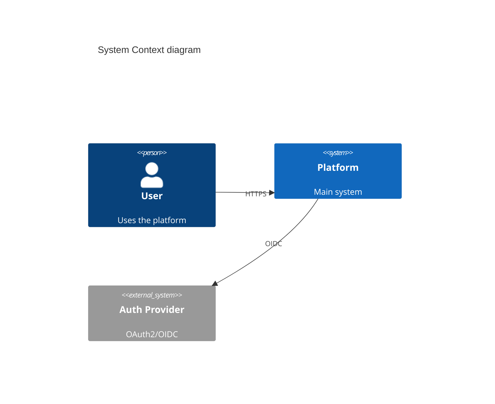

# Architecture, Design & Development (Moderate)

System design through code review: C4 diagrams, API design, database schema, architecture patterns, ADRs, branching, dependency management.

## When to Use

Trigger when user:
- Designs system architecture or draws C4 diagrams
- Designs REST/GraphQL/gRPC APIs
- Creates database schemas or migrations
- Chooses architecture patterns (Clean, Hexagonal, DDD)
- Sets up branching strategy or code review workflow
- Writes Architecture Decision Records

## Step 1: C4 Diagrams

4 hierarchical levels — each zooms into element from level above:

| Level | Shows | Audience |
|-------|-------|----------|
| Context | System as box, actors connected | Everyone |
| Container | Apps/services inside system boundary with tech labels | Devs, ops |
| Component | Classes/packages/modules fulfilling responsibilities | Devs |
| Code | UML class diagram (rarely needed for entire system) | Devs |

**Key rules:** Don't mix abstraction levels. Supplement with arc42 doc template.

### Structurizr DSL
```dsl
workspace {
  model {
    user = person "User"
    softwareSystem = softwareSystem "Platform" {
      webApp = container "Web App" "React" "TypeScript"
      api = container "API" "FastAPI" "Python"
      db = container "Database" "PostgreSQL"
    }
    user -> webApp "uses"
    webApp -> api "JSON/HTTPS"
    api -> db "SQL/TCP"
  }
}

views {
  systemContext softwareSystem { include *; autolayout lr }
  container softwareSystem { include *; autolayout lr }
}
```

### Mermaid Alternative


## Step 2: API Design

### REST (OpenAPI 3.1)
```yaml
openapi: 3.1.0
info:
  title: Order API
  version: 1.0.0
paths:
  /orders:
    get:
      summary: List orders
      parameters:
        - name: status
          in: query
          schema: { type: string, enum: [pending, shipped, delivered] }
      responses:
        '200':
          description: Order list
          content:
            application/json:
              schema:
                type: array
                items: { $ref: '#/components/schemas/Order' }
```

### GraphQL
```graphql
type Query {
  order(id: ID!): Order
  orders(status: OrderStatus, first: Int, after: String): OrderConnection!
}

type Order {
  id: ID!
  status: OrderStatus!
  items: [OrderItem!]!
  total: Money!
}
```

### gRPC
```protobuf
service OrderService {
  rpc GetOrder(GetOrderRequest) returns (Order);
  rpc ListOrders(ListOrdersRequest) returns (ListOrdersResponse);
}
```

### API Versioning

| Strategy | Pros | Cons | Best For |
|----------|------|------|----------|
| URL path `/v1/orders` | Simple, cacheable, explicit | URL proliferation | Public APIs |
| Header `Accept: application/vnd.api.v2+json` | Clean URLs | Hard to test in browser | Enterprise APIs |
| Query param `?version=2` | Easy to test | Cache key pollution | Internal APIs |

**Best practice:** URL path for public APIs. Support 2-3 concurrent versions. Use Sunset header (RFC 8594) for deprecation.

### GraphQL Federation (Apollo v2)

Compose multiple GraphQL services into unified supergraph.

```graphql
# Products subgraph
type Product @key(fields: "id") {
  id: ID!
  name: String!
  price: Float!
}

# Reviews subgraph
extend schema @link(url: "https://specs.apollo.dev/federation/v2.0", import: ["@key", "@external"])
type Product @key(fields: "id") {
  id: ID! @external
  reviews: [Review!]!
}
```

| Aspect | Apollo Federation v2 | Schema Stitching |
|--------|---------------------|------------------|
| Schema ownership | Declarative (@key, @external) | Imperative merge config |
| Entity resolution | Automatic via @key | Manual type merging |
| Tooling | Apollo Router, Rover CLI | graphql-tools |

## Step 3: Database Schema Design

### Schema Patterns
```sql
-- Soft delete
ALTER TABLE orders ADD COLUMN deleted_at TIMESTAMP NULL;

-- Audit trail
CREATE TABLE order_audit (
  id BIGSERIAL PRIMARY KEY,
  order_id UUID NOT NULL,
  action VARCHAR(10) NOT NULL,
  old_data JSONB,
  new_data JSONB,
  changed_at TIMESTAMP DEFAULT NOW(),
  changed_by UUID
);
```

### Indexing Strategy
```sql
-- Composite index for common query pattern
CREATE INDEX idx_orders_user_status ON orders(user_id, status);

-- Partial index for active records
CREATE INDEX idx_orders_active ON orders(user_id) WHERE deleted_at IS NULL;

-- GIN index for JSONB queries
CREATE INDEX idx_orders_metadata ON orders USING GIN(metadata);

-- Always EXPLAIN ANALYZE before deploying
EXPLAIN ANALYZE SELECT * FROM orders WHERE user_id = '...' AND status = 'pending';
```

### Migration Tools

| Tool | Ecosystem | Approach | Autogenerate |
|------|-----------|----------|--------------|
| Flyway | Java, SQL | Imperative | No |
| Alembic | Python | Imperative | Yes |
| Atlas | Go, SQL-first | Declarative (HCL) | Yes |
| Prisma Migrate | JS/TS | Declarative | Yes |

### Expand-and-Contract (Zero-Downtime)
```
Phase 1 (expand):  Add new column (nullable), backfill, deploy code writing both
Phase 2 (migrate): Switch reads to new column, deploy
Phase 3 (contract): Remove old column, clean up
```

### Polyglot Persistence

| Store Type | Use When | Examples | Anti-Pattern |
|-----------|----------|----------|--------------|
| Relational | ACID, complex joins, structured data | PostgreSQL, MySQL | Append-only logs |
| Document | Flexible schema, nested data | MongoDB, DynamoDB | Complex joins |
| Key-Value | Caching, sessions, high-throughput | Redis, DynamoDB | Range queries |
| Columnar | Analytics, time-series, high write | Cassandra, ClickHouse | OLTP workloads |
| Search | Full-text search, faceted nav | Elasticsearch | Primary data store |
| Graph | Relationship-heavy queries | Neo4j, Neptune | Simple CRUD |

**Decision framework:**
1. Start with PostgreSQL (handles 80% of workloads)
2. Add Elasticsearch only if full-text search is core
3. Add Redis only if sub-ms latency or pub/sub needed
4. Add graph DB only if >30% of queries traverse relationships
5. Justify each addition with measured bottleneck

### Database Sharding

| Strategy | Pros | Cons |
|----------|------|------|
| Hash-based | Even distribution | Range queries span all shards |
| Range-based | Range queries efficient | Hotspots on new ranges |
| Directory-based | Flexible, movable | Lookup table is SPOF |
| Geographic | Data residency, latency | Complex cross-region queries |

**Consistent hashing:** ring with virtual nodes (100-200 per physical node). Adding/removing node moves only ~1/n keys. Used by DynamoDB, Cassandra, Redis Cluster.

**Don't shard prematurely** — optimize queries, add read replicas first; shard at ~1TB or clear bottleneck.

### Caching Strategies

| Strategy | Description | Use Case |
|----------|-------------|----------|
| Cache-Aside | App checks cache → miss → read DB → write cache | Read-heavy workloads |
| Write-Through | App writes cache → cache writes DB synchronously | Cache always consistent |
| Write-Behind | App writes cache → cache acks → async batched DB write | Low write latency |
| Read-Through | App reads cache → cache loads from DB on miss | Cache as data source |

```python
# Cache-Aside pattern
def get_order(order_id):
    cached = redis.get(f"order:{order_id}")
    if cached:
        return json.loads(cached)
    order = db.query("SELECT * FROM orders WHERE id = ?", order_id)
    redis.setex(f"order:{order_id}", 300, json.dumps(order))  # TTL 5min
    return order

def update_order(order_id, data):
    db.execute("UPDATE orders SET ... WHERE id = ?", order_id)
    redis.delete(f"order:{order_id}")  # invalidate, don't update
```

### Eviction Policies
| Policy | Algorithm | Use Case |
|--------|-----------|----------|
| LRU | Least Recently Used | General purpose |
| LFU | Least Frequently Used | Frequency matters more |
| TTL | Time-To-Live expiry | Known staleness window |

### Cache Stampede Protection
```
Multiple requests for same stale key → all hit DB simultaneously.
Fix: mutex/lock (only one request rebuilds), probabilistic early expiration,
     stale-while-revalidate.
```

### Eventual Consistency Patterns

| Pattern | Guarantee | Implementation |
|---------|-----------|----------------|
| Read-Your-Writes | Writer sees own writes | Sticky sessions or read-after-write cursor |
| Monotonic Reads | Data never goes backward | Track last-seen version per client |
| Causal Consistency | Causally related ops ordered | Vector clocks or hybrid logical clocks |

### Conflict Resolution
**Last-Writer-Wins (LWW):** latest timestamp wins. Problem: concurrent writes → data loss.
**CRDTs:** data structures that merge automatically (G-Counter, OR-Set, LWW-Register). Used by Redis CRDB, Riak, Yjs.

## Step 4: Code Architecture Patterns

### Clean Architecture
```
src/
  domain/          # Entities, value objects, domain services
  application/     # Use cases, DTOs, ports
  infrastructure/  # Frameworks, DB, external services
```
Rule: dependencies point inward. Domain has zero imports from infra.

### Hexagonal Architecture (Ports & Adapters)
```
src/
  domain/
    ports/
      inbound/     # Use case interfaces
      outbound/    # Repository/gateway interfaces
    model/
  adapters/
    inbound/       # REST handlers, CLI, GraphQL resolvers
    outbound/      # DB repos, HTTP clients, message publishers
```

**Dependency rule:** Dependencies point INWARD. Core never imports adapter code.

```java
// Port defined IN domain (inner)
public interface OrderRepository {
    Order findById(OrderId id);
    void save(Order order);
}

// Adapter OUTSIDE domain (outer)
@Repository
public class JpaOrderRepository implements OrderRepository {
    @PersistenceContext EntityManager em;
    public Order findById(OrderId id) { /* JPA logic */ }
    public void save(Order order) { /* JPA logic */ }
}
```

### DDD Strategic Patterns

| Pattern | Description |
|---------|-------------|
| Shared Kernel | Two contexts share subset of model. Changes require agreement. |
| Customer-Supplier | Downstream depends on upstream. Supplier may prioritize customer. |
| Conformist | Downstream conforms entirely to upstream model. |
| Anti-Corruption Layer | Downstream translates upstream model into own model. |
| Open Host Service | Upstream provides protocol/API for multiple consumers. |
| Published Language | Shared, documented data format (Avro, OpenAPI). |
| Separate Ways | Contexts don't integrate. Each evolves independently. |

**Tactical patterns:** Entity (identity-based), Value Object (immutable, attribute-based), Aggregate (transactional boundary), Aggregate Root (single entry, enforces invariants), Domain Event (immutable past-tense fact), Repository (collection-like persistence).

**DDD Lite:** Start with bounded contexts + ubiquitous language. Add aggregates + domain events when complexity warrants. Skip full tactical patterns for CRUD domains.

### Domain Service vs Application Service
```python
# Domain Service — pure business logic, no I/O
class PricingService:
    def calculate_total(self, order: Order, customer: Customer) -> Money:
        subtotal = sum(item.price * item.qty for item in order.items)
        discount = self._loyalty_discount(customer.tier)
        return subtotal - discount

# Application Service — orchestration, I/O, transactions
class PlaceOrderService:
    def __init__(self, repo: IOrderRepository, pricing: PricingService, events: IEventBus):
        self.repo = repo
        self.pricing = pricing
        self.events = events

    def place_order(self, cmd: PlaceOrderCommand) -> OrderDTO:
        customer = self.repo.get_customer(cmd.customer_id)
        order = Order.create(cmd.items)
        total = self.pricing.calculate_total(order, customer)
        order.confirm(total)
        self.repo.save(order)
        self.events.publish(OrderPlaced(order.id))
        return OrderDTO.from_entity(order)
```

### Clean Architecture Layers (Robert C. Martin)
```
┌─────────────────────────────────────────────────────┐
│                 Frameworks & Drivers                 │  ← outermost
│  ┌───────────────────────────────────────────────┐  │
│  │           Interface Adapters                   │  │
│  │  ┌─────────────────────────────────────────┐  │  │
│  │  │          Use Cases                       │  │  │
│  │  │  ┌───────────────────────────────────┐  │  │  │
│  │  │  │           Entities                 │  │  │  │  ← innermost
│  │  │  └───────────────────────────────────┘  │  │  │
│  │  └─────────────────────────────────────────┘  │  │
│  └───────────────────────────────────────────────┘  │
└─────────────────────────────────────────────────────┘
```

**Dependency Rule:** Source code dependencies point inward ONLY. Inner layers NEVER know about outer layers.

```python
# Entity (innermost)
class Order:
    def __init__(self, id, items, status="pending"):
        self.id = id
        self.items = items
        self.status = status

    def confirm(self):
        if not self.items:
            raise DomainError("Cannot confirm empty order")
        self.status = "confirmed"

# Use Case / Interactor
class PlaceOrderUseCase:
    def __init__(self, order_repo: OrderRepository, event_publisher: EventPublisher):
        self.order_repo = order_repo
        self.event_publisher = event_publisher

    def execute(self, request: PlaceOrderRequest) -> OrderResponse:
        order = Order(id=uuid4(), items=request.items)
        order.confirm()  # entity enforces its own rules
        self.order_repo.save(order)
        self.event_publisher.publish(OrderPlaced(order.id))
        return OrderResponse.from_entity(order)

# Composition Root (outermost — framework layer)
def configure_services():
    order_repo = PostgresOrderRepository(session)
    event_pub = KafkaEventPublisher(producer)
    place_order = PlaceOrderUseCase(order_repo, event_pub)
    return OrderController(place_order)
```

**Common violations:** business logic in controllers, entities with ORM annotations, use cases returning HTTP response objects.

### Onion Architecture (Jeffrey Palermo)
```
┌─────────────────────────────────────────────┐
│         Infrastructure                       │  ← HTTP, DB, MQ, External APIs
│  ┌───────────────────────────────────────┐  │
│  │     Application Services               │  │  ← Use cases, DTOs, orchestration
│  │  ┌─────────────────────────────────┐  │  │
│  │  │    Domain Services               │  │  │  ← Business logic spanning entities
│  │  │  ┌───────────────────────────┐  │  │  │
│  │  │  │    Domain Model            │  │  │  │  ← Entities, VOs, Domain Events
│  │  │  └───────────────────────────┘  │  │  │
│  │  └─────────────────────────────────┘  │  │
│  └───────────────────────────────────────┘  │
└─────────────────────────────────────────────┘
```

**Contrast with N-tier:** N-tier puts DB at center → anemic domain. Onion puts domain at center → rich model. N-tier leaks SQL into business logic. Domain is pure — no ORM, no HTTP, no framework.

### Modular Monolith (Start Here)
```
modules/
  orders/
    api/           # Public interface
    domain/
    infrastructure/
  inventory/
    api/
    domain/
    infrastructure/
```

**Spring Modulith verification:**
```java
@SpringBootTest
class ApplicationTest {
    @Test
    void verifyModuleStructure() {
        ApplicationModules.of(Application.class).verify();
    }
}
```

**Migration path:** Monolith → Modular Monolith → Microservices (only if scaling/deployment requires it).

## Step 5: Branching Strategies

### Trunk-Based Development (recommended for SaaS)
- Single `main` branch
- Short-lived feature branches (< 1 day)
- Feature flags for incomplete work
- Deploy from main continuously

### GitFlow (for versioned releases)
```
main ← release branches
  ↑
develop ← feature branches
  ↑
hotfix branches → main
```

### Feature Flag Tools
- **LaunchDarkly** — commercial, targeting rules
- **Unleash** — open-source, self-hosted
- **Flagsmith** — open-source
- **OpenFeature** — vendor-neutral SDK standard (CNCF)

## Step 6: Code Review

### PR Standards
- Small PRs (< 400 lines ideal, < 200 best)
- Template with checklist: tests, docs, breaking changes
- Required reviewers: 1-2

### pre-commit config
```yaml
repos:
  - repo: https://github.com/pre-commit/pre-commit-hooks
    hooks:
      - id: trailing-whitespace
      - id: end-of-file-fixer
  - repo: https://github.com/astral-sh/ruff-pre-commit
    hooks:
      - id: ruff
      - id: ruff-format
```

## Step 7: Dependency Management

### Renovate (preferred)
```json
{
  "$schema": "https://docs.renovatebot.com/renovate-schema.json",
  "extends": ["config:recommended"],
  "packageRules": [
    { "matchUpdateTypes": ["minor", "patch"], "automerge": true }
  ],
  "schedule": ["before 6am on Monday"]
}
```

**Security scanning:** `npm audit`, `pip-audit`, `cargo audit`, `govulncheck`, Snyk, Socket.dev

| Monorepo Tool | Ecosystem |
|---------------|-----------|
| Turborepo | JS/TS |
| Nx | JS/TS/Angular |
| Bazel / Pants | Polyglot, large scale |

## Step 8: Architecture Decision Records

### ADR Format (Michael Nygard)
```markdown
# ADR-001: Use PostgreSQL as primary database

## Status
Accepted — 2025-01-15

## Context
We need a relational database. Requirements: ACID, JSON support, full-text search.

## Decision
Use PostgreSQL 16 as primary database.

## Consequences
+ JSONB eliminates need for separate document store
- Requires more ops than managed NoSQL

## Alternatives Considered
- DynamoDB: rejected (poor relational queries)
- MongoDB: rejected (no ACID for multi-doc)
```

**Best practices:** One ADR per significant decision. Immutable — supersede with new ADR. Store in `docs/adr/`. Tooling: adr-tools (CLI), Log4brains (static site).

## Step 9: Architecture Fitness Functions

| Type | Description | Example |
|------|-------------|---------|
| Atomic + Triggered | Tests single characteristic on event | Layer violation check on PR |
| Atomic + Continuous | Tests single characteristic always | Performance monitoring |
| Holistic + Triggered | Tests combination on event | Load test + resilience on deploy |
| Holistic + Continuous | Tests combination always | Chaos engineering in production |

```python
# ArchUnit-style: enforce dependency rules
def test_domain_never_depends_on_infra():
    rule = no_classes().that().reside_in("..domain..").should().depend_on_classes_that().reside_in("..infra..")
    rule.check(import_classes)

# Performance fitness function in CI
def test_api_latency_p99_under_200ms():
    result = load_test("/api/orders", concurrent_users=100, duration="30s")
    assert result.p99_latency_ms < 200
```

## Step 10: Platform Engineering

Treat platform as product. Build Internal Developer Platform (IDP) with golden paths.

| Concept | Description |
|---------|-------------|
| IDP | Self-service layer abstracting infrastructure |
| Golden Paths | Pre-approved workflows for common tasks |
| Platform-as-Product | Platform team has roadmap, SLAs, internal customers |

### Backstage (Spotify → CNCF)
- Software Catalog: register all services, track ownership
- Software Templates: scaffold from golden path templates
- TechDocs: docs-as-code (Markdown in repo, rendered in Backstage)

### Score Spec
```yaml
apiVersion: score.dev/v1b1
metadata:
  name: orders-service
containers:
  main:
    image: orders:latest
    variables:
      DB_HOST: ${resources.db.host}
service:
  ports:
    http:
      port: 8080
resources:
  db:
    type: postgres
```

### Implementation Checklist
- Inventory existing tools (pain point mapping)
- Start with one golden path: new service → CI/CD → observability in < 30 min
- Build on Backstage or similar — don't build from scratch
- Measure: time-to-first-deploy, onboarding time, platform NPS

## Step 11: Event-Driven Architecture

| Pattern | Description |
|---------|-------------|
| Event Notification | Producer sends event, doesn't care about consumers |
| Event-Carried State Transfer | Event carries enough data, no callback needed |
| Choreography | Services react to events, no central coordinator |
| Orchestration | Central coordinator manages workflow |

**Key concepts:** eventual consistency, idempotent consumers, dead letter queues, schema registry (Avro/Protobuf)

## Step 12: CQRS + Event Sourcing

### CQRS
```
Commands → Write Side (Domain Model) → Events → Read Side (Projections) → Queries
```

| Pattern | Write Side | Read Side | Best For |
|---------|-----------|-----------|----------|
| Event-Sourced CQRS | Events only (no state table) | Projections from events | Full audit trail, temporal queries |
| State-Based CQRS | Traditional CRUD + domain model | Separate read DB | Simpler domains, gradual adoption |
| Hybrid | State table + event log | Projections from events | Balance of simplicity and event benefits |

### Event Sourcing
Store all state changes as immutable sequence of events.
```
Events: [OrderCreated, ItemAdded, PaymentProcessed, OrderShipped]
Current state = replay events (or from snapshot)
```

**Snapshot strategy:** snapshot every 100-1000 events. Keep ability to rebuild from events.

### Projection Lag Fix
```python
# Causal consistency token pattern
async def create_order(cmd):
    event = OrderCreated(...)
    position = await event_store.append(event)
    return {"order_id": event.id, "consistency_token": position}

async def get_order(order_id, consistency_token=None):
    if consistency_token:
        await projection_store.wait_for_position(consistency_token, timeout=5s)
    return await projection_store.get(order_id)
```

### Anti-Patterns
- Don't query write side — defeats purpose
- Don't share DB between read and write models
- Don't use CQRS for simple CRUD
- Don't ignore eventual consistency UX — show "saving..." states

## Step 13: Resilience Patterns

### Circuit Breaker
```
Closed → (failures exceed threshold) → Open → (timeout) → Half-Open → (probe succeeds) → Closed
```

```java
CircuitBreakerConfig config = CircuitBreakerConfig.custom()
    .failureRateThreshold(50)
    .waitDurationInOpenState(Duration.ofSeconds(30))
    .permittedNumberOfCallsInHalfOpenState(5)
    .slidingWindowSize(10)
    .build();
```

### Retry with Exponential Backoff + Jitter
```python
import random, time

def retry_with_backoff(func, max_retries=5, base_delay=1.0, max_delay=30.0):
    for attempt in range(max_retries):
        try:
            return func()
        except TransientError as e:
            if attempt == max_retries - 1:
                raise
            delay = min(base_delay * (2 ** attempt), max_delay)
            jitter = random.uniform(0, delay)
            time.sleep(jitter)
```

| Strategy | Formula | Use Case |
|----------|---------|----------|
| Exponential + full jitter | random(0, base × 2^attempt) | Prevent thundering herd |
| Decorrelated jitter | min(cap, random(base, prev_delay × 3)) | AWS-recommended, best spread |

**Retry budget:** max 20% of calls retried. Prevents retry storms.

### Bulkhead Isolation
Isolate failure domains. Patterns: thread pool bulkhead, semaphore bulkhead, connection pool.

```java
// Resilience4j bulkhead
BulkheadConfig config = BulkheadConfig.custom()
    .maxConcurrentCalls(25)
    .maxWaitDuration(Duration.ofMillis(500))
    .build();

Bulkhead bulkhead = Bulkhead.of("payment", config);
```

### Timeout
```
Operation timeout < User-facing timeout < Upstream timeout
(e.g., 2s)        (e.g., 5s)              (e.g., 10s)
```
**Rule:** cascading timeouts must decrease toward origin.

### Fallback
Graceful degradation when circuit is open or call fails.
**Strategies:** cached response, default value, secondary service, queue for later processing.

```java
Supplier<String> withFallback = CircuitBreaker
    .decorateSupplier(breaker, () -> callPayment())
    .recover(CallNotPermittedException.class, e -> "default-cached-value")
    .recover(TimeoutException.class, e -> "default-cached-value");
```

### Polly (.NET)
```csharp
var breaker = Policy
    .Handle<HttpRequestException>()
    .CircuitBreakerAsync(
        handledEventsAllowedBeforeBreaking: 5,
        durationOfBreak: TimeSpan.FromSeconds(30),
        onBreak: (ex, ts) => Log.Warning("Circuit open"),
        onReset: () => Log.Information("Circuit closed"));
```

### Composition Order
```
Retry → CircuitBreaker → RateLimiter → Bulkhead → Timeout → Fallback → Call
```

## Step 14: Distributed Consensus

### Raft (used by etcd, Consul, CockroachDB)
```
All nodes → FOLLOWER
  → election timeout (150-300ms random) → CANDIDATE → request vote
  → majority votes → LEADER → heartbeats every 50-150ms
  → leader fails → followers timeout → new election
```

**Log replication:** Client → Leader → append to log → replicate to followers → majority ack → commit → respond.

### CAP / PACELC

| System | Partition: A/C | Else: L/C |
|--------|---------------|-----------|
| DynamoDB | A | L |
| Cassandra | A | L (tunable) |
| MongoDB | C | C |
| CockroachDB | C | C |
| Spanner | C | C (TrueTime) |

## Step 15: Idempotency Patterns

### Idempotency Key (Stripe Pattern)
```python
def handle_payment(request):
    idempotency_key = request.headers["Idempotency-Key"]
    existing = db.query("SELECT response FROM idempotency_keys WHERE key = ?", idempotency_key)
    if existing:
        return JSONResponse(existing.response, status=200)

    db.execute("INSERT INTO idempotency_keys (key, status) VALUES (?, 'processing')", idempotency_key)
    try:
        result = process_payment(request.body)
        db.execute("UPDATE idempotency_keys SET status='complete', response=? WHERE key=?",
                   json.dumps(result), idempotency_key)
        return JSONResponse(result)
    except Exception as e:
        db.execute("DELETE FROM idempotency_keys WHERE key=?", idempotency_key)
        raise
```

### Database Deduplication
```sql
CREATE TABLE events (
    id UUID PRIMARY KEY,
    idempotency_key VARCHAR(64) UNIQUE NOT NULL,
    payload JSONB,
    created_at TIMESTAMP DEFAULT NOW()
);

INSERT INTO events (id, idempotency_key, payload)
VALUES (gen_random_uuid(), $1, $2)
ON CONFLICT (idempotency_key) DO NOTHING
RETURNING id;
```

### Outbox Pattern
```
1. Begin transaction
2. Write business data to domain table
3. Write event to outbox table (same DB, same transaction)
4. Commit
5. Separate process: read outbox → publish to broker → mark as published
```

## Step 16: OAuth2/OIDC

### Authorization Code + PKCE (Recommended)
```
Browser → Auth Server: GET /authorize?response_type=code&code_challenge=SHA256(verifier)&...
Auth Server → Browser: redirect with AUTH_CODE
Browser → Auth Server: POST /token with code_verifier
Server verifies SHA256(code_verifier) == stored code_challenge
```

### Client Credentials (Machine-to-Machine)
```
POST /token
grant_type=client_credentials&client_id=service-a&client_secret=SECRET&scope=api:read
```

### Token Storage (BFF Pattern)
```
Browser → BFF Server → Authorization Server
Browser stores: only HttpOnly session cookie
BFF stores: access_token + refresh_token in server-side session
```

**Why:** eliminates XSS token theft. Tokens never in browser JS.

## Step 17: JWT Best Practices

| Algorithm | Type | Use Case |
|-----------|------|----------|
| HS256 | Symmetric | Single service, same team controls issuer/verifier |
| RS256 | Asymmetric | Multiple services verify, public key distribution |
| ES256 | Asymmetric (ECDSA) | Same as RS256 but more efficient |

**Recommendation:** RS256 for microservices. Distribute public key via JWKS endpoint.

| Storage | XSS | CSRF | Recommended |
|---------|-----|------|-------------|
| localStorage | Vulnerable | Safe | No |
| HttpOnly cookie | Immune | Vulnerable (mitigate with SameSite) | Yes |
| In-memory (JS) | Window only while script runs | Safe | Yes (SPA + silent refresh) |

**Refresh token rotation:** client sends refresh_token_1 → receives new access_token + refresh_token_2. If refresh_token_1 reused → ALL tokens for user invalidated.

## Step 18: Authorization Patterns

### RBAC
```sql
CREATE TABLE roles (id UUID PRIMARY KEY, name VARCHAR(50) UNIQUE);
CREATE TABLE permissions (id UUID PRIMARY KEY, resource VARCHAR(100), action VARCHAR(50));
CREATE TABLE role_permissions (role_id UUID REFERENCES roles, permission_id UUID REFERENCES permissions);
CREATE TABLE user_roles (user_id UUID, role_id UUID);
```

### ABAC (OPA/Rego)
```rego
package authz
default allow = false
allow {
    input.method == "GET"
    input.path == ["api", "orders", order_id]
    user_owns_order(order_id)
}
```

### ReBAC (Google Zanzibar / OpenFGA)
```
document:readme  viewer    user:alice
folder:eng       editor    group:engineering
document:readme  parent    folder:eng
# Can alice read readme? → true (inherited via parent)
```

### Hybrid: Layer authorization checks
```
API Gateway: coarse-grained (token valid? IP allowed?)
Service: RBAC (role for endpoint?)
Domain: ABAC/ReBAC (user access this specific resource?)
```

## Step 19: Rate Limiting

| Algorithm | Burst | Memory | Precision | Use Case |
|-----------|-------|--------|-----------|----------|
| Token Bucket | Yes (configurable) | O(1) | High | API rate limiting |
| Sliding Window Log | No | O(n) | Exact | Low-traffic precise |
| Sliding Window Counter | Partial | O(1) | Approximate | High-traffic general |
| Leaky Bucket | No (smooths) | O(1) | Exact | Backend protection |
| Fixed Window | Yes (boundary burst) | O(1) | High | Simple per-minute |

### Token Bucket (Redis Lua)
```lua
local key = KEYS[1]
local bucket_size = tonumber(ARGV[1])
local refill_rate = tonumber(ARGV[2])
local now = tonumber(ARGV[3])
local cost = tonumber(ARGV[4])

local data = redis.call('HMGET', key, 'tokens', 'last_refill')
local tokens = tonumber(data[1]) or bucket_size
local last_refill = tonumber(data[2]) or now
local elapsed = now - last_refill
tokens = math.min(bucket_size, tokens + elapsed * refill_rate)

if tokens >= cost then
  tokens = tokens - cost
  redis.call('HMSET', key, 'tokens', tokens, 'last_refill', now)
  redis.call('EXPIRE', key, math.ceil(bucket_size / refill_rate) * 2)
  return {1, tokens}
else
  redis.call('HMSET', key, 'tokens', tokens, 'last_refill', now)
  redis.call('EXPIRE', key, math.ceil(bucket_size / refill_rate) * 2)
  return {0, tokens}
end
```

### Response Headers
```
RateLimit-Limit: 1000, 1000;w=60
RateLimit-Remaining: 999
RateLimit-Reset: 5
Retry-After: 5
```

## Step 20: Message Queue Comparison

| Feature | Kafka | RabbitMQ | NATS | Pulsar |
|---------|-------|----------|------|--------|
| Model | Distributed log | Message broker | Pub/sub + JetStream | Distributed log |
| Throughput | Very high | Medium | Very high | Very high |
| Latency | Low ms | Sub-ms | Sub-ms | Low ms |
| Retention | Time/size-based | Until consumed | JetStream: configurable | Tiered storage |
| Replay | Yes | No | JetStream: yes | Yes |
| Ops complexity | High | Low-Medium | Very low | High |
| Best for | Event streaming, high-throughput | Task queues, complex routing | Low-latency, IoT | Multi-tenant streaming |

**Decision guide:**
- Event sourcing / stream processing: Kafka or Pulsar
- Task queues / complex routing: RabbitMQ
- Low-latency microservices / IoT: NATS
- Simple setup, minimal ops: NATS

### Kafka Patterns

**Consumer groups:** max consumers = partition count. Each partition → exactly one consumer in group.

**Exactly-once:** `enable.idempotence=true` + transactional API + `isolation.level=read_committed`.

**Schema Registry:** enforce Avro/Protobuf compatibility. Modes: BACKWARD (default), FORWARD, FULL.

**Dead Letter Queues:**
```java
@KafkaListener(topics = "orders")
public void consume(ConsumerRecord<String, String> record) {
    try {
        process(record);
    } catch (Exception e) {
        kafkaTemplate.send("orders.DLQ", record.key(), record.value());
    }
}
```

## Step 21: CDC (Change Data Capture)

```
PostgreSQL WAL → Debezium connector → Kafka → Consumers
                                              ├── Search index (Elasticsearch)
                                              ├── Cache (Redis)
                                              └── Analytics (Snowflake)
```

**Advantages over polling:** real-time, no query load on source DB, captures deletes.

### Production Config
```json
{
  "snapshot.mode": "initial",
  "snapshot.fetch.size": 10000,
  "max.batch.size": 2048,
  "max.queue.size": 8192,
  "producer.compression.type": "lz4",
  "errors.tolerance": "all",
  "errors.deadletterqueue.topic.name": "dlq-cdc"
}
```

| Metric | Typical | High-Performance |
|--------|---------|-----------------|
| Events/sec (single connector) | 5K-20K | 50K-100K |
| Latency (commit → Kafka) | 100-500ms | 10-50ms |

## Step 22: Data Pipelines

| Aspect | ETL | ELT |
|--------|-----|-----|
| Transform | Before loading | After loading (in target DB) |
| Modern choice | Legacy / strict compliance | Most new systems |
| Tools | Informatica, Talend | dbt, Spark in data lake |

### Lambda vs Kappa Architecture
**Kappa preferred.** Single stream processing layer. Reprocess by replaying event log. Simpler than Lambda (one codebase).

## Step 23: Saga Pattern

### Choreography vs Orchestration

| Aspect | Choreography | Orchestration |
|--------|-------------|---------------|
| Coupling | Low (events only) | Medium (orchestrator knows steps) |
| Complexity | Hard to trace | Centralized, easier to reason |
| Debugging | Distributed tracing needed | Single point of inspection |
| Testing | Hard (event chains) | Easier (mock orchestrator) |
| Good for | Simple 2-3 step sagas | Complex multi-step workflows |
| Failure handling | Each service handles own compensation | Orchestrator triggers compensations |
| Adding steps | Add event listener in new service | Add step in orchestrator |

### Choreography Example
```
OrderService ──[OrderPlaced]──▶ InventoryService
                                      ├──[ItemsReserved]──▶ PaymentService
                                      │                          ├──[PaymentProcessed]──▶ ShippingService
                                      │                          └──[PaymentFailed]──▶ InventoryService
                                      └──[ReservationFailed]──▶ OrderService [OrderCancelled]
```

```java
// InventoryService
@Component
class OrderPlacedListener {
    @KafkaListener(topics = "order-events")
    void onOrderPlaced(OrderPlacedEvent event) {
        try {
            inventoryService.reserveItems(event.getItems());
            kafkaTemplate.send("inventory-events", new ItemsReservedEvent(event.getOrderId()));
        } catch (InsufficientStockException e) {
            kafkaTemplate.send("inventory-events", new ReservationFailedEvent(event.getOrderId()));
        }
    }
}
```

### Orchestration Example
```java
public OrderSagaOrchestrator() {
    this.sagaDefinition = step()
        .invoke(orderService::reserveOrder)
        .compensate(orderService::cancelOrder)
    .step()
        .invoke(inventoryService::reserveItems)
        .compensate(inventoryService::releaseItems)
    .step()
        .invoke(paymentService::processPayment)
        .compensate(paymentService::refundPayment)
    .step()
        .invoke(shippingService::createShipment)
        .compensate(shippingService::cancelShipment)
    .build();
}
```

### Saga State Machine
```
                    ┌──────────┐
                    │ STARTED  │
                    └────┬─────┘
                         │ OrderPlaced
                    ┌────▼─────┐
            ┌──────│RESERVING │──────┐
            │      └────┬─────┘      │
     ReservationFailed   │    ItemsReserved
            │       ┌────▼─────┐      │
     ┌──────▼───┐   │ PAYING   │◄─────┘
     │CANCELLED │   └────┬─────┘
     └──────────┘        │ PaymentProcessed
                    ┌────▼─────┐
               ┌────│SHIPPING  │
               │    └────┬─────┘
        ShipFailed       │ Shipped
               │    ┌────▼─────┐
               └───▶│COMPLETED │
                    └──────────┘
At any state: Timeout → COMPENSATE → CANCELLED
```

### Compensating Transactions
- Compensating action undoes effect, not state (can't "un-send email", but can "send cancellation email")
- Idempotent: compensation may be retried
- Compensatable: can always be executed (check state before compensating)
- Pivot action: first non-compensatable action — after this, must succeed or compensate

**Compensation patterns:**
```java
// Pattern 1: Direct undo
compensate: () -> inventoryService.releaseItems(orderId)

// Pattern 2: Semantic compensation (not state undo)
compensate: () -> notificationService.sendCancellationEmail(orderId, reason)

// Pattern 3: Record compensation intent, execute later
compensate: () -> compensationLog.record(orderId, "REFUND", amount)
```

**Don't use choreography for >5 steps** — impossible to reason about flow.
**Don't mix saga state with domain state** — separate tables.

## Step 24: Microservices Decomposition

### Strangler Fig Pattern
1. **Identify seam** — bounded context with clear API boundary
2. **Build façade** — proxy/intercept traffic (API gateway, service mesh)
3. **Extract service** — implement new service, same contract
4. **Route traffic** — gradually shift (canary, feature flag, weighted routing)
5. **Migrate data** — dual-write or CDC-based sync
6. **Remove monolith code** — delete extracted code once 100% on new service
7. **Repeat** — next bounded context

**Anti-patterns:** big-bang rewrite, shared database between old and new, no rollback plan.

### Distributed Monolith Detection

| Signal | Threshold |
|--------|-----------|
| Shared database | Any shared tables = critical |
| Synchronous chains | >3 hops = warning |
| Lock-step deployments | Any = critical |
| Cross-service joins | Any = critical |
| Temporal coupling | Deep chains = critical |

### Coupling Score
```
Weights: Shared DB table=10, Sync chain(each)=5, Shared lib=8, Lock-step=10, Cross-join=10
0-15=Healthy, 16-40=Moderate, 41-70=Distributed monolith, 71+=Monolith
```

## Step 25: Service Mesh

| Feature | Istio (Envoy) | Linkerd (Rust) | Cilium (eBPF) |
|---------|---------------|----------------|----------------|
| Resource cost | High (50-100MB/sidecar) | Low (10-20MB) | Very low (kernel) |
| mTLS | Automatic | Automatic (default) | SPIFFE-based |
| Traffic mgmt | Rich: fault injection, mirroring | Basic: retries, timeouts | Full L7 |
| Observability | Kiali, Jaeger/Zipkin | Viz dashboard, tap | Hubble (flow visibility) |
| Multi-cluster | Trust federation | Gateway linking | ClusterMesh (native) |
| Install complexity | High | Low | Medium (kernel ≥5.10) |
| Best for | Enterprise, complex routing | Simple, resource-constrained | Kernel-level perf |

### Ambient Mode (Istio)
Istio ambient mode eliminates sidecars. Two layers:
- **ztunnel (L4):** per-node daemon handles mTLS, L4 auth, basic telemetry
- **waypoint proxy (L7):** optional per-service Envoy proxy for L7 policies

**Benefits:** Lower resource cost, simpler debugging, gradual adoption (L4 first, add L7 where needed).
**Status:** GA in Istio 1.22+; production-ready as of 2024.

**Decision guide:**
- Simple, fast, low-resource: Linkerd
- Complex enterprise routing, multi-cluster: Istio (sidecar or ambient)
- Kernel-level performance, eBPF: Cilium
- Gradual adoption, no sidecar overhead: Istio ambient or Cilium eBPF

## Step 26: API Gateway Comparison

| Feature | Kong | Envoy | APISIX |
|---------|------|-------|--------|
| Language | Lua (Nginx) | C++ | Lua + etcd |
| Performance | High (50-100k RPS) | Very high (100k+) | Very high (100k+) |
| Plugin ecosystem | 100+ | Fewer, WASM extensible | 80+ built-in (OSS) |
| gRPC support | Native proxy + gateway | Native (designed for it) | Native + transcoding |
| GUI | Kong Manager (commercial) | No GUI | Built-in Dashboard (OSS) |
| Config store | PostgreSQL or Cassandra | xDS API (dynamic) | etcd (distributed KV) |
| Service discovery | DNS, Consul, K8s | xDS, EDS, K8s | DNS, K8s, Consul, Nacos |
| Auth plugins | Keycloak, OIDC, JWT, LDAP | JWT, RBAC, ext_authz | Keycloak, OIDC, JWT, LDAP |
| Rate limiting | Built-in (local + Redis) | Built-in (local) | Built-in (local + Redis) |
| Extensibility | Lua, Go (PDK), WASM | WASM, Lua, ext_proc | Lua, WASM, Java, Go |
| License | Apache 2.0 / Enterprise | Apache 2.0 | Apache 2.0 |

**Decision guide:**
- Enterprise support, large plugin ecosystem: Kong
- Sidecar/service mesh, low-level proxy: Envoy
- Full-featured OSS, built-in dashboard: APISIX
- gRPC-first: Envoy or APISIX
- WASM extensibility: Envoy (native), Kong and APISIX (growing)

## Step 27: Kubernetes Gateway API

Replaces Ingress. Richer, role-oriented, extensible.

```yaml
# GatewayClass — infrastructure provider
apiVersion: gateway.networking.k8s.io/v1
kind: GatewayClass
metadata:
  name: cilium
spec:
  controllerName: io.cilium/gateway-controller
---
# Gateway — cluster operator configures listeners
apiVersion: gateway.networking.k8s.io/v1
kind: Gateway
metadata:
  name: main-gateway
  namespace: infra
spec:
  gatewayClassName: cilium
  listeners:
    - name: https
      protocol: HTTPS
      port: 443
      tls:
        mode: Terminate
        certificateRefs:
          - name: wildcard-cert
---
# HTTPRoute — app developer defines routing
apiVersion: gateway.networking.k8s.io/v1
kind: HTTPRoute
metadata:
  name: orders-route
  namespace: orders
spec:
  parentRefs:
    - name: main-gateway
      namespace: infra
  hostnames: ["orders.example.com"]
  rules:
    - matches:
        - path: { type: PathPrefix, value: /api/orders }
      backendRefs:
        - name: orders-svc
          port: 8080
          weight: 90
        - name: orders-svc-canary
          port: 8080
          weight: 10
```

## Step 28: Serverless Architecture

### FaaS Platforms

| Platform | Max Timeout | Cold Start | Key Differentiator |
|----------|-------------|------------|-------------------|
| AWS Lambda | 15 min | 100-500ms | Broadest ecosystem |
| Cloudflare Workers | 30s | ~0ms (V8 isolates) | 300+ PoPs, zero cold start |
| Google Cloud Functions | 60 min | 100-300ms | GCP integration |

### Decision Framework
```
Event-driven or HTTP? → Yes → Bursty/low traffic? → Yes → Serverless
                                                → No → Steady-state > breakeven? → Yes → Containers
                                                                                    → No → Serverless
                 → No → Long-running (>15min)? → Yes → Containers/Step Functions
                                               → No → CPU intensive (>10GB)? → Yes → Containers
                                                                                  → No → Serverless
```

### Cold Start Mitigation
| Runtime | Cold Start | Mitigation |
|---------|------------|------------|
| Go/Rust | 5-50ms | Minimal, near-zero |
| Node.js | 100-300ms | Small bundle, provisioned concurrency |
| Java | 1-5s | SnapStart, GraalVM native-image |

### Serverless Patterns

**Fan-out/Fan-in:** Orchestrator → invoke N workers in parallel → aggregate results
**Strangler Fig:** Legacy monolith ← API Gateway → new Lambda functions
**BFF:** Dedicated serverless function per client type

### Stateful Serverless
| State Type | Service | Use Case |
|-----------|---------|----------|
| Ephemeral | ElastiCache/Redis | Session, rate limiting |
| Document | DynamoDB/Firestore | App state, user data |
| Queue | SQS/Pub-Sub | Async task queues |
| Workflow | Step Functions/Durable Functions | Multi-step orchestration |
| Object | S3/GCS/Blob Storage | Files, blobs, artifacts |

### Serverless Tradeoffs

| Tradeoff | Detail |
|----------|--------|
| Execution limits | Lambda 15min, Cloud Functions 60min |
| Package size | Lambda 250MB unzipped, 50MB zipped |
| Concurrency limits | Default 1000 concurrent (AWS) |
| Cost at scale | High-volume steady workloads cheaper on containers |
| Debugging | Distributed, ephemeral — use structured logging + distributed tracing |

### Workflow Orchestration Tools

| Tool | Type | Features |
|------|------|----------|
| AWS Step Functions | Managed | Visual workflow, 200+ integrations |
| Temporal | Self-hosted/Cloud | Durable execution, workflow as code, replay |
| Azure Durable Functions | Managed | Chaining, fan-out/fan-in |

**Temporal core concepts:**
- **Workflow:** deterministic code; replayed from event history on failure
- **Activity:** non-deterministic work (API calls, DB writes); retried independently
- **Workflow replay:** on crash, Temporal replays history + resumes from last completed activity

### Serverless Microservices Structure
```
api-gateway/
  orders/
    create-order/     # POST /orders → Lambda
    get-order/        # GET /orders/{id} → Lambda
    list-orders/      # GET /orders → Lambda
    order-processor/  # SQS consumer, async processing
  inventory/
    check-stock/      # GET /inventory/{sku} → Lambda
    update-stock/     # EventBridge consumer
```

### EventBridge vs SNS
| Feature | EventBridge | SNS |
|---------|------------|-----|
| Routing | Content-based rules | Topic subscription |
| Schema | Schema registry, discovery | None |
| Targets | 15+ AWS services, API destinations | Lambda, SQS, HTTP, email |
| Use when | Complex routing, event bus | Simple fan-out, high throughput |

### Step Functions Saga (Orchestration)
```json
{
  "StartAt": "ReserveInventory",
  "States": {
    "ReserveInventory": {
      "Type": "Task",
      "Resource": "arn:aws:lambda:...:reserve",
      "Next": "ProcessPayment",
      "Catch": [{"ErrorEquals": ["States.ALL"], "Next": "ReleaseInventory"}]
    },
    "ProcessPayment": {
      "Type": "Task",
      "Resource": "arn:aws:lambda:...:payment",
      "Next": "ShipOrder",
      "Catch": [{"ErrorEquals": ["States.ALL"], "Next": "RefundPayment"}]
    },
    "ReleaseInventory": {
      "Type": "Task",
      "Resource": "arn:aws:lambda:...:release_inventory",
      "Next": "Failed"
    },
    "RefundPayment": {
      "Type": "Task",
      "Resource": "arn:aws:lambda:...:refund",
      "Next": "CancelShipment"
    },
    "Failed": {"Type": "Fail", "Error": "SagaFailed"}
  }
}
```

## Step 29: Edge Architecture

| Platform | Runtime | Locations | Key Differentiator |
|----------|---------|-----------|-------------------|
| Cloudflare Workers | V8 isolates | 300+ cities | KV, R2, D1, Durable Objects |
| Deno Deploy | V8 isolates (Deno) | 35+ regions | Native Deno, Web Standard APIs |
| Fastly Compute | WASM | 90+ PoPs | True isolation via WASM sandbox |

### Edge Caching Strategies
| Strategy | Description | Use Case |
|----------|-------------|----------|
| Stale-while-revalidate | Serve stale, refresh in background | High-traffic content |
| Purge-on-write | Invalidate on data mutation | E-commerce inventory |
| Tiered caching | Edge → Shield → Origin | Reduce origin load |

### Edge vs Origin Decision
| Criteria | Edge Compute | Origin/Serverless |
|----------|-------------|-------------------|
| Latency | < 50ms globally | < 200ms acceptable |
| Data freshness | Eventually consistent OK | Strong consistency needed |
| CPU intensive | No (isolate limits) | Yes |
| State | Read-heavy, cached | Write-heavy, transactional |

### Common Edge Patterns

**1. Edge-side rendering (ESR):** Render HTML at edge, personalize per user/region. Tools: Cloudflare Workers + D1, Next.js Edge Runtime.

**2. Edge caching + stale-while-revalidate:**
```
Client → Edge PoP → cache HIT? → return cached
                   → cache MISS? → origin → cache response → return
```
Cache-Control: `public, max-age=60, stale-while-revalidate=300`

**3. Edge authentication / token validation:** Validate JWT at edge before hitting origin. JWKS cached at edge, refreshed periodically.

**4. Edge A/B testing / feature flags:** Split traffic at edge without origin round-trip. Cookie-based or random assignment at PoP.

**5. Edge API gateway:** Rate limiting, auth, request transformation at edge. Offload origin from cross-cutting concerns.

**6. Edge-side aggregation (BFF pattern):** Aggregate multiple backend APIs at edge. Return single payload to client.

### Cloudflare Workers Config
```yaml
# wrangler.toml
name = "edge-api"
main = "src/index.ts"
compatibility_date = "2025-01-01"

[[kv_namespaces]]
binding = "CACHE"
id = "kv-namespace-id"

[[r2_buckets]]
binding = "ASSETS"
bucket_name = "static-assets"

[[d1_databases]]
binding = "DB"
database_name = "edge-db"
database_id = "d1-database-id"
```

### Edge Request Flow
```
User (Tokyo) → Cloudflare PoP (Tokyo)
  ├── KV lookup: user session cached at edge → fast auth
  ├── D1 query: product data (read replica at edge) → fast read
  ├── Cache HIT: return response (p50 < 20ms)
  └── Cache MISS: fetch origin, cache at edge, return
```

## Step 30: Multi-Cloud Architecture

| Approach | Complexity | Portability | When to Use |
|----------|-----------|-------------|-------------|
| Single cloud | Low | Low | Startups, specific features needed |
| Cloud-agnostic containers | Medium | Medium | Most teams |
| Active-active multi-cloud | High | High | Regulated industries, global SLAs |
| Abstraction layer (Pulumi/TF) | Medium | High | All teams — IaC portability |

### Portability Patterns
- **Compute:** Docker on ECS/Cloud Run/AKS/GKE
- **Database:** PostgreSQL everywhere (RDS, Cloud SQL, Azure DB, Neon)
- **Storage:** S3-compatible (MinIO, R2)
- **Messaging:** AMQP/CloudEvents (RabbitMQ, SQS, Pub/Sub)
- **Observability:** OpenTelemetry

### Anti-Patterns
1. Lowest-common-denominator: miss best features of each cloud
2. Active-active across clouds: complex networking, data sync
3. Abstracting too early: wrap services before understanding needs
4. One Terraform module for all clouds: unmaintainable

## Step 31: 12-Factor App (Extended)

### Original 12 Factors
| # | Factor | Principle |
|---|--------|-----------|
| 1 | Codebase | One codebase, many deploys |
| 2 | Dependencies | Explicitly declare and isolate |
| 3 | Config | Store in environment variables |
| 4 | Backing services | Treat as attached resources |
| 5 | Build, release, run | Separate build and run stages |
| 6 | Processes | Stateless processes |
| 7 | Port binding | Export services via port binding |
| 8 | Concurrency | Scale out via process model |
| 9 | Disposability | Fast startup, graceful shutdown |
| 10 | Dev/prod parity | Keep environments similar |
| 11 | Logs | Treat as event streams |
| 12 | Admin processes | Run as one-off processes |

### Extended Factors
| # | Factor | Tools |
|---|--------|-------|
| 13 | API-First | OpenAPI, contract testing (Pact) |
| 14 | Telemetry | OpenTelemetry, Prometheus, Grafana |
| 15 | AuthN/AuthZ | OAuth2/OIDC, OPA, SPIFFE |
| 16 | Cost Awareness | Kubecost, Infracost, FinOps tagging |
| 17 | Supply Chain Security | SBOM (Syft/Trivy), SLSA, Sigstore |
| 18 | Resilience | Circuit breakers, chaos engineering |
| 19 | Edge & Distribution | Cloudflare Workers, Deno Deploy |
| 20 | AI/ML Lifecycle | MLflow, drift detection, model registries |

### Checklist for New Services
- [ ] OpenAPI spec committed before implementation
- [ ] OpenTelemetry SDK integrated from day 1
- [ ] AuthN/AuthZ middleware configured; no default-allow
- [ ] Cost tags applied; budget alerts set
- [ ] SBOM generated in CI; signed images in registry
- [ ] Circuit breakers + retry budgets configured
- [ ] Edge deployment evaluated for latency-sensitive paths

## Step 32: Green Software

### Principles
- **Energy Efficiency:** minimize energy per request
- **Carbon Awareness:** shift compute to cleaner grid times/regions
- **Hardware Efficiency:** maximize utilization, extend lifespan

### Carbon-Aware Patterns
```yaml
# Shift batch workloads to low-carbon windows
# Use carbon-aware scheduler (e.g., KEDA + Carbon Aware SDK)
triggers:
  - type: carbon-intensity
    carbonIntensityThreshold: 200  # gCO2/kWh
    region: westeurope
```

- **Time-shifting:** batch jobs when grid carbon intensity is lowest (Carbon Aware SDK)
- **Region-shifting:** deploy to cleaner grids (electricityMap API)
- **Demand shaping:** reduce precision/quality during high-carbon periods
- **Measurement:** Cloud Carbon Footprint (CCF), Green Metrics Tool

### Implementation Checklist
- Instrument: add carbon intensity metrics to CI/CD dashboards
- Measure: Cloud Carbon Footprint (CCF) for cloud usage
- Shift: KEDA carbon-aware scaler for batch workloads
- Optimize: profile hot paths, reduce idle resources, right-size instances
- Report: include sustainability section in ADRs and architecture reviews

## Step 33: API Governance

### Correlation ID Standard
```yaml
X-Request-ID: uuid-v4        # unique per request, generated at edge
X-Correlation-ID: uuid-v4    # groups related requests (saga, batch)
X-Trace-ID: hex-128          # OpenTelemetry trace ID
```

### Structured Logging
```json
{
  "timestamp": "2025-01-15T10:30:00Z",
  "level": "INFO",
  "service": "orders-service",
  "traceId": "abc123",
  "requestId": "uuid-v4",
  "message": "Order created",
  "orderId": "ORD-001",
  "duration_ms": 42
}
```

Libraries: structlog (Python), pino (Node), zerolog (Go), tracing (Rust)

## Step 34: Service Discovery

| Feature | Client-Side | Server-Side | DNS-Based |
|---------|------------|-------------|-----------|
| How it works | Client queries registry, picks instance | LB queries registry, routes | Client resolves DNS to IP |
| Examples | Eureka, Consul client | AWS ALB, Nginx+Consul | K8s CoreDNS, Consul DNS |
| Load balancing | Client-side (Ribbon) | Server-side (LB algorithm) | DNS round-robin (limited) |
| Failover | Fast (cached list, immediate retry) | Medium (LB health check interval) | Slow (DNS TTL, 30-60s) |
| Protocol support | Any (app-level) | L4 (TCP) or L7 (HTTP/gRPC) | L3 (IP only) |
| Best for | Microservices, polyglot | Most production | Simple setups, K8s native |

### K8s Built-in
```yaml
apiVersion: v1
kind: Service
metadata:
  name: order-service
spec:
  selector:
    app: order
  ports:
    - port: 8080
# DNS: order-service.default.svc.cluster.local
```

**Headless service (for stateful apps):**
```yaml
apiVersion: v1
kind: Service
metadata:
  name: kafka-brokers
spec:
  clusterIP: None  # headless
  selector:
    app: kafka
  ports:
    - port: 9092
# DNS: kafka-brokers-0.kafka-brokers.default.svc.cluster.local
```

### Consul Service Discovery
```hcl
service {
  name = "order-service"
  port = 8080
  tags = ["v2", "canary"]
  check {
    http     = "http://localhost:8080/health"
    interval = "10s"
    timeout  = "3s"
  }
}
```

### Consul vs etcd vs ZooKeeper
| Feature | Consul | etcd | ZooKeeper |
|---------|--------|------|-----------|
| Primary use | Service discovery + KV | KV store, K8s backing | Coordination, legacy |
| Health checks | Built-in (HTTP/TCP/gRPC) | Client-side (leases) | Session-based |
| DNS interface | Yes (built-in) | No (external SkyDNS) | No |
| Multi-DC | Native (WAN gossip) | Manual federation | Manual |
| Consensus | Raft | Raft | ZAB |
| K8s native | Adapter available | Native (K8s etcd) | Adapter (deprecated) |

### Pitfalls
- Don't use DNS for rapid failover — TTL caching causes stale records
- Don't hardcode service addresses — breaks in dynamic environments
- Don't skip health checks — stale instances cause 500s
- Don't mix discovery methods — pick one per environment
- Don't forget deregistration — graceful shutdown must deregister (SIGTERM handler)

## Step 35: Error Handling

### RFC 9457: Problem Details
```json
{
  "type": "https://api.example.com/errors/out-of-stock",
  "title": "Out of Stock",
  "status": 409,
  "detail": "Item SKU-12345 is out of stock",
  "instance": "/orders/abc-123"
}
```
Content-Type: `application/problem+json`

### Error Envelope
```json
{
  "error": {
    "code": "RESOURCE_NOT_FOUND",
    "message": "Order not found",
    "status": 404,
    "request_id": "req_abc123",
    "doc_url": "https://api.example.com/docs/errors#RESOURCE_NOT_FOUND"
  }
}
```

### HTTP Status Code Guidelines
| Code | Meaning | When to Use |
|------|---------|-------------|
| 400 | Bad Request | Validation errors, malformed input |
| 401 | Unauthorized | Missing or invalid authentication |
| 403 | Forbidden | Authenticated but not authorized |
| 404 | Not Found | Resource doesn't exist |
| 409 | Conflict | State conflict (duplicate, version mismatch) |
| 422 | Unprocessable | Valid JSON, bad business logic |
| 429 | Too Many Requests | Rate limited |
| 500 | Internal Server Error | Unexpected server error |
| 502 | Bad Gateway | Upstream service failure |
| 503 | Service Unavailable | Maintenance, overloaded |
| 504 | Gateway Timeout | Upstream timeout |

**Never:** return 200 with error body, expose stack traces, use generic "Something went wrong" for every error, leak implementation details.

### Error Codes Taxonomy
**Two-layer model:** HTTP status code (transport-level) + domain error code (application-level).

**Stripe pattern:**
```
type: "card_error" | "invalid_request_error" | "authentication_error" | "api_error"
code: "card_declined" | "expired_card" | "incorrect_cvc"
param: "exp_month" (which field)
message: human-readable
doc_url: link to docs
```

### RFC 9457 Problem Details Implementation
```python
from fastapi import HTTPException
from fastapi.responses import JSONResponse

class ProblemException(HTTPException):
    def __init__(self, type_uri: str, title: str, status: int,
                 detail: str, instance: str = None, errors: list = None):
        self.problem = {"type": type_uri, "title": title, "status": status, "detail": detail}
        if instance: self.problem["instance"] = instance
        if errors: self.problem["errors"] = errors
        super().__init__(status_code=status)

@app.exception_handler(ProblemException)
async def problem_handler(request, exc):
    return JSONResponse(
        status_code=exc.problem["status"],
        content=exc.problem,
        headers={"Content-Type": "application/problem+json"}
    )
```

### Error Budgets (SRE)
```
Error budget = 1 - SLO target
SLO = 99.9% → budget = 0.1% = 43.8 minutes/month

Burn rate: 14.4x in 1h AND 3x in 6h → page on-call
```

## Step 36: Data Mesh

### 4 Principles
1. **Domain Ownership:** teams own data pipelines end-to-end
2. **Data as a Product:** discoverable, addressable, trustworthy, self-describing
3. **Self-Serve Platform:** infra-as-code for data products
4. **Federated Computational Governance:** global policies enforced computationally

### Anti-Patterns
- "Data Mesh = New Central Team" — central platform team only
- "All Data Must Be Mesh" — only expose products, keep scratch internal
- "No Platform Investment" — invest in self-serve platform first
- "Premature Mesh" — for 10+ domain teams; simpler for smaller orgs

### Data Product Structure
```
┌──────────────────────────────────────────────────┐
│                 Data Product                      │
├──────────────────────────────────────────────────┤
│  Input Ports (consume) │ Output Ports (expose)   │
│  Data Pipeline         │ Metadata (schema, lineage)│
│  SLA Contract          │ Infrastructure           │
└──────────────────────────────────────────────────┘
```

**Output port example:**
```yaml
apiVersion: datacontract/v1
kind: DataProduct
metadata:
  name: customer-360
  domain: marketing
  owner: marketing-team@company.com
spec:
  ports:
    - name: customer-profiles
      type: bigquery
      description: "Enriched customer profiles with segmentation"
      schema:
        fields:
          - name: customer_id
            type: STRING
            pii: true
          - name: segment
            type: STRING
      sla:
        freshness: 1h
        availability: 99.9%
```

## Step 37: K8s Operator Patterns

### Reconcile Loop (controller-runtime)
```go
func (r *MyReconciler) Reconcile(ctx context.Context, req ctrl.Request) (ctrl.Result, error) {
    cr := &v1alpha1.MyApp{}
    if err := r.Get(ctx, req.NamespacedName, cr); err != nil {
        return ctrl.Result{}, client.IgnoreNotFound(err)
    }

    deploy := &appsv1.Deployment{}
    err := r.Get(ctx, types.NamespacedName{Name: cr.Name, Namespace: cr.Namespace}, deploy)

    if apierrors.IsNotFound(err) {
        deploy = r.buildDeployment(cr)
        if err := r.Create(ctx, deploy); err != nil {
            return ctrl.Result{}, err
        }
    } else if err == nil {
        if *deploy.Spec.Replicas != cr.Spec.Replicas {
            deploy.Spec.Replicas = &cr.Spec.Replicas
            r.Update(ctx, deploy)
        }
    }

    cr.Status.ReadyReplicas = deploy.Status.ReadyReplicas
    r.Status().Update(ctx, cr)
    return ctrl.Result{}, nil
}
```

### Anti-Patterns
- Polling instead of watching (use controller-runtime watches)
- Not idempotent reconcile (derive from observed state, don't increment)
- Ignoring errors (always return error for requeue)
- Large status objects (keep < 1MB etcd limit)
- Not handling NotFound on primary CR

### Finalizers (Cleanup Before Delete)
```go
func (r *MyReconciler) Reconcile(ctx context.Context, req ctrl.Request) (ctrl.Result, error) {
    cr := &v1alpha1.MyApp{}
    r.Get(ctx, req.NamespacedName, cr)

    if !cr.DeletionTimestamp.IsZero() {
        // Being deleted — run cleanup
        if controllerutil.ContainsFinalizer(cr, "myapp.example.com/cleanup") {
            if err := r.cleanupExternalResources(cr); err != nil {
                return ctrl.Result{}, err  // retry
            }
            controllerutil.RemoveFinalizer(cr, "myapp.example.com/cleanup")
            r.Update(ctx, cr)
        }
        return ctrl.Result{}, nil
    }

    // Not being deleted — ensure finalizer exists
    if !controllerutil.ContainsFinalizer(cr, "myapp.example.com/cleanup") {
        controllerutil.AddFinalizer(cr, "myapp.example.com/cleanup")
        r.Update(ctx, cr)
    }

    // Normal reconcile logic...
}
```

### Operator SDK Flavors
| Type | Language | When to Use |
|------|----------|-------------|
| Go operator | Go | Complex logic, custom controllers |
| Helm operator | Helm charts | Existing charts, simple lifecycle |
| Ansible operator | Ansible playbooks | Ops team, existing Ansible roles |

## Pitfalls (Consolidated)

1. **Don't start with microservices** — modular monolith first
2. **Don't design API without OpenAPI/SDL first**
3. **Don't use GitFlow for SaaS** — trunk-based + feature flags
4. **Don't skip EXPLAIN ANALYZE** — index problems compound
5. **Don't review style manually** — automate lint/format
6. **Don't write ADRs after the fact** — write during decision
7. **Don't mix C4 levels** — one abstraction per diagram
8. **Don't skip fitness functions** — architecture erodes without automated checks
9. **Don't force DDD on CRUD** — DDD Lite is enough
10. **Don't use Ingress for new K8s projects** — Gateway API is standard
11. **Don't ignore carbon cost** — include in fitness functions
12. **Don't allow unstructured logging** — enforce structured JSON + correlation IDs
13. **Don't default to servers** — evaluate serverless-first
14. **Don't store JWTs in localStorage** — HttpOnly cookies or in-memory + BFF
15. **Don't use HS256 across microservices** — RS256
16. **Don't use fixed window rate limiting** — boundary bursts allow 2x limit
17. **Don't skip idempotency keys on POST endpoints**
18. **Don't poll for CDC** — use Debezium/log-based capture
19. **Don't shard prematurely** — optimize queries, add replicas first
20. **Don't ignore circuit breaker composition order** — retry wraps breaker
21. **Don't allow unbounded retries** — use retry budget (max 20%)
22. **Don't use saga for single-service transactions** — local ACID simpler
23. **Don't forget idempotency on every saga step**
24. **Don't use choreography for >5 saga steps**
25. **Don't query CQRS write side** — defeats purpose
26. **Don't use CQRS for simple CRUD**
27. **Don't use DNS for rapid failover** — TTL caching causes stale records
28. **Don't hardcode service addresses**
29. **Don't skip health checks** — stale instances cause 500s
30. **Don't return raw exception messages** — sanitize for production

## Quick Reference: Pattern Selection

| Situation | Pattern |
|-----------|---------|
| Start new project | Modular monolith, Clean Architecture |
| Complex domain | DDD bounded contexts, aggregates |
| Distributed transactions | Saga (choreography <5 steps, orchestration >5) |
| Read-heavy workload | CQRS with separate read DB |
| Audit requirements | Event sourcing |
| Legacy migration | Strangler Fig |
| Cross-service sync | CDC (Debezium) + Kafka |
| Rate limiting | Token bucket or sliding window counter |
| Authentication | OAuth2 + PKCE, BFF pattern |
| Authorization | RBAC (coarse) + ReBAC (fine-grained) |
| Service-to-service | Service mesh (Linkerd/Cilium/Istio) |
| External traffic | API Gateway (Kong/APISIX/Envoy) |
| Latency-sensitive | Edge compute (Cloudflare Workers) |
| Bursty workloads | Serverless (Lambda/Cloud Functions) |
| Multi-cloud | Containers + PostgreSQL + S3-compatible + Terraform |

## Related Skills

  - [sdlc-prd-to-production](sdlc-prd-to-production): End-to-end workflow: PRD → design doc → implementation → code review → testing → deployment → monito
  - [sdlc-deployment](sdlc-deployment): Deployment strategies: canary, blue-green, rolling, progressive delivery, feature flags, rollback, d
  - [sdlc-platform-engineering](sdlc-platform-engineering): Platform engineering: internal developer portals (IDP), Backstage, golden paths, service catalog, se
