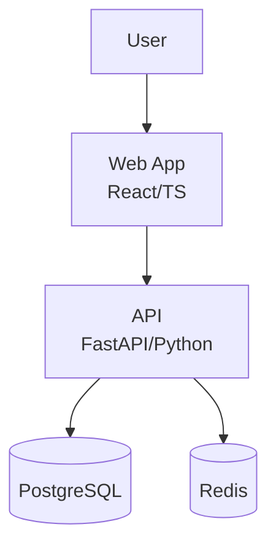

# Architecture, Design & Development

System design through code review: C4 diagrams, API design, database schema, architecture patterns, ADRs, branching, dependency management. Includes DDIA and Staff Engineer patterns.

## When to Use

Trigger when user:
- Designs system architecture or draws C4 diagrams
- Designs REST/GraphQL/gRPC APIs
- Creates database schemas or migrations
- Chooses architecture patterns (Clean, Hexagonal, DDD)
- Sets up branching strategy or code review workflow
- Writes Architecture Decision Records

## Step 1: System Design & C4 Diagrams

### C4 Levels
1. **Context** — system boundary, external actors
2. **Container** — apps, databases, message brokers
3. **Component** — internal modules per container
4. **Code** — class/module diagrams (rarely needed)

### Structurizr DSL
```dsl
workspace {
  model {
    user = person "User"
    softwareSystem = softwareSystem "Platform" {
      webApp = container "Web App" "React" "TypeScript"
      api = container "API" "FastAPI" "Python"
      db = container "Database" "PostgreSQL"
    }
    user -> webApp "uses"
    webApp -> api "JSON/HTTPS"
    api -> db "SQL/TCP"
  }
}
```

### Mermaid (GitHub-native)


### Diagram-as-Code Tools
| Tool | Format | Best For |
|------|--------|----------|
| Structurizr DSL | `.dsl` | C4 model, version-controllable |
| PlantUML + C4 | `.puml` | UML + C4 hybrid |
| Mermaid | `.mmd` | GitHub-native, inline in .md |
| D2lang | `.d2` | Declarative, CI-friendly |
| Excalidraw | `.excalidraw` | Quick whiteboard sketches |

## Step 2: API Design

### REST Best Practices
- Resource-oriented URIs: `/users/{id}/orders`
- HTTP verbs → CRUD: GET/POST/PUT/PATCH/DELETE
- Plural nouns, kebab-case
- Cursor-based pagination (preferred over offset)
- Versioning: URI path `/v1/` or header `Accept-Version`
- Error format: RFC 7807 Problem Details
- Rate limiting headers: `X-RateLimit-Limit`, `Retry-After`

### OpenAPI 3.1 (spec-first)
```yaml
openapi: 3.1.0
info:
  title: User API
  version: 1.0.0
paths:
  /users:
    get:
      summary: List users
      parameters:
        - name: cursor
          in: query
          schema: { type: string }
      responses:
        '200':
          description: User list
```

### API Tools
| Tool | Purpose |
|------|---------|
| Redocly / Swagger UI | Docs generation |
| Prism (Stoplight) | Mock server from OpenAPI |
| Schemathesis | Property-based API testing |
| httpie / curl / xh | CLI testing |
| Bruno | Open-source Postman alternative |

### GraphQL
- Schema-first with SDL
- DataLoader pattern (N+1 prevention)
- Relay-style cursor pagination
- Depth/complexity limits to prevent abuse

### gRPC
- Proto-first design
- **buf** — proto linter, breaking change detection
  ```bash
  buf lint
  buf breaking --against '.git#branch=main'
  buf generate
  ```
- **grpcurl** — CLI for gRPC

## Step 3: Database Schema Design

### Relational (PostgreSQL, MySQL)
- Normalize to 3NF minimum; denormalize for read perf
- Migrations as code: forward-only, immutable
- Naming: snake_case tables, consistent singular/plural
- Always add `created_at`, `updated_at`, soft delete `deleted_at`
- Index strategy: composite indexes match query patterns
- Use `EXPLAIN ANALYZE` early

### Migration Tools
| Tool | Ecosystem |
|------|-----------|
| Atlas (ariga) | Declarative schema, diff-based |
| Flyway | Java ecosystem |
| Prisma Migrate | Node.js/TypeScript |
| Drizzle Kit | TypeScript, lightweight |
| Alembic | Python/SQLAlchemy |
| pgroll (xata) | Zero-downtime PostgreSQL |

### ERD Visualization
- **dbdocs.io** — DBML to ERD
- **pgModeler**, **DBeaver**, **DataGrip** — visual design

## Step 4: Code Architecture Patterns

### Clean Architecture
```
src/
  domain/          # Entities, value objects, interfaces (no deps)
    entities/
    use_cases/     # Application business rules
  adapters/        # Interface adapters
    repositories/
    controllers/
  infrastructure/  # Frameworks, DB, external services
    db/
    external/
```
Rule: dependencies point inward. Domain has zero imports from infra.

### Hexagonal Architecture (Ports & Adapters)
```
src/
  domain/
    ports/
      inbound/     # Use case interfaces
      outbound/    # Repository/gateway interfaces
    model/
  adapters/
    inbound/       # REST handlers, CLI
    outbound/      # DB repos, HTTP clients
```

### DDD Tactical Patterns
- **Entities** — identity, mutable
- **Value Objects** — immutable, equality by value
- **Aggregates** — consistency boundary, root entity
- **Domain Events** — `OrderPlaced`, `PaymentProcessed`
- **Repositories** — per aggregate root
- **Anti-Corruption Layer** — for legacy/external integration

### Modular Monolith (start here)
```
modules/
  orders/
    api/           # Public interface
    domain/
    infrastructure/
  inventory/
    api/
    domain/
    infrastructure/
```

## Step 5: Branching Strategies

### Trunk-Based Development (recommended for SaaS)
- Single `main` branch
- Short-lived feature branches (< 1 day)
- Feature flags for incomplete work
- Deploy from main continuously

### GitFlow (for versioned releases)
```
main ← release branches
  ↑
develop ← feature branches
  ↑
hotfix branches → main
```

### Feature Flag Tools
- **LaunchDarkly** — commercial, targeting rules
- **Unleash** — open-source, self-hosted
- **Flagsmith** — open-source
- **OpenFeature** — vendor-neutral SDK standard (CNCF)

## Step 6: Code Review

### PR Standards
- Small PRs (< 400 lines ideal, < 200 best)
- Template with checklist: tests, docs, breaking changes
- Required reviewers: 1-2

### Automation Before Human Review
- Lint/format passes
- Type checking passes
- Tests pass with coverage threshold
- SAST scans clean

### pre-commit config
```yaml
repos:
  - repo: https://github.com/pre-commit/pre-commit-hooks
    hooks:
      - id: trailing-whitespace
      - id: end-of-file-fixer
  - repo: https://github.com/astral-sh/ruff-pre-commit
    hooks:
      - id: ruff
      - id: ruff-format
```

## Step 7: Dependency Management

### Renovate (preferred)
```json
{
  "$schema": "https://docs.renovatebot.com/renovate-schema.json",
  "extends": ["config:recommended"],
  "packageRules": [
    { "matchUpdateTypes": ["minor", "patch"], "automerge": true }
  ],
  "schedule": ["before 6am on Monday"]
}
```

### Security Scanning
- `npm audit`, `pip-audit`, `cargo audit`, `govulncheck`
- **Snyk**, **Socket.dev** (supply chain)

### Monorepo Tools
| Tool | Ecosystem |
|------|-----------|
| Turborepo | JS/TS |
| Nx | JS/TS/Angular |
| Bazel / Pants | Polyglot, large scale |

## Step 8: Architecture Decision Records (from Staff Engineer)

### ADR Format
```markdown
# ADR-001: Use PostgreSQL as primary database

## Status
Accepted — 2025-01-15

## Context
We need a relational database. Requirements: ACID, JSON support, full-text search.

## Decision
Use PostgreSQL 16 as primary database.

## Consequences
+ JSONB eliminates need for separate document store
- Requires more ops than managed NoSQL

## Alternatives Considered
- DynamoDB: rejected (poor relational queries)
- MongoDB: rejected (no ACID for multi-doc)
```

### ADR Best Practices
- One ADR per significant decision
- ADRs are immutable — supersede with new ADR
- Store in repo: `docs/adr/`
- Link from code where decision applies

## Step 9: Architecture Characteristics (from Fundamentals of Software Architecture)

Identify top 3 per system (not 20):
- **Operational**: scalability, availability, reliability, performance
- **Structural**: modifiability, testability, deployability
- **Cross-cutting**: security, observability, compliance

### Fitness Functions (Automated Governance)
```python
# ArchUnit-style: enforce dependency rules
def test_domain_never_depends_on_infra():
    """Domain layer must not import from infrastructure."""
    rule = no_classes().that().reside_in("..domain..").should().depend_on_classes_that().reside_in("..infra..")
    rule.check(import_classes)
```

## Step 10: Data-Intensive Design (from DDIA — Kleppmann)

### Key Principles
- Choose consistency model based on use case, not dogma
- Use event sourcing for auditability and reprocessing
- Monitor percentiles not averages (p50, p95, p99)
- "Exactly-once" is usually "effectively once" via idempotence

### Derived Data Pattern
```
Source of truth (DB) → Event log → Derived views (caches, search indexes)
```

### Schema Evolution
- Backward compatible: new code reads old data
- Forward compatible: old code reads new data
- Use Avro/Protobuf for schema evolution

## Step 11: Codebase Deepening (from mattpocock/skills)

### Key Concepts
- **Depth** — leverage at interface: lots of behavior behind small interface
- **Seam** — where behavior can be altered without editing in place
- **Deletion test**: delete module. If complexity vanishes → pass-through

### Process
1. Read domain glossary + ADRs
2. Map modules, interfaces, seams
3. Identify shallow modules
4. Propose deepening: extract, consolidate, reduce coupling

## Pitfalls

1. **Don't start with microservices** — modular monolith first
2. **Don't design API without OpenAPI/SDL first**
3. **Don't use GitFlow for SaaS** — trunk-based + feature flags
4. **Don't skip EXPLAIN ANALYZE** — index problems compound
5. **Don't review style manually** — automate lint/format
6. **Don't write ADRs after the fact** — write during decision
7. **Don't ignore Hyrum's Law** — all observable behaviors become contracts
