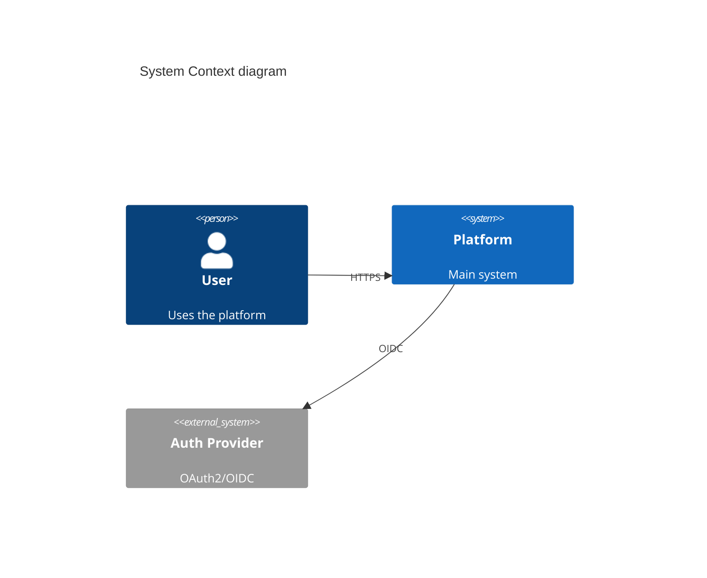

# Architecture, Design & Development

System design through code review: C4 diagrams, API design, database schema, architecture patterns, ADRs, branching, dependency management. Includes DDIA, Staff Engineer patterns, and architecture fitness functions.

## When to Use

Trigger when user:
- Designs system architecture or draws C4 diagrams
- Designs REST/GraphQL/gRPC APIs
- Creates database schemas or migrations
- Chooses architecture patterns (Clean, Hexagonal, DDD)
- Sets up branching strategy or code review workflow
- Writes Architecture Decision Records

## Step 1: System Design & C4 Diagrams

### C4 Model (Simon Brown)
Source: https://c4model.com/

4 hierarchical abstraction levels — each zooms into element from level above:

**Level 1 — Context:** System scope, users, external dependencies.
- Shows: your system as box, actors (people/systems) connected
- Audience: everyone

**Level 2 — Container:** Applications/services inside system boundary.
- Shows: web apps, APIs, databases, message buses as boxes inside system
- Labels: technology choices (e.g., "Spring Boot", "PostgreSQL")
- Audience: developers, ops

**Level 3 — Component:** Major building blocks inside a container.
- Shows: classes/packages/modules that fulfill responsibilities
- Audience: developers

**Level 4 — Code:** UML class diagram for specific component.
- Shows: classes, interfaces, relationships
- Audience: developers (rarely needed for entire system)

**Core notation:**
- Person (stick figure or box)
- Software System (box, solid or dashed border)
- Container (box with tech label)
- Component (box with tech label)
- Relationships (arrows with description + protocol)

**Key rules:**
- Don't mix abstraction levels on one diagram
- Supplement with supporting text (e.g., arc42 doc template)

### Structurizr DSL
```dsl
workspace {
  model {
    user = person "User"
    softwareSystem = softwareSystem "Platform" {
      webApp = container "Web App" "React" "TypeScript"
      api = container "API" "FastAPI" "Python"
      db = container "Database" "PostgreSQL"
    }
    user -> webApp "uses"
    webApp -> api "JSON/HTTPS"
    api -> db "SQL/TCP"
  }
}

views {
  systemContext softwareSystem {
    include *
    autolayout lr
  }
  container softwareSystem {
    include *
    autolayout lr
  }
}
```

### Mermaid Alternative


## Step 2: API Design

### REST
```yaml
# OpenAPI 3.1
openapi: 3.1.0
info:
  title: Order API
  version: 1.0.0
paths:
  /orders:
    get:
      summary: List orders
      parameters:
        - name: status
          in: query
          schema: { type: string, enum: [pending, shipped, delivered] }
      responses:
        '200':
          description: Order list
          content:
            application/json:
              schema:
                type: array
                items: { $ref: '#/components/schemas/Order' }
```

### GraphQL
```graphql
type Query {
  order(id: ID!): Order
  orders(status: OrderStatus, first: Int, after: String): OrderConnection!
}

type Order {
  id: ID!
  status: OrderStatus!
  items: [OrderItem!]!
  total: Money!
}
```

### gRPC
```protobuf
service OrderService {
  rpc GetOrder(GetOrderRequest) returns (Order);
  rpc ListOrders(ListOrdersRequest) returns (ListOrdersResponse);
}
```

### API Versioning
- **URL path**: `/v1/orders` (simplest)
- **Header**: `Accept: application/vnd.api.v1+json`
- **Query param**: `?version=1`

## Step 3: Database Schema Design

### Normalization vs Denormalization
- **3NF** for transactional systems (OLTP)
- **Denormalized** for analytics (OLAP) and read-heavy workloads
- **Event sourcing** for auditability

### Schema Patterns
```sql
-- Polymorphic association (bad)
-- Use instead: shared PK or junction table

-- Soft delete
ALTER TABLE orders ADD COLUMN deleted_at TIMESTAMP NULL;

-- Audit trail
CREATE TABLE order_audit (
  id BIGSERIAL PRIMARY KEY,
  order_id UUID NOT NULL,
  action VARCHAR(10) NOT NULL, -- INSERT, UPDATE, DELETE
  old_data JSONB,
  new_data JSONB,
  changed_at TIMESTAMP DEFAULT NOW(),
  changed_by UUID
);

-- Temporal tables (SQL:2011)
-- Use for point-in-time queries
```

### Indexing Strategy
```sql
-- Composite index for common query pattern
CREATE INDEX idx_orders_user_status ON orders(user_id, status);

-- Partial index for active records
CREATE INDEX idx_orders_active ON orders(user_id) WHERE deleted_at IS NULL;

-- GIN index for JSONB queries
CREATE INDEX idx_orders_metadata ON orders USING GIN(metadata);

-- Always EXPLAIN ANALYZE before deploying
EXPLAIN ANALYZE SELECT * FROM orders WHERE user_id = '...' AND status = 'pending';
```

### Migration Tools
| Tool | Ecosystem |
|------|-----------|
| Flyway | Java, SQL |
| Alembic | Python |
| golang-migrate | Go |
| Prisma Migrate | JS/TS |
| Atlas | Go, SQL-first |

## Step 4: Code Architecture Patterns

### Clean Architecture
```
src/
  domain/          # Entities, value objects, domain services
  application/     # Use cases, DTOs, ports
  infrastructure/  # Frameworks, DB, external services
    db/
    external/
```
Rule: dependencies point inward. Domain has zero imports from infra.

### Hexagonal Architecture (Ports & Adapters)
Source: https://alistair.cockburn.us/hexagonal-architecture/

```
src/
  domain/
    ports/
      inbound/     # Use case interfaces
      outbound/    # Repository/gateway interfaces
    model/
  adapters/
    inbound/       # REST handlers, CLI, GraphQL resolvers
    outbound/      # DB repos, HTTP clients, message publishers
```

**Core concepts:**
- **Application Core** — business logic, NO dependencies on infrastructure
- **Primary/Driving Ports** — interfaces the app exposes (use case interfaces)
- **Secondary/Driven Ports** — interfaces the app needs (repository interfaces)
- **Primary/Driving Adapters** — invoke the app (REST controllers, CLI, tests)
- **Secondary/Driven Adapters** — implement secondary ports (DB repos, message publishers)

**Dependency rule:** Dependencies point INWARD. Core never imports adapter code.

**Benefits:**
- Testable: swap adapters for mocks/fakes at boundaries
- Replaceable: swap DB, UI, transport without touching core
- Framework-independent: core doesn't know Spring/Django/Express

### DDD Strategic Patterns
Source: Eric Evans "Domain-Driven Design" (2003), Vaughn Vernon "Implementing DDD" (2013)

**Bounded Context** — explicit boundary within which domain model is defined:
- Same term can mean different things in different contexts
- Each bounded context has its own ubiquitous language

**Context Map — patterns for relationships between bounded contexts:**

| Pattern | Description |
|---------|-------------|
| Shared Kernel | Two contexts share subset of model. Changes require agreement. |
| Customer-Supplier | Downstream depends on upstream. Supplier may prioritize customer needs. |
| Conformist | Downstream conforms entirely to upstream model. No translation. |
| Anti-Corruption Layer (ACL) | Downstream translates upstream model into own model. Isolation. |
| Open Host Service | Upstream provides protocol/API for multiple consumers. |
| Published Language | Shared, documented data format (e.g., Avro schema, OpenAPI spec). |
| Separate Ways | Contexts don't integrate. Each evolves independently. |
| Partnership | Both contexts coordinate evolution together. |

**Ubiquitous Language** — shared language between developers and domain experts:
- Same terms in code, docs, conversation
- Scoped to bounded context (don't force global terms)

**Tactical Patterns (within bounded context):**
- **Entity** — identity-based equality, lifecycle
- **Value Object** — immutable, attribute-based equality
- **Aggregate** — cluster of entities/VOs, transactional consistency boundary
- **Aggregate Root** — single entry point, enforces invariants
- **Domain Event** — something that happened, immutable past-tense fact
- **Repository** — collection-like interface for aggregate persistence
- **Domain Service** — operation that doesn't belong to single entity/VO
- **Application Service** — orchestrates use cases, no business logic

**DDD Lite (pragmatic subset):**
- Start with bounded contexts + ubiquitous language
- Add aggregates + domain events when complexity warrants
- Skip full tactical patterns for CRUD domains

### Modular Monolith (start here)
```
modules/
  orders/
    api/           # Public interface
    domain/
    infrastructure/
  inventory/
    api/
    domain/
    infrastructure/
```

## Step 5: Branching Strategies

### Trunk-Based Development (recommended for SaaS)
- Single `main` branch
- Short-lived feature branches (< 1 day)
- Feature flags for incomplete work
- Deploy from main continuously

### GitFlow (for versioned releases)
```
main ← release branches
  ↑
develop ← feature branches
  ↑
hotfix branches → main
```

### Feature Flag Tools
- **LaunchDarkly** — commercial, targeting rules
- **Unleash** — open-source, self-hosted
- **Flagsmith** — open-source
- **OpenFeature** — vendor-neutral SDK standard (CNCF)

## Step 6: Code Review

### PR Standards
- Small PRs (< 400 lines ideal, < 200 best)
- Template with checklist: tests, docs, breaking changes
- Required reviewers: 1-2

### Automation Before Human Review
- Lint/format passes
- Type checking passes
- Tests pass with coverage threshold
- SAST scans clean

### pre-commit config
```yaml
repos:
  - repo: https://github.com/pre-commit/pre-commit-hooks
    hooks:
      - id: trailing-whitespace
      - id: end-of-file-fixer
  - repo: https://github.com/astral-sh/ruff-pre-commit
    hooks:
      - id: ruff
      - id: ruff-format
```

## Step 7: Dependency Management

### Renovate (preferred)
```json
{
  "$schema": "https://docs.renovatebot.com/renovate-schema.json",
  "extends": ["config:recommended"],
  "packageRules": [
    { "matchUpdateTypes": ["minor", "patch"], "automerge": true }
  ],
  "schedule": ["before 6am on Monday"]
}
```

### Security Scanning
- `npm audit`, `pip-audit`, `cargo audit`, `govulncheck`
- **Snyk**, **Socket.dev** (supply chain)

### Monorepo Tools
| Tool | Ecosystem |
|------|-----------|
| Turborepo | JS/TS |
| Nx | JS/TS/Angular |
| Bazel / Pants | Polyglot, large scale |

## Step 8: Architecture Decision Records

### ADR Format (Michael Nygard)
Source: https://adr.github.io/

```markdown
# ADR-001: Use PostgreSQL as primary database

## Status
Accepted — 2025-01-15

## Context
We need a relational database. Requirements: ACID, JSON support, full-text search.

## Decision
Use PostgreSQL 16 as primary database.

## Consequences
+ JSONB eliminates need for separate document store
- Requires more ops than managed NoSQL

## Alternatives Considered
- DynamoDB: rejected (poor relational queries)
- MongoDB: rejected (no ACID for multi-doc)
```

### MADR Enhanced Template
Source: https://adr.github.io/madr/

```markdown
# [short title of solved problem and solution]

## Context and Problem Statement
[describe context and problem]

## Decision Drivers
* [driver 1]
* [driver 2]

## Considered Options
* [option 1]
* [option 2]

## Decision Outcome
Chosen option: "[option]", because [justification].

### Consequences
* Good: ...
* Bad: ...

### Confirmation
[how to confirm implementation follows decision]

## Pros and Cons of Options

### [option 1]
* Good: ...
* Bad: ...

## More Information
[links, references]
```

### ADR Best Practices
- One ADR per significant decision
- ADRs are immutable — supersede with new ADR
- Store in repo: `docs/adr/`
- Link from code where decision applies
- Tooling: adr-tools (CLI), Log4brains (static site)

## Step 9: Architecture Fitness Functions

Source: "Building Evolutionary Architectures" (Neal Ford, Rebecca Parsons, Patrick Kua, 2017)

**Definition:** Objective integrity assessment of architecture characteristic(s).

**Types:**
| Type | Description | Example |
|------|-------------|---------|
| Atomic + Triggered | Tests single characteristic on event | Layer violation check on PR |
| Atomic + Continuous | Tests single characteristic always | Performance monitoring |
| Holistic + Triggered | Tests combination on event | Load test + resilience on deploy |
| Holistic + Continuous | Tests combination always | Chaos engineering in production |

**Examples:**

```python
# ArchUnit-style: enforce dependency rules
def test_domain_never_depends_on_infra():
    """Domain layer must not import from infrastructure."""
    rule = no_classes().that().reside_in("..domain..").should().depend_on_classes_that().reside_in("..infra..")
    rule.check(import_classes)

# Performance fitness function in CI
def test_api_latency_p99_under_200ms():
    """P99 latency must be under 200ms for /api/orders."""
    result = load_test("/api/orders", concurrent_users=100, duration="30s")
    assert result.p99_latency_ms < 200

# Resilience fitness function
def test_api_survives_db_outage():
    """API returns cached data when DB is unavailable."""
    with chaos_kill("database"):
        response = get("/api/orders")
        assert response.status == 200  # degraded but available
```

**Implementation patterns:**
- Fitness functions as CI pipeline stages (gates on PR merge)
- Dashboard of architecture metrics over time
- Versioned architecture decisions linked to fitness functions

## Step 10: Data-Intensive Design (from DDIA — Kleppmann)

### Key Principles
- Choose consistency model based on use case, not dogma
- Use event sourcing for auditability and reprocessing
- Monitor percentiles not averages (p50, p95, p99)
- "Exactly-once" is usually "effectively once" via idempotence

### Derived Data Pattern
```
Source of truth (DB) → Event log → Derived views (caches, search indexes)
```

### Schema Evolution
- Backward compatible: new code reads old data
- Forward compatible: old code reads new data
- Use Avro/Protobuf for schema evolution

## Step 10b: Platform Engineering

Source: https://backstage.io/, https://score.dev/, https://humanitec.com/, https://maturity.platformengineering.org/

Treat the platform as a product. Build an Internal Developer Platform (IDP) that gives developers golden paths — opinionated, well-supported workflows for common tasks.

### Core Concepts

| Concept | Description |
|---------|-------------|
| Internal Developer Platform (IDP) | Self-service layer abstracting infrastructure. Developers consume via APIs, CLIs, UIs. |
| Golden Paths | Pre-approved, paved roadways for common workflows (new service, deploy pipeline, observability setup). Opinionated defaults, escape hatches available. |
| Platform-as-Product | Platform team has roadmap, SLAs, internal customers. Measure developer satisfaction (DORA metrics, developer NPS). |
| Self-Service | Developers provision infrastructure, create services, manage configs without tickets. |
| Abstraction Layer | Hide complexity of K8s, cloud providers, CI/CD behind developer-friendly interfaces. |

### Backstage (Spotify → CNCF)
Source: https://backstage.io/

Developer portal — single pane of glass for services, docs, APIs, infrastructure.

- **Software Catalog:** register all services, track ownership, dependencies
- **Software Templates:** scaffold new services from golden path templates (cookiecutter-based)
- **TechDocs:** docs-as-code (Markdown in repo, rendered in Backstage)
- **Plugins:** Scaffolder, Kubernetes, GitHub Actions, SonarQube, Grafana, PagerDuty
- **RBAC:** role-based access to templates, catalog entities, plugins

### Score Spec
Source: https://score.dev/

Platform-agnostic workload specification. Developers declare workload intent; platform resolves to concrete infrastructure.

```yaml
# score.yaml
apiVersion: score.dev/v1b1
metadata:
  name: orders-service
containers:
  main:
    image: orders:latest
    variables:
      DB_HOST: ${resources.db.host}
service:
  ports:
    http:
      port: 8080
resources:
  db:
    type: postgres
```

- Decouples workload definition from infrastructure
- `score-compose`, `score-k8s` — resolve Score to Docker Compose or K8s manifests
- No vendor lock-in: same spec works across environments

### CNCF Platform Engineering Maturity Model
Source: https://maturity.platformengineering.org/

4 levels:
1. **Operators:** manual ops, tribal knowledge, ad-hoc tools
2. **Enabling:** curated tools, some self-service, basic docs
3. **Scalable:** golden paths, self-service portal, platform team with SLAs
4. **Optimizing:** data-driven iteration, high DORA metrics, platform NPS tracked

### Implementation Checklist
- Inventory existing tools and workflows (pain point mapping)
- Start with one golden path: new service → CI/CD → observability in < 30 min
- Build on Backstage or similar portal — don't build from scratch
- Measure: time-to-first-deploy, onboarding time, platform NPS
- Iterate: treat platform team as product team with sprints and backlog

## Step 11: Codebase Deepening

### Key Concepts
- **Depth** — leverage at interface: lots of behavior behind small interface
- **Seam** — where behavior can be altered without editing in place
- **Deletion test**: delete module. If complexity vanishes → pass-through

### Process
1. Read domain glossary + ADRs
2. Map modules, interfaces, seams
3. Identify shallow modules
4. Propose deepening: extract, consolidate, reduce coupling

## Step 12: Event-Driven Architecture (EDA)

Source: https://martinfowler.com/articles/201701-event-driven.html

Components communicate by producing and consuming events rather than direct calls.

**Patterns:**
- **Event Notification:** Producer sends event, doesn't care about consumers. Loose coupling.
- **Event-Carried State Transfer:** Event carries enough data so consumer doesn't need to call back.
- **Choreography:** Services react to events, no central coordinator.
- **Orchestration:** Central coordinator (saga orchestrator) manages workflow.

**Event brokers:** Kafka, RabbitMQ, AWS EventBridge, NATS, Pulsar

**Key concepts:** eventual consistency, idempotent consumers, dead letter queues, schema registry (Avro/Protobuf)

## Step 13: CQRS + Event Sourcing

### CQRS (Command Query Responsibility Segregation)
Source: https://martinfowler.com/bliki/CQRS.html (Greg Young, 2010)

Separate write model (commands) from read model (queries).

```
Commands → Write Side (Domain Model) → Events → Read Side (Projections) → Queries
```

- Write side: domain model, validates commands, emits events
- Read side: denormalized projections, optimized for specific queries
- Can use different databases for read/write (polyglot persistence)
- Tradeoff: eventual consistency between write and read

### Event Sourcing
Source: https://martinfowler.com/eaaDev/EventSourcing.html (Greg Young)

Instead of storing current state, store all state changes as immutable sequence of events.

```
Events: [OrderCreated, ItemAdded, ItemAdded, PaymentProcessed, OrderShipped]
Current state = replay events from beginning (or from snapshot)
```

**Benefits:**
- Complete audit trail built-in
- Temporal queries: reconstruct state at any point in time
- Pairs naturally with CQRS

**Challenges:**
- Event schema migration complexity
- Querying current state requires building read models
- Event store choice matters (EventStoreDB, Axon, Kafka-based)

Source: https://eventstore.com/blog/what-is-event-sourcing/

## Step 14: Microservices Patterns

Source: https://microservices.io/patterns/index.html (Chris Richardson)

### Saga Pattern
Distributed transactions across microservices via sequence of local transactions.

- **Choreography:** Each service listens for events, performs action, publishes next event
- **Orchestration:** Central orchestrator coordinates steps, tells services what to do
- Compensating transactions for rollback (no 2PC)

### Circuit Breaker
Source: https://microservices.io/patterns/reliability/circuit-breaker.html

Track failures. When threshold exceeded, "open" circuit, fail fast.

```
Closed → (failures exceed threshold) → Open → (timeout) → Half-Open → (probe succeeds) → Closed
```

**Implementations:** Resilience4j, Polly (.NET), AWS App Mesh

### API Gateway
Source: https://microservices.io/patterns/apigateway.html

Single entry point that routes, aggregates, and handles cross-cutting concerns.

**Responsibilities:** request routing, composition, protocol translation, auth, rate limiting, SSL termination

**API Gateway vs Service Mesh:**
- Gateway: north-south traffic (external → internal)
- Service Mesh: east-west traffic (service → service)

## Step 15: Service Mesh

Source: https://istio.io/latest/docs/concepts/, https://cilium.io/

Infrastructure layer for service-to-service communication. Two architectural approaches:

**Sidecar proxy pattern** (traditional): one proxy per pod (Envoy, linkerd2-proxy).
**Sidecar-less / eBPF-based** (next-gen): kernel-level packet processing, no per-pod proxy.

| Feature | Istio | Linkerd |
|---------|-------|---------|
| Proxy | Envoy | Rust-based (linkerd2-proxy) |
| Complexity | High | Low |
| mTLS | ✓ | ✓ |
| Traffic management | ✓ | ✓ |
| Observability | ✓ | ✓ |
| CNCF status | Graduated | Graduated |

**Linkerd2-proxy (Rust-based):**
- Memory-safe, no CVEs from buffer overflows
- Minimal resource footprint (~10MB RSS vs Envoy ~50MB)
- Sub-millisecond p99 latency overhead
- Source: https://linkerd.io/2.15/overview/

**Cilium Service Mesh (eBPF-based):**
Source: https://cilium.io/

- Sidecar-less: eBPF programs in Linux kernel handle networking, security, observability
- No per-pod proxy container — reduced resource overhead and latency
- Replaces kube-proxy (Cilium CNI), adds service mesh, network policy, Hubble observability
- mTLS via eBPF socket-level encryption (no proxy negotiation)
- CNCF Graduated project
- Tradeoff: requires Linux kernel 5.10+, less mature traffic management than Istio

**When to choose:**
| Scenario | Recommendation |
|----------|---------------|
| Max features, complex traffic rules | Istio + Envoy |
| Low ops overhead, memory safety | Linkerd |
| Kernel-level performance, minimal sidecar overhead | Cilium |
| Hybrid: CNI + mesh in one | Cilium |

## Step 16: Kubernetes Gateway API

Source: https://gateway-api.sigs.k8s.io/

Replaces Ingress resource as the standard for K8s traffic routing. Richer, role-oriented, extensible.

**Why Gateway API over Ingress:**
- Expressive routing: header matching, method matching, weighted backends — natively
- Role-oriented: InfrastructureProvider, ClusterOperator, ApplicationDeveloper roles
- Protocol support: HTTP, HTTPS, gRPC, TCP, UDP, TLS in one API
- Extensible: policy attachment model (attach rate limiting, auth, CORS per route)
- Cross-namespace routing (ReferenceGrant)

**Core resources:**
```yaml
# GatewayClass — infrastructure provider (e.g., Envoy, Cilium, Istio)
apiVersion: gateway.networking.k8s.io/v1
kind: GatewayClass
metadata:
  name: cilium
spec:
  controllerName: io.cilium/gateway-controller
---
# Gateway — cluster operator configures listeners
apiVersion: gateway.networking.k8s.io/v1
kind: Gateway
metadata:
  name: main-gateway
  namespace: infra
spec:
  gatewayClassName: cilium
  listeners:
    - name: https
      protocol: HTTPS
      port: 443
      tls:
        mode: Terminate
        certificateRefs:
          - name: wildcard-cert
---
# HTTPRoute — app developer defines routing
apiVersion: gateway.networking.k8s.io/v1
kind: HTTPRoute
metadata:
  name: orders-route
  namespace: orders
spec:
  parentRefs:
    - name: main-gateway
      namespace: infra
  hostnames: ["orders.example.com"]
  rules:
    - matches:
        - path: { type: PathPrefix, value: /api/orders }
      backendRefs:
        - name: orders-svc
          port: 8080
          weight: 90
        - name: orders-svc-canary
          port: 8080
          weight: 10
```

**Policy attachments:** attach auth, rate limiting, CORS, retries to routes without modifying route definitions.

**Implementations:** Cilium Gateway API, Istio Gateway API, Envoy Gateway, NGINX Gateway Fabric, Traefik

## Step 17: API Gateway Tools

| Tool | Base | Key Features | Source |
|------|------|-------------|--------|
| Kong | OpenResty/Nginx | Plugin architecture, JWT, OAuth2, rate limiting | https://docs.konghq.com/gateway/latest/ |
| Ambassador | Envoy | K8s-native, CRD-based, GitOps friendly | https://www.getambassador.io/docs/emissary/latest/ |
| Traefik | Go | Auto-discovery, Let's Encrypt, Docker/K8s native | https://doc.traefik.io/traefik/ |
| AWS API Gateway | Managed | Serverless-friendly, pay-per-call | https://docs.aws.amazon.com/apigateway/ |

## Step 18: Green Software & Carbon-Aware Computing

Source: ThoughtWorks Technology Radar — ADOPT

Reduce carbon footprint of software systems. Green Software Foundation patterns.

### Principles
- **Energy Efficiency:** minimize energy consumed per request (efficient code, fewer round trips)
- **Carbon Awareness:** shift compute to times/locations with cleaner energy grid
- **Hardware Efficiency:** maximize utilization, extend hardware lifespan, choose efficient hardware

### Carbon-Aware Patterns
```yaml
# Shift batch workloads to low-carbon windows
# Use carbon-aware scheduler (e.g., KEDA + Carbon Aware SDK)
triggers:
  - type: carbon-intensity
    carbonIntensityThreshold: 200  # gCO2/kWh
    region: westeurope
```

- **Time-shifting:** run batch jobs when grid carbon intensity is lowest (Carbon Aware SDK)
- **Region-shifting:** deploy to regions with cleaner grids (electricityMap API provides real-time data)
- **Demand shaping:** reduce precision/quality during high-carbon periods (e.g., lower video resolution)
- **Measurement:** track carbon per request, carbon per deploy (Cloud Carbon Footprint, Green Metrics Tool)
- **Sustainability scorecards:** include carbon cost in PR review and architecture fitness functions

### Implementation Checklist
- Instrument: add carbon intensity metrics to CI/CD dashboards
- Measure: Cloud Carbon Footprint (CCF) for cloud usage
- Shift: KEDA carbon-aware scaler for batch workloads
- Optimize: profile hot paths, reduce idle resources, right-size instances
- Report: include sustainability section in ADRs and architecture reviews

## Step 19: API Governance — Structured Logging & Correlation IDs

Distributed systems require consistent observability. Enforce structured logging and correlation ID propagation as team standard.

### Correlation ID Standard
```yaml
# Every service MUST propagate these headers:
X-Request-ID: uuid-v4        # unique per request, generated at edge
X-Correlation-ID: uuid-v4    # groups related requests (saga, batch)
X-Trace-ID: hex-128          # OpenTelemetry trace ID (if using OTel)
```

- Generate `X-Request-ID` at API gateway / load balancer
- Propagate all three headers across service calls (HTTP, gRPC metadata, message headers)
- Log all three in every structured log entry
- Use correlation ID in error responses for support debugging

### Structured Logging Format
```json
{
  "timestamp": "2025-01-15T10:30:00Z",
  "level": "INFO",
  "service": "orders-service",
  "traceId": "abc123",
  "spanId": "def456",
  "requestId": "uuid-v4",
  "correlationId": "uuid-v4",
  "message": "Order created",
  "orderId": "ORD-001",
  "userId": "USR-001",
  "duration_ms": 42
}
```

- Use JSON format for machine parsing
- Include: timestamp (ISO 8601), level, service name, trace/span IDs, message, domain context
- Library recommendations: structlog (Python), pino (Node), zerolog (Go), tracing (Rust)
- Aggregate to centralized log platform (ELK, Loki, CloudWatch)

### Enforcement
- Add to CI: lint log statements for structured format compliance
- Include in PR template: "Does this PR propagate correlation IDs across all call boundaries?"
- Architecture fitness function: test that correlation headers are present in response headers

## Pitfalls

1. **Don't start with microservices** — modular monolith first
2. **Don't design API without OpenAPI/SDL first**
3. **Don't use GitFlow for SaaS** — trunk-based + feature flags
4. **Don't skip EXPLAIN ANALYZE** — index problems compound
5. **Don't review style manually** — automate lint/format
6. **Don't write ADRs after the fact** — write during decision
7. **Don't ignore Hyrum's Law** — all observable behaviors become contracts
8. **Don't mix C4 levels** — one abstraction per diagram
9. **Don't skip fitness functions** — architecture erodes without automated checks
10. **Don't force DDD on CRUD** — DDD Lite (bounded contexts + ubiquitous language) is enough
11. **Don't forget context mapping** — bounded contexts need explicit integration patterns
12. **Don't build platform without measuring** — track developer time-to-first-deploy, platform NPS
13. **Don't use Ingress for new K8s projects** — Gateway API is the standard, richer and role-oriented
14. **Don't ignore carbon cost** — include sustainability in architecture fitness functions
15. **Don't allow unstructured logging** — enforce structured JSON + correlation IDs from day one
16. **Don't default to servers** — evaluate serverless-first for event-driven, bursty, or low-traffic workloads
17. **Don't ignore vendor lock-in** — use abstraction layers (Terraform, Score, SAM) or plan exit strategy
18. **Don't ignore edge** — consider edge compute for latency-sensitive or geo-distributed workloads

## Step 20: Serverless Architecture Patterns

Source: https://aws.amazon.com/lambda/, https://cloud.google.com/functions/, https://docs.microsoft.com/azure/azure-functions/

FaaS (Function as a Service) and serverless patterns eliminate server management. Pay-per-invocation, auto-scaling to zero.

### FaaS Platforms

| Platform | Runtime | Max Timeout | Cold Start | Source |
|----------|---------|-------------|------------|--------|
| AWS Lambda | Node, Python, Go, Java, .NET, Rust (custom) | 15 min | ~100-500ms | https://docs.aws.amazon.com/lambda/ |
| Google Cloud Functions (Gen 2) | Node, Python, Go, Java, .NET, Ruby | 60 min | ~100-300ms | https://cloud.google.com/functions |
| Azure Functions | Node, Python, Java, .NET, PowerShell | Unlimited (Consumption: 5/10 min) | ~200-1000ms | https://learn.microsoft.com/azure/azure-functions/ |
| Cloudflare Workers | JS/TS, WASM | 30s (paid), 10ms (free) | ~0ms (V8 isolates) | https://developers.cloudflare.com/workers/ |
| Deno Deploy | JS/TS (Deno runtime) | 50ms-15min | ~0ms (V8 isolates) | https://deno.com/deploy |

### Event-Driven Serverless

```
Event sources → Event bus/router → FaaS functions → Stateful services (DB, storage)

Event sources: HTTP, S3 uploads, DynamoDB streams, SQS, EventBridge, Kafka, IoT, cron
Event bus: AWS EventBridge, Google Eventarc, Azure Event Grid
```

**Pattern: Event-driven processing pipeline:**
```yaml
# AWS SAM example
AWSTemplateFormatVersion: '2010-09-09'
Transform: AWS::Serverless-2016-10-31
Resources:
  ImageProcessor:
    Type: AWS::Serverless::Function
    Properties:
      Handler: app.handler
      Runtime: python3.12
      MemorySize: 1024
      Timeout: 60
      Events:
        S3Upload:
          Type: S3
          Properties:
            Bucket: !Ref UploadBucket
            Event: s3:ObjectCreated:*
            Filter:
              S3Key:
                Suffix: .jpg
      Policies:
        - S3ReadPolicy:
            BucketName: !Ref UploadBucket
        - DynamoDBCrudPolicy:
            TableName: !Ref ImagesTable
```

### Serverless Microservices

Decompose into small, independently deployable functions grouped by bounded context:

```
api-gateway/
  orders/
    create-order/     # POST /orders → Lambda
    get-order/        # GET /orders/{id} → Lambda
    list-orders/      # GET /orders → Lambda
    order-processor/  # SQS consumer, async processing
  inventory/
    check-stock/      # GET /inventory/{sku} → Lambda
    update-stock/     # EventBridge consumer
  payments/
    process-payment/  # SQS consumer
    webhook-handler/  # POST /payments/webhook → Lambda
```

**API Gateway options:**
- **AWS:** API Gateway (REST/HTTP) + Lambda, or App Runner for containers
- **GCP:** API Gateway + Cloud Functions, or Cloud Run (container-based serverless)
- **Azure:** API Management + Azure Functions
- **Multi-cloud:** Kong, Traefik, or Ambassador as API gateway in front of FaaS

### Serverless Design Patterns

**Fan-out/Fan-in:** One function triggers N parallel functions, collects results.
```
Orchestrator → invoke N workers in parallel → aggregate results → respond
```
Implementation: AWS Step Functions Map state, Durable Functions fan-out

**Strangler Fig:** Incrementally migrate from monolith to serverless.
```
Legacy monolith ← API Gateway routes → new Lambda functions (for new endpoints)
Over time: migrate old endpoints to Lambda, decommission monolith
```

**Backend for Frontend (BFF):** Dedicated serverless function per client type.
```
Mobile app  → Mobile BFF Lambda  → downstream services
Web app     → Web BFF Lambda     → downstream services
Partner API → Partner BFF Lambda → downstream services
```

### Stateful Serverless Patterns

Functions are stateless — use external state:

| State Type | Service | Use Case |
|-----------|---------|----------|
| Ephemeral | ElastiCache / Redis | Session data, rate limiting |
| Document | DynamoDB / Firestore | Application state, user data |
| Queue | SQS / Pub-Sub / Service Bus | Async task queues |
| Workflow | Step Functions / Durable Functions | Multi-step orchestration |
| Object | S3 / GCS / Blob Storage | Files, blobs, artifacts |

## Step 21: Edge Architecture Patterns

Source: https://developers.cloudflare.com/workers/, https://deno.com/deploy, https://www.fastly.com/

Edge computing runs code at CDN points-of-presence (PoPs) — hundreds of locations worldwide. Latency-sensitive, geo-distributed workloads benefit most.

### Edge Platforms

| Platform | Runtime | Locations | Key Differentiator | Source |
|----------|---------|-----------|-------------------|--------|
| Cloudflare Workers | V8 isolates (JS/TS/WASM) | 300+ cities | KV, R2, D1, Durable Objects, Queues | https://developers.cloudflare.com/workers/ |
| Deno Deploy | V8 isolates (JS/TS) | 35+ regions | Native Deno, Web Standard APIs | https://deno.com/deploy |
| Fastly Compute | WASM (any language→WASM) | 90+ PoPs | True isolation via WASM sandbox | https://www.fastly.com/products/edge-compute |
| AWS Lambda@Edge | Node, Python | CloudFront 400+ PoPs | Pairs with CloudFront CDN | https://docs.aws.amazon.com/lambda/latest/dg/lambda-edge.html |
| Vercel Edge Functions | V8 isolates (JS/TS) | Global | Next.js integration, middleware | https://vercel.com/docs/functions/edge-functions |
| Netlify Edge Functions | Deno runtime | Global | Deno-based, integrated with Netlify | https://docs.netlify.com/edge-functions/overview/ |

### Edge Caching Strategies

**Cache hierarchy:**
```
User → Edge PoP (cached) → Shield/Mid-tier (cached) → Origin

TTLs: Edge 60s, Shield 300s, Origin 3600s
```

**Strategies:**

| Strategy | Description | Use Case |
|----------|-------------|----------|
| Stale-while-revalidate | Serve stale, refresh in background | High-traffic content, APIs |
| Cache-aside | App controls cache population | User-specific data |
| Edge-side includes (ESI) | Compose page from cached fragments | Personalized pages with shared layout |
| Purge-on-write | Invalidate cache on data mutation | E-commerce inventory, pricing |
| Tiered caching | Edge → Shield → Origin | Reduce origin load, improve global latency |

**Cloudflare-specific edge services:**
```yaml
# wrangler.toml — Cloudflare Worker with KV + R2 + D1
name = "edge-api"
main = "src/index.ts"
compatibility_date = "2025-01-01"

[[kv_namespaces]]
binding = "CACHE"
id = "kv-namespace-id"

[[r2_buckets]]
binding = "ASSETS"
bucket_name = "static-assets"

[[d1_databases]]
binding = "DB"
database_name = "edge-db"
database_id = "d1-database-id"
```

**Edge compute patterns:**
```
# Request flow with edge compute
User (Tokyo) → Cloudflare PoP (Tokyo)
  ├── KV lookup: user session cached at edge → fast auth
  ├── D1 query: product data (read replica at edge) → fast read
  ├── Cache HIT: return response (p50 < 20ms)
  └── Cache MISS: fetch origin, cache at edge, return
```

### When to Use Edge vs Origin

| Criteria | Edge Compute | Origin/Serverless |
|----------|-------------|-------------------|
| Latency requirement | < 50ms globally | < 200ms acceptable |
| Data freshness | Eventually consistent OK | Strong consistency needed |
| CPU intensive | No (isolate limits) | Yes |
| State | Read-heavy, cached | Write-heavy, transactional |
| Geo-specific logic | Yes (localization, routing) | No |

## Step 22: Serverless-First Design Principles

**Design for serverless by default. Move to servers only with justification.**

### Core Principles

1. **Pay-per-use:** Zero cost when idle. Cost scales linearly with usage.
   ```
   Lambda: $0.20 per 1M requests + $0.0000166667 per GB-second
   vs EC2 t3.micro: $0.0104/hr = ~$7.50/month regardless of usage
   Breakeven: ~37.5M requests/month at 256MB, 100ms avg
   ```

2. **Auto-scaling:** No capacity planning. Scales from 0 to thousands of concurrent executions automatically.
   - Concurrency limits are soft (AWS: 1000 default, request increase)
   - Provisioned concurrency for latency-critical paths (eliminates cold starts)

3. **Event-driven:** Functions react to events, not poll. Natural fit for async workflows.
   ```
   S3 upload → Lambda resize → SQS → Lambda index → DynamoDB
   DB change → DynamoDB Streams → Lambda sync → Elasticsearch
   Cron → EventBridge → Lambda report → S3 + SNS notify
   ```

4. **Single-purpose:** One function = one responsibility. Small, focused, testable.
   - Good: `createOrder` function handles only order creation
   - Bad: `handleAllOrders` function with switch/case routing

5. **Stateless:** No in-memory state between invocations. Externalize to DB/cache/queue.

6. **Managed services over self-hosted:** Prefer DynamoDB over self-hosted Mongo, SQS over self-hosted RabbitMQ.

### Decision Framework

```
Is it event-driven or HTTP-triggered?
  ├── Yes → Is traffic bursty or low?
  │   ├── Yes → Serverless-first (Lambda, Cloud Functions)
  │   └── No → Is steady-state > breakeven?
  │       ├── Yes → Consider containers (ECS, Cloud Run)
  │       └── No → Still serverless (simpler ops)
  └── No → Is it long-running (>15min)?
      ├── Yes → Containers or Step Functions
      └── No → Is it CPU/memory intensive (>10GB)?
          ├── Yes → Containers or EC2
          └── No → Serverless-first
```

## Step 23: Serverless Tradeoffs

### Cold Starts

**Problem:** First invocation after idle period incurs latency for runtime initialization.

| Platform | Cold Start (typical) | Mitigation |
|----------|---------------------|------------|
| Lambda (Python/Node) | 100-300ms | Provisioned concurrency, SnapStart (Java) |
| Lambda (Java/.NET) | 500-2000ms | SnapStart, ARM64 (Graviton2), Lambda Layers |
| Lambda (Rust/Go) | 10-50ms | Minimal, often negligible |
| Cloudflare Workers | ~0ms | V8 isolates, no cold start |
| Cloud Functions Gen 2 | 100-500ms | Min instances |

**Mitigation patterns:**
- **Provisioned concurrency** (AWS): keep N instances warm, cost = provisioned × duration × price
- **Min instances** (GCP): same concept for Cloud Functions
- **Scheduled warming:** cron invokes function every 5 min to prevent idle (hacky, costs money)
- **ARM64 (Graviton2):** 20-34% cheaper, 10-20% faster cold starts on AWS Lambda
- **SnapStart** (Java): snapshot initialized JVM, restore on cold start — 10x faster cold starts

### Vendor Lock-in

**Problem:** Deep integration with provider-specific services creates migration cost.

| Lock-in Level | Services | Migration Difficulty |
|--------------|----------|---------------------|
| Low | Lambda + API Gateway + S3 | Easy — replace with any FaaS + gateway + storage |
| Medium | Lambda + DynamoDB + SQS + EventBridge | Medium — need equivalent services |
| High | Step Functions + DynamoDB Streams + Lambda@Edge | Hard — workflow logic tied to provider |

**Mitigation:**
- **Infrastructure abstraction:** Terraform/Pulumi for IaC (not CloudFormation-only)
- **Application abstraction:** hexagonal architecture — domain logic independent of AWS SDK
- **Portable runtimes:** use standard runtimes (Node, Python) not provider-specific languages
- **S3-compatible storage:** MinIO, R2 (Cloudflare) — same API as S3
- **Open standards:** CloudEvents for event format, OpenTelemetry for observability

### Debugging Complexity

**Problem:** Distributed, ephemeral functions are harder to debug than long-running servers.

**Challenges:**
- No SSH into a running server
- Logs scattered across thousands of invocations
- Cold start vs warm start behavior differences
- Concurrency limits and throttling invisible locally

**Mitigation:**
- **Structured logging:** JSON logs with correlation IDs (X-Request-ID, X-Correlation-ID)
- **Distributed tracing:** OpenTelemetry + X-Ray/Jaeger/Tempo
- **Local emulation:** SAM CLI (`sam local invoke`), Serverless Framework (`sls invoke local`), Cloudflare Wrangler (`wrangler dev`)
- **X-Ray active tracing:** automatic trace segments for Lambda + API Gateway + DynamoDB
- **Dead letter queues:** capture failed invocations for analysis
- **Anomaly detection:** CloudWatch anomaly detection on error rates, duration, throttles

### Other Tradeoffs

| Tradeoff | Detail |
|----------|--------|
| Execution limits | Lambda 15min, Cloud Functions 60min. Long jobs need Step Functions or containers. |
| Package size | Lambda 250MB unzipped, 50MB zipped. Large deps need Lambda Layers or container images. |
| Concurrency limits | Default 1000 concurrent (AWS). High-traffic may need limit increase or reserved concurrency. |
| VPC latency | Lambda in VPC adds ~1-2s cold start (ENI attachment). Fixed with Hyperplane (2019+). |
| Cost at scale | High-volume steady workloads cheaper on containers/EC2. Model your break-even. |
| Testing gaps | Local testing never matches production environment exactly. Canary deploys essential. |

## Step 24: Multi-Cloud Architecture Patterns

Source: https://www.terraform.io/, https://www.pulumi.com/, https://score.dev/

### Why Multi-Cloud

| Reason | Description |
--------|-------------|
| Avoid vendor lock-in | Negotiation leverage, exit strategy |
| Best-of-breed services | Use GCP ML + AWS compute + Cloudflare edge |
| Regulatory | Data residency requirements per region |
| Disaster recovery | Provider-level outages (rare but catastrophic) |
| Acquisitions | Merge orgs on different clouds |

### Abstraction Layers

**Infrastructure abstraction (IaC):**
```
Application Code
  ↓
Pulumi / Terraform / Crossplane    ← Abstract cloud resources
  ↓
Cloud Provider SDKs                ← AWS / GCP / Azure APIs
```

| Tool | Approach | Multi-Cloud | Source |
|------|----------|-------------|--------|
| Terraform | Declarative HCL | ✓ (providers for all clouds) | https://www.terraform.io/ |
| Pulumi | Imperative (TS, Python, Go, C#) | ✓ (same concept) | https://www.pulumi.com/ |
| Crossplane | K8s CRDs for infrastructure | ✓ (providers as K8s controllers) | https://www.crossplane.io/ |
| AWS CDK + cdk8s | Imperative (TS, Python) | Partial (cdk8s for K8s, CDK for AWS) | https://cdk8s.io/ |

**Application-level abstraction:**

| Layer | Abstraction | Example |
|-------|------------|---------|
| Storage | S3-compatible API | MinIO, R2, GCS (with S3 compat), Azure Blob (with S3 compat) |
| Messaging | AMQP / CloudEvents | RabbitMQ, SQS, Pub/Sub, Service Bus |
| Compute | Containers | Docker on ECS, Cloud Run, AKS, GKE |
| Database | PostgreSQL | RDS, Cloud SQL, Azure Database, Supabase |
| Secrets | Vault | HashiCorp Vault (cloud-agnostic), AWS Secrets Manager, GCP Secret Manager |
| Observability | OpenTelemetry | Vendor-neutral telemetry → any backend |

### Portability Patterns

**Container-first compute:**
```
Docker image (same everywhere)
  ├── AWS: ECS Fargate / EKS
  ├── GCP: Cloud Run / GKE
  ├── Azure: Container Apps / AKS
  └── Edge: Cloudflare Container Instances
```

**Database portability:**
```
Use PostgreSQL everywhere:
  AWS → RDS PostgreSQL or Aurora PostgreSQL
  GCP → Cloud SQL for PostgreSQL or AlloyDB
  Azure → Azure Database for PostgreSQL
  Edge → Neon (serverless Postgres), Turso (SQLite at edge)

Avoid: DynamoDB-only, Spanner-only, CosmosDB-only in portable designs
```

**Multi-cloud anti-patterns:**
```
1. Lowest-common-denominator: using only services available on all clouds
   → Misses best features of each. Use abstraction + targeted services.

2. Active-active across clouds: complex networking, data sync, cost
   → Prefer active-passive or regional deployment per cloud.

3. Abstracting too early: wrapping cloud services before understanding needs
   → Start cloud-native, abstract when migration is real.

4. One Terraform module for all clouds: unmaintainable
   → Separate modules per cloud, shared variables/outputs.
```

### Multi-Cloud Architecture Decision Matrix

| Approach | Complexity | Cost | Portability | When to Use |
|----------|-----------|------|-------------|-------------|
| Single cloud (best-of-breed) | Low | Low | Low | Startups, single-region, specific cloud features needed |
| Cloud-agnostic containers | Medium | Medium | Medium | Most teams — use K8s, PostgreSQL, S3-compatible storage |
| Active-active multi-cloud | High | High | High | Regulated industries, global SLAs < 100ms |
| Abstraction layer (Pulumi/TF) | Medium | Low | High | All teams — IaC portability from day one |

## Step 25: Resilience Patterns

Source: https://resilience4j.readme.io/, https://github.com/App-vNext/Polly

### Circuit Breaker

State machine protecting downstream services from cascading failures.

```
         ┌─────────────────────────────────────┐
         │            CLOSED                    │
         │  (normal operation, count failures)  │
         └──────┬───────────────────┬───────────┘
                │                   │
     failures exceed         request succeeds
     threshold               (after probe)
                │                   │
                ▼                   ▼
         ┌──────────┐       ┌──────────┐
         │   OPEN   │──────▶│ HALF-OPEN│
         │(fail fast│       │(allow 1  │
         │  reject) │◀──────│  probe)  │
         └──────────┘       └──────────┘
              ▲                   │
              │   probe fails     │
              └───────────────────┘
```

**Parameters:** failure rate threshold, slow call rate threshold, wait duration in open state, permitted calls in half-open, sliding window size.

**Resilience4j (Java):**
```java
CircuitBreakerConfig config = CircuitBreakerConfig.custom()
    .failureRateThreshold(50)
    .waitDurationInOpenState(Duration.ofSeconds(30))
    .permittedNumberOfCallsInHalfOpenState(5)
    .slidingWindowType(SlidingWindowType.COUNT_BASED)
    .slidingWindowSize(10)
    .build();

CircuitBreaker breaker = CircuitBreaker.of("payment", config);
Supplier<String> decorated = CircuitBreaker.decorateSupplier(breaker, () -> callPayment());
```

**Polly (.NET):**
```csharp
var breaker = Policy
    .Handle<HttpRequestException>()
    .CircuitBreakerAsync(
        handledEventsAllowedBeforeBreaking: 5,
        durationOfBreak: TimeSpan.FromSeconds(30),
        onBreak: (ex, ts) => Log.Warning("Circuit open"),
        onReset: () => Log.Information("Circuit closed"));
```

**Key decisions:** per-endpoint vs shared breaker, fallback strategy when open, monitoring/alerting on state transitions.

### Retry with Exponential Backoff + Jitter

Retry transient failures while avoiding thundering herd.

```python
import random
import time

def retry_with_backoff(func, max_retries=5, base_delay=1.0, max_delay=30.0):
    for attempt in range(max_retries):
        try:
            return func()
        except TransientError as e:
            if attempt == max_retries - 1:
                raise
            # Exponential backoff with full jitter
            delay = min(base_delay * (2 ** attempt), max_delay)
            jitter = random.uniform(0, delay)
            time.sleep(jitter)
```

**Backoff strategies:**

| Strategy | Formula | Use Case |
|----------|---------|----------|
| Exponential | base × 2^attempt | Default for most retries |
| Exponential + full jitter | random(0, base × 2^attempt) | Prevent thundering herd |
| Exponential + equal jitter | base × 2^attempt / 2 + random(0, base × 2^attempt / 2) | Balance between retry delay and jitter |
| Decorrelated jitter | min(cap, random(base, prev_delay × 3)) | AWS-recommended, best spread |

**Retry budget:** limit total retries across all calls in a time window (e.g., max 20% of calls retried). Prevents retry storms.

### Bulkhead Isolation

Isolate failure domains so one failing dependency doesn't exhaust all resources.

```java
// Resilience4j bulkhead
BulkheadConfig config = BulkheadConfig.custom()
    .maxConcurrentCalls(25)
    .maxWaitDuration(Duration.ofMillis(500))
    .build();

Bulkhead bulkhead = Bulkhead.of("payment", config);
```

**Patterns:**
- **Thread pool bulkhead:** separate thread pool per dependency (Resilience4j `ThreadPoolBulkhead`)
- **Semaphore bulkhead:** limit concurrent calls, no separate threads (Resilience4j `Bulkhead`)
- **Connection pool:** limit DB/HTTP connections per service

### Timeout

Fail fast when downstream is too slow.

```
Operation timeout < User-facing timeout < Upstream timeout
(e.g., 2s)        (e.g., 5s)              (e.g., 10s)
```

**Rule:** cascading timeouts must decrease toward origin. If service C has 2s timeout, service B should have 3-4s, service A should have 5-6s.

### Fallback

Graceful degradation when circuit is open or call fails.

```java
Supplier<String> withFallback = CircuitBreaker
    .decorateSupplier(breaker, () -> callPayment())
    .andThen(s -> s)
    .recover(CallNotPermittedException.class, e -> "default-cached-value")
    .recover(TimeoutException.class, e -> "default-cached-value");
```

**Fallback strategies:** cached response, default value, static placeholder, secondary service, queue for later processing.

### Composition Order

Resilience patterns compose. Correct order matters:

```
Retry → CircuitBreaker → RateLimiter → Bulkhead → Timeout → Fallback → Call

Outer                                          Inner
```

**Rationale:** Retry wraps circuit breaker (retry opens breaker, not retry-forever). Rate limiter before bulkhead (reject before consuming thread). Timeout closest to call.

## Step 26: Distributed Consensus

Source: https://raft.github.io/, https://lamport.azurewebsites.net/pubs/paxos-simple.pdf

### Raft Consensus

Source: https://raft.github.io/ (Ongaro & Ousterhout, 2014)

Designed for understandability. Used by etcd, Consul, CockroachDB, TiKV.

**Three subproblems:**

**Leader Election:**
```
All nodes start as FOLLOWER
  ↓
Follower election timeout (150-300ms random)
  ↓
No heartbeat received → become CANDIDATE → request vote
  ↓
Majority votes → become LEADER
  ↓
Leader sends heartbeats (AppendEntries RPC) every 50-150ms
  ↓
If leader fails → followers timeout → new election
```

**Log Replication:**
```
Client → Leader
Leader appends to log → replicates to followers (AppendEntries)
Majority ack → commit → apply to state machine → respond to client
```

**Safety guarantees:**
- Election safety: at most one leader per term
- Leader append-only: leader never overwrites/deletes log entries
- Log matching: if two logs have entry with same index and term, logs identical up to that index
- Leader completeness: committed entries present in all future leaders' logs
- State machine safety: if server applied entry at index, no other server applies different entry at same index

### Paxos (Simplified)

Source: Lamport (1998, simplified 2001)

**Single-decree Paxos (two phases):**

```
Phase 1a: PROPOSE — Proposer sends Prepare(n) to majority
Phase 1b: PROMISE — Acceptors respond with highest accepted value (if any)
Phase 2a: ACCEPT — Proposer sends Accept(n, value) to majority
          If no value was accepted → use proposer's value
          If value was accepted → use that value (must not change)
Phase 2b: ACCEPTED — Acceptors respond, majority → value chosen
```

**Multi-Paxos:** optimize with stable leader (skip phase 1 for subsequent values). Raft is essentially multi-Paxos made understandable.

### CAP Theorem (Practical Implications)

Source: Gilbert & Lynch (2002), Brewer (2000)

**In network partition, choose:**
- **CP** (consistency over availability): reject writes during partition (etcd, ZooKeeper, HBase)
- **AP** (availability over consistency): accept writes, serve stale/conflicting data (Cassandra, DynamoDB, CouchDB)

**Practical reality:**
- Partitions are rare in well-connected data centers
- Most systems choose CA in practice (no partition → both available)
- The real tradeoff is latency vs consistency (not CAP)

### PACELC Extension

Source: Abadi (2012)

```
IF Partition (P):
  Choose Availability (A) or Consistency (C)?
ELSE (no partition — normal operation):
  Choose Latency (L) or Consistency (C)?
```

| System | P:A/C | E:L/C |
|--------|-------|-------|
| DynamoDB | A | L |
| Cassandra | A | L (tunable) |
| MongoDB | C | C |
| CockroachDB | C | C |
| Spanner | C | C (TrueTime) |
| Cosmos DB | Configurable per consistency level | Configurable |

## Step 27: Eventual Consistency Patterns

Source: https://jepsen.io/consistency models, Vogels (2009)

### Read-Your-Writes

Guarantee: after a write, the user who made the write sees it on subsequent reads.

**Implementations:**
- Sticky sessions: route user to node that accepted write
- Read-after-write: pass write timestamp/version as cursor on subsequent reads
- Write to leader, read from leader for recent writes

```python
# Client sends last write timestamp with read request
response = client.get("/orders", headers={"X-Last-Write": "2025-01-15T10:30:00Z"})
# Server ensures read result includes writes up to that timestamp
```

### Monotonic Reads

Guarantee: a user never sees data go backward in time.

**Implementation:** track last-seen version per client, reject reads with older version.

### Causal Consistency

Guarantee: if operation A causally precedes B, all nodes see A before B.

**Implementation:** vector clocks or logical timestamps (Lamport, hybrid logical clocks).

### Conflict Resolution

**Last-Writer-Wins (LWW):**
```
Each write has timestamp. Latest timestamp wins.
Problem: concurrent writes → data loss of one write.
Good for: fields where overwrite is acceptable (status, metadata).
```

**CRDTs (Conflict-free Replicated Data Types):**
```
Data structures that merge automatically without conflicts.
Types: G-Counter, PN-Counter, G-Set, OR-Set, LWW-Register, MV-Register, RGA (text)
Used by: Redis (CRDB), Riak, Automerge, Yjs
```

**Operational Transformation (OT):**
```
Transform operations so they can be applied in any order and converge.
Used by: Google Docs, Etherpad.
Largely replaced by CRDTs for new systems (Yjs, Automerge).
```

### Saga Pattern (Deep Dive)

**Choreography:**
```
Order Service ──OrderCreated──▶ Payment Service
Payment Service ──PaymentProcessed──▶ Inventory Service
Inventory Service ──InventoryReserved──▶ Shipping Service
Each service: listen for event → do work → publish event
Compensation: publish failure event → upstream listens → undo
```

**Orchestration:**
```
Saga Orchestrator
  ├── Call Order.create() → success
  ├── Call Payment.charge() → success
  ├── Call Inventory.reserve() → FAIL
  ├── Call Payment.refund()   ← compensating transaction
  └── Call Order.cancel()     ← compensating transaction
```

| Aspect | Choreography | Orchestration |
|--------|-------------|---------------|
| Coupling | Low (events only) | Medium (orchestrator knows steps) |
| Complexity | Spans many services, hard to trace | Centralized, easier to reason about |
| Failure handling | Each service handles own compensation | Orchestrator drives compensation |
| Testing | Hard (event chains) | Easier (mock orchestrator) |
| Good for | Simple 2-3 step sagas | Complex multi-step workflows |

## Step 28: Idempotency Patterns

Source: https://stripe.com/blog/idempotency

### Idempotency Key (Stripe Pattern)

Client generates unique key per logical operation. Server deduplicates.

```
POST /payments
Idempotency-Key: 7a0c46e8-e20f-4b5a-9e0a-8c9d0e1f2a3b
Content-Type: application/json
{"amount": 100, "currency": "USD"}
```

**Server implementation:**
```python
def handle_payment(request):
    idempotency_key = request.headers["Idempotency-Key"]

    # Check if already processed
    existing = db.query("SELECT response FROM idempotency_keys WHERE key = ?", idempotency_key)
    if existing:
        return JSONResponse(existing.response, status=200)  # or 409 if in-flight

    # Mark as in-flight (prevent concurrent processing)
    db.execute("INSERT INTO idempotency_keys (key, status) VALUES (?, 'processing')", idempotency_key)

    try:
        result = process_payment(request.body)
        db.execute("UPDATE idempotency_keys SET status='complete', response=? WHERE key=?",
                   json.dumps(result), idempotency_key)
        return JSONResponse(result)
    except Exception as e:
        db.execute("DELETE FROM idempotency_keys WHERE key=?", idempotency_key)
        raise
```

**Key lifecycle:** generate at client → store at server → expire after 24-48h → cleanup via TTL.

### Conditional Requests

Use HTTP conditional headers for natural idempotency.

```
PUT /orders/123
If-Match: "etag-v3"
# Returns 412 Precondition Failed if ETag doesn't match
```

**ETags for optimistic concurrency:** read resource + ETag → modify → PUT with If-Match → server checks ETag → reject if changed.

### Natural Idempotency

Some operations are inherently idempotent:
- `PUT /resource` (replace entire resource)
- `DELETE /resource` (delete is idempotent — already deleted is fine)
- `GET /resource` (read-only)

**NOT naturally idempotent:**
- `POST /resource` (creates new resource each time)
- `PATCH /resource` with increment (`{"quantity": 5}` → not idempotent if applied twice as increment)

### Deduplication via Database

```sql
-- Unique constraint prevents duplicates
CREATE TABLE events (
    id UUID PRIMARY KEY,
    idempotency_key VARCHAR(64) UNIQUE NOT NULL,
    payload JSONB,
    created_at TIMESTAMP DEFAULT NOW()
);

-- INSERT with ON CONFLICT DO NOTHING
INSERT INTO events (id, idempotency_key, payload)
VALUES (gen_random_uuid(), $1, $2)
ON CONFLICT (idempotency_key) DO NOTHING
RETURNING id;
-- Returns NULL if duplicate
```

### Idempotent Event Processing

```
Consumer receives event → check event_id in processed_events table
  ├── Not found → process → store event_id
  └── Found → skip (already processed)
```

**Outbox pattern for idempotent publishing:**
```
1. Begin transaction
2. Write business data to domain table
3. Write event to outbox table (same DB, same transaction)
4. Commit
5. Separate process: read outbox → publish to broker → mark as published
```

## Step 29: OAuth2/OIDC Flows

Source: https://oauth.net/2/, https://openid.net/developers/how-connect-works/

### Authorization Code + PKCE (Recommended for SPAs and Mobile)

```
Browser → Authorization Server
  GET /authorize?
    response_type=code&
    client_id=app&
    redirect_uri=https://app/callback&
    scope=openid profile&
    code_challenge=E9Melhoa2OwvFrEMTJguCHaoeK1t8URWbuGJSstw-cM&
    code_challenge_method=S256&
    state=abc123

Authorization Server → Browser (redirect)
  GET https://app/callback?code=AUTH_CODE&state=abc123

Browser → Authorization Server (back-channel)
  POST /token
  grant_type=authorization_code&
  code=AUTH_CODE&
  code_verifier=dBjftJeZ4CVP-mB92K27uhbUJU1p1r_wW1gFWFOEjXk&
  redirect_uri=https://app/callback
```

**PKCE (Proof Key for Code Exchange):**
- Client generates random `code_verifier` (43-128 chars, URL-safe)
- Sends `code_challenge = SHA256(code_verifier)` in authorize request
- Sends `code_verifier` in token request
- Server verifies SHA256(code_verifier) == stored code_challenge
- Prevents authorization code interception attacks

### Client Credentials (Machine-to-Machine)

```
POST /token
Content-Type: application/x-www-form-urlencoded
  grant_type=client_credentials&
  client_id=service-a&
  client_secret=SECRET&
  scope=api:read
```

No user context. Service-to-service authentication. Use short-lived tokens.

### Device Flow (TV, IoT, CLI)

```
Device → Authorization Server
  POST /device/code
  client_id=tv-app&
  scope=openid profile

Response:
  { "device_code": "xxx", "user_code": "WDJB-MJHT",
    "verification_uri": "https://auth.example.com/device",
    "expires_in": 600, "interval": 5 }

User → opens verification_uri on phone → enters user_code → authorizes

Device → polls /token every 5s with device_code until success or timeout
```

### OIDC id_token

OpenID Connect extends OAuth2 with authentication layer.

**id_token:** JWT containing user identity claims.
```json
{
  "iss": "https://auth.example.com",
  "sub": "user-123",
  "aud": "client-id",
  "exp": 1705312200,
  "iat": 1705308600,
  "name": "Jane Doe",
  "email": "jane@example.com",
  "email_verified": true
}
```

**Flow:** authorization code → receive `access_token` + `id_token` + optional `refresh_token`.

### Token Storage (BFF Pattern)

**Backend For Frontend (BFF):** tokens never reach browser.

```
Browser → BFF Server → Authorization Server
Browser stores: only HttpOnly session cookie
BFF stores: access_token + refresh_token in server-side session
BFF proxies API calls, attaching access_token
```

**Why:** eliminates XSS token theft. Tokens only in server memory/storage, never in browser JS.

## Step 30: JWT Best Practices

Source: https://datatracker.ietf.org/doc/html/rfc7519

### Short-Lived Access Tokens

```
Access token: 5-15 minutes
Refresh token: hours to days (single-use, rotated)
```

**Why short-lived:** stolen token window minimized. No need for token revocation infrastructure.

### Refresh Token Rotation

```
Client sends refresh_token_1 → receives new access_token + new refresh_token_2
refresh_token_1 is invalidated

If refresh_token_1 reused (replay attack) → ALL tokens for user invalidated
```

**Detection:** store refresh token hash + family ID. Reuse of any token in family → revoke entire family.

### jti Claim (JWT ID)

```json
{ "jti": "unique-token-id-uuid" }
```

- Unique identifier per token
- Server stores seen jti values in short-lived cache (TTL = token expiry)
- Enables single-use tokens and revocation detection
- Tradeoff: requires state (cache/DB), defeats statelessness advantage

### RS256 vs HS256

| Algorithm | Type | Key | Use Case |
|-----------|------|-----|----------|
| HS256 | Symmetric | Shared secret | Single service, same team controls issuer and verifier |
| RS256 | Asymmetric | Private key signs, public key verifies | Multiple services verify, public key distribution |
| ES256 | Asymmetric (ECDSA) | Smaller keys, faster | Same as RS256 but more efficient |

**Recommendation:** RS256 for microservices. Distribute public key (JWKS endpoint) for verification. Private key stays with issuer only.

### Token Storage

| Storage | XSS | CSRF | Recommended |
|---------|-----|------|-------------|
| localStorage | Vulnerable | Not vulnerable | No (XSS = token theft) |
| sessionStorage | Vulnerable (while tab open) | Not vulnerable | No |
| HttpOnly cookie | Immune | Vulnerable (mitigate with SameSite) | Yes (with CSRF protection) |
| In-memory (JS variable) | Window only while script runs | Not vulnerable | Yes (SPA + silent refresh) |

**Best practice:** HttpOnly + Secure + SameSite=Strict cookies for session. In-memory for access tokens in SPAs with BFF-served silent refresh.

## Step 31: Authorization Patterns

### RBAC (Role-Based Access Control)

```
User → has Role → has Permissions
Admin  → [read, write, delete, manage-users]
Editor → [read, write]
Viewer → [read]
```

**Implementation:**
```sql
CREATE TABLE roles (id UUID PRIMARY KEY, name VARCHAR(50) UNIQUE);
CREATE TABLE permissions (id UUID PRIMARY KEY, resource VARCHAR(100), action VARCHAR(50));
CREATE TABLE role_permissions (role_id UUID REFERENCES roles, permission_id UUID REFERENCES permissions);
CREATE TABLE user_roles (user_id UUID, role_id UUID);
```

**Limitations:** role explosion (too many roles), no context awareness (time, location, resource state).

### ABAC (Attribute-Based Access Control)

Source: XACML (eXtensible Access Control Markup Language)

```
Policy: IF user.department == "finance" AND resource.type == "report"
        AND action == "read" AND environment.time BETWEEN 9am-5pm
        THEN PERMIT
```

**XACML architecture:**
```
PEP (Policy Enforcement Point) → PDP (Policy Decision Point)
                                      ├── PAP (Policy Administration Point)
                                      └── PIP (Policy Information Point)
```

**Modern ABAC:** OPA (Open Policy Agent) with Rego language.

```rego
package authz

default allow = false

allow {
    input.method == "GET"
    input.path == ["api", "orders", order_id]
    user_owns_order(order_id)
}

user_owns_order(order_id) {
    order := data.orders[order_id]
    order.user_id == input.user.id
}
```

### ReBAC (Relationship-Based Access Control)

Source: Google Zanzibar (2019), https://openfga.dev/

```
# Object-relation-user tuples
document:readme  viewer    user:alice
folder:eng       editor    group:engineering
document:readme  parent    folder:eng
folder:eng       viewer    user:alice   # inherited through parent relation

# Can alice read readme?
check(document:readme, viewer, user:alice) → true (inherited via parent)
```

**OpenFGA (open-source Zanzibar):**
```
model
  schema 1.1

type user

type document
  relations
    define viewer: [user] or editor
    define editor: [user]

type folder
  relations
    define viewer: [user] or can_view
    define editor: [user]
    define parent: [folder]
    define can_view: viewer or viewer from parent
```

### Hybrid Patterns

**Layer authorization checks:**
```
API Gateway: coarse-grained (is token valid? is IP allowed?)
Service: RBAC (does user have role for this endpoint?)
Domain: ABAC/ReBAC (can this user access this specific resource?)
```

**Common stack:** RBAC for coarse permissions + ReBAC for fine-grained resource access.

## Step 32: Rate Limiting Algorithms

### Token Bucket

```
Bucket fills at fixed rate (tokens/sec) up to max capacity.
Each request consumes 1 token.
Request rejected if bucket empty.

Parameters: bucket_size (max burst), refill_rate (sustained rate)
```

**Use:** AWS API Gateway, Stripe API. Best for allowing bursts while limiting sustained rate.

### Sliding Window Log

```
Store timestamp of each request in sorted set.
Count requests in last window.
Reject if count exceeds limit.

Redis: ZADD key timestamp, ZREMRANGEBYSCORE key 0 (now - window), ZCARD key
```

**Pros:** exact count. **Cons:** memory proportional to request count.

### Sliding Window Counter

```
Combine current window count + weighted previous window count.

count = current_count + (prev_count × overlap_percentage)
overlap_percentage = (window_size - elapsed_in_current) / window_size
```

**Pros:** memory efficient (2 counters). **Cons:** approximate. Used by Cloudflare.

### Leaky Bucket

```
Requests enter queue (bucket). Processed at fixed rate.
If queue full → reject.
Smooths traffic to constant output rate.
```

**Use:** nginx rate limiting. Good for protecting backend with steady processing rate.

### Fixed Window

```
Divide time into fixed windows (e.g., per minute).
Count requests per window. Reset at window boundary.

Problem: burst at boundary (2x limit in 2 seconds if window ends at :00)
```

### Response Headers

```
X-RateLimit-Limit: 1000          # max requests per window
X-RateLimit-Remaining: 999       # remaining in current window
X-RateLimit-Reset: 1705312200    # Unix timestamp when window resets
Retry-After: 60                  # seconds to wait (when rate limited)
```

**Standard:** draft-ietf-httpapi-ratelimit-headers.

### Comparison

| Algorithm | Burst Handling | Memory | Precision | Use Case |
|-----------|---------------|--------|-----------|----------|
| Token Bucket | Yes (configurable) | O(1) | High | API rate limiting |
| Sliding Window Log | No | O(n) | Exact | Low-traffic precise limiting |
| Sliding Window Counter | Partial | O(1) | Approximate | High-traffic general limiting |
| Leaky Bucket | No (smooths) | O(1) | Exact | Backend protection |
| Fixed Window | Yes (boundary burst) | O(1) | High | Simple per-minute limiting |

## Step 33: API Versioning

### URL Path Versioning

```
GET /v1/orders
GET /v2/orders
```

**Pros:** simple, explicit, cacheable, easy routing.
**Cons:** URL proliferation, client must update URLs.

### Header Versioning

```
GET /orders
Accept: application/vnd.myapi.v2+json
```

**Pros:** clean URLs, content negotiation.
**Cons:** harder to test in browser, caching requires Vary header.

### Query Parameter Versioning

```
GET /orders?version=2
```

**Pros:** easy to test.
**Cons:** cache key pollution, not RESTful.

### Sunset Header (RFC 8594)

```
HTTP/1.1 200 OK
Sunset: Sat, 01 Jun 2025 00:00:00 GMT
Link: <https://api.example.com/v2/orders>; rel="successor-version"
```

**Deprecation:** warn clients of version end-of-life.

```yaml
# OpenAPI extension
x-sunset: "2025-06-01"
x-deprecated: true
```

### Versioning Strategy Decision

| Approach | When to Use |
|----------|-------------|
| URL path | Public APIs, simple consumer apps |
| Header | Enterprise APIs, many consumers |
| Query param | Internal APIs, prototyping |
| Content negotiation | Large version families, infrequent breaking changes |

**Best practice:** URL path for public APIs. Support at most 2-3 concurrent versions. Document deprecation timeline. Use Sunset header.

## Step 34: GraphQL Federation

Source: https://www.apollographql.com/docs/federation/

### Apollo Federation v2

Compose multiple GraphQL services into unified supergraph.

**Core directives:**
```graphql
# @key — defines entity's primary key
type Product @key(fields: "id") {
  id: ID!
  name: String!
  price: Float!
}

# @external — field owned by another subgraph
type Product @key(fields: "id") {
  id: ID! @external
}

# @requires — needs external fields to resolve
type Product @key(fields: "id") {
  id: ID! @external
  weight: Float! @external
  shippingCost: Float! @requires(fields: "weight")
}

# @shareable — resolved by multiple subgraphs
type Product @key(fields: "id") {
  id: ID!
  name: String! @shareable
}
```

**Subgraph example:**
```graphql
# Products subgraph
type Product @key(fields: "id") {
  id: ID!
  name: String!
  price: Float!
}

# Reviews subgraph
extend schema @link(url: "https://specs.apollo.dev/federation/v2.0", import: ["@key", "@external"])
type Product @key(fields: "id") {
  id: ID! @external
  reviews: [Review!]!
}

type Review {
  id: ID!
  rating: Int!
  text: String
}
```

### Schema Stitching (Alternative)

Source: https://www.graphql-tools.com/schema-stitching

```
Gateway merges schemas manually at build/runtime.
Stitching uses type merging to connect types across schemas.
```

**Less automated than Federation.** Federation: declarative with directives. Stitching: imperative merge config.

### Federation v2 vs Schema Stitching

| Aspect | Apollo Federation v2 | Schema Stitching |
|--------|---------------------|------------------|
| Schema ownership | Declarative (@key, @external) | Imperative merge config |
| Entity resolution | Automatic via @key | Manual type merging |
| Subgraph independence | Each subgraph owns types | Gateway needs full picture |
| Tooling | Apollo Router, Rover CLI | graphql-tools, graphql-mesh |
| Complexity | Lower for large teams | Lower for small projects |

### GraphQL Mesh

Source: https://the-guild.dev/graphql/mesh

Compose GraphQL from non-GraphQL sources (REST, gRPC, SOAP, databases).

```yaml
# .meshrc.yaml
sources:
  - name: REST API
    handler:
      openapi:
        source: ./openapi.yaml
  - name: gRPC Service
    handler:
      grpc:
        endpoint: localhost:50051
        protoFilePath: ./service.proto
```

**Use when:** migrating from REST/gRPC to GraphQL incrementally.

## Step 35: Kafka Patterns

Source: https://kafka.apache.org/documentation/

### Consumer Groups

```
Topic: orders (6 partitions)
Consumer Group: order-processors

Consumer A → partitions 0, 1
Consumer B → partitions 2, 3
Consumer C → partitions 4, 5

Rules:
- Max consumers = partition count (more consumers → idle)
- Each partition assigned to exactly one consumer in group
- Rebalance on consumer join/leave
```

### Exactly-Once Semantics

**Kafka supports exactly-once within Kafka ecosystem:**
```
Producer → idempotent writes (enable.idempotence=true)
         → transactional API (atomic multi-partition writes)
Consumer → read_committed isolation level
         → manual offset commit within transaction
```

**End-to-end exactly-once:** requires idempotent consumer (idempotency key in DB).

```
enable.idempotence=true
transactional.id=order-service-01
isolation.level=read_committed
```

### Schema Registry

Source: https://docs.confluent.io/platform/current/schema-registry/

**Purpose:** enforce schema compatibility for Avro/Protobuf/JSON Schema messages.

```
Producer → Schema Registry (register/validate schema)
         → Kafka (message + schema ID)
Consumer ← Schema Registry (fetch schema by ID)
         ← Kafka (deserialize with schema)
```

**Compatibility modes:**
- `BACKWARD` (default): new schema reads old data
- `FORWARD`: old schema reads new data
- `FULL`: both directions
- `NONE`: no checks

### Dead Letter Queues

Failed messages routed to DLQ instead of blocking consumer.

```
Consumer → process message → FAIL (retry 3x)
  ↓
Route to DLQ topic: orders.DLQ
  ↓
Alert + manual inspection/replay
```

**Implementation:**
```java
@KafkaListener(topics = "orders")
public void consume(ConsumerRecord<String, String> record) {
    try {
        process(record);
    } catch (Exception e) {
        kafkaTemplate.send("orders.DLQ", record.key(), record.value());
        // Log, alert, store failure reason in headers
    }
}
```

## Step 36: Database Sharding

### Hash-Based Sharding

```
shard_id = hash(partition_key) % num_shards
```

**Pros:** even distribution. **Cons:** range queries span all shards, resharding requires rehashing.

### Range-Based Sharding

```
shard_1: user_id 0-999999
shard_2: user_id 1000000-1999999
shard_3: user_id 2000000-2999999
```

**Pros:** range queries efficient. **Cons:** hotspots (new users all go to one shard).

### Directory-Based Sharding

```
Lookup table: user_id → shard_id
123 → shard_2
456 → shard_1
```

**Pros:** flexible, can move data between shards. **Cons:** lookup table is SPOF/bottleneck.

### Geographic Sharding

```
US users → US shard (us-east-1)
EU users → EU shard (eu-west-1)
APAC users → APAC shard (ap-southeast-1)
```

**Use:** data residency (GDPR), latency optimization.

### Consistent Hashing

```
Hash ring: 0 ─────────────────────────────── 2^32
           │    │    │    │    │    │    │
           N1   N2   N3   N4   N5   N6

Key → hash → find next node clockwise on ring
Adding/removing node → only ~1/n keys move
```

**Virtual nodes:** each physical node maps to multiple points on ring (100-200 vnodes). Improves distribution.

**Used by:** DynamoDB, Cassandra, Redis Cluster.

## Step 37: Caching Strategies

Source: https://martinfowler.com/bliki/CacheAside.html

### Cache-Aside (Lazy Loading)

```
Read: App → check cache → HIT: return | MISS: read DB → write cache → return
Write: App → write DB → invalidate cache
```

**Most common pattern.** App controls cache. Good for read-heavy workloads.

### Write-Through

```
Write: App → write cache → cache writes to DB (synchronously)
Read: App → read cache (always hit after write)
```

**Pros:** cache always consistent. **Cons:** write latency (double write), cache may have data never read.

### Write-Behind (Write-Back)

```
Write: App → write cache → cache acks → cache writes to DB (async, batched)
Read: App → read cache
```

**Pros:** low write latency, write batching. **Cons:** data loss risk (cache crash before flush), eventual consistency.

### Read-Through

```
Read: App → cache → on miss: cache loads from DB → cache returns
```

Cache acts as data source. App doesn't know about DB.

### Eviction Policies

| Policy | Algorithm | Use Case |
|--------|-----------|----------|
| LRU | Least Recently Used | General purpose, recency matters |
| LFU | Least Frequently Used | Frequency matters more than recency |
| FIFO | First In First Out | Simple, no access pattern preference |
| TTL | Time-To-Live expiry | Data with known staleness window |
| Random | Random eviction | Uniform access patterns |

**Redis defaults:** LRU approximated (allkeys-lru or volatile-lru).

### Cache Invalidation

**Strategies:**
- **TTL-based:** set expiry, let cache miss naturally (simpler, stale until TTL)
- **Event-driven:** publish cache invalidation on write (fresher, more complex)
- **Version-based:** cache key includes version/hash, new version = new key

**Cache stampede protection:**
```
Multiple requests for same stale key → all hit DB simultaneously.
Fix: mutex/lock (only one request rebuilds), probabilistic early expiration, stale-while-revalidate.
```

## Step 38: Data Pipeline Patterns

### ETL vs ELT

| Aspect | ETL | ELT |
|--------|-----|-----|
| Transform | Before loading (in pipeline) | After loading (in target DB) |
| Tools | Informatica, Talend, dbt | dbt, Spark in data lake |
| Target | Data warehouse (structured) | Data lake (raw) + warehouse |
| Latency | Higher (transform first) | Lower (load raw fast) |
| Flexibility | Fixed schema at load time | Schema-on-read, retransform anytime |
| Modern choice | Legacy / strict compliance | Most new systems (cloud data warehouses) |

### CDC (Change Data Capture)

Source: https://debezium.io/

Capture row-level changes from database transaction log.

```
PostgreSQL WAL → Debezium connector → Kafka → Consumers
                                              ├── Search index (Elasticsearch)
                                              ├── Cache (Redis)
                                              ├── Analytics (Snowflake)
                                              └── Event store
```

**Debezium:** open-source CDC for PostgreSQL, MySQL, MongoDB, SQL Server, Oracle.

**Advantages over polling:** real-time, no query load on source DB, captures deletes.

### Batch vs Stream Processing

| Aspect | Batch | Stream |
|--------|-------|--------|
| Latency | Minutes to hours | Milliseconds to seconds |
| Data | Complete dataset | Individual events |
| Throughput | High (bulk processing) | Lower per-event overhead |
| Tools | Spark, Hadoop, dbt | Flink, Kafka Streams, ksqlDB |
| Use case | Daily reports, ML training | Real-time dashboards, fraud detection |

### Lambda vs Kappa Architecture

**Lambda:**
```
Batch layer (Hadoop/Spark) + Speed layer (Flink/Storm) + Serving layer
Data stored twice: batch views + real-time views
Query merges both layers
```

**Kappa:**
```
Single stream processing layer
All processing on streaming data
Reprocess by replaying event log
Simpler than Lambda (one codebase)
```

**Modern choice:** Kappa preferred. Replay Kafka topic to reprocess. dbt + Snowflake for batch when needed.

## Step 39: Message Queue Comparison

Source: https://kafka.apache.org/, https://www.rabbitmq.com/, https://nats.io/, https://pulsar.apache.org/

| Feature | Kafka | RabbitMQ | NATS | Pulsar |
|---------|-------|----------|------|--------|
| **Model** | Distributed log | Message broker | Pub/sub + JetStream | Distributed log (segments) |
| **Throughput** | Very high (millions/sec) | Medium (tens of thousands/sec) | Very high (millions/sec) | Very high (millions/sec) |
| **Latency** | Low ms | Sub-ms | Sub-ms | Low ms |
| **Ordering** | Per-partition | Per-queue | Per-subject | Per-partition |
| **Retention** | Time/size-based, configurable | Until consumed (classic) | JetStream: configurable | Segment-based, tiered storage |
| **Delivery** | At-least-once, exactly-once (trans) | At-least-once, at-most-once | At-most-once, at-least-once (JetStream) | At-least-once, effectively-once |
| **Protocol** | Custom TCP | AMQP, MQTT, STOMP | Custom text/binary | Custom TCP (binary) |
| **Schema** | Schema Registry (Avro/Protobuf) | None built-in | None built-in | Built-in Schema Registry |
| **Multi-tenancy** | Clusters per tenant | Vhosts | Accounts | Native multi-tenancy (namespaces) |
| **Storage** | Disk (segments) | Memory + disk (Mnesia) | Memory (core), disk (JetStream) | BookKeeper (segmented) |
| **Replay** | Yes (offset-based) | No (consumed = gone) | JetStream: yes | Yes (cursor-based) |
| **Consumer groups** | Native | Competing consumers | Queue groups | Subscription types (shared, failover, key_shared) |
| **Geo-replication** | MirrorMaker 2 | Federation/Shovel | Leaf nodes, superclusters | Built-in geo-replication |
| **Ops complexity** | High (ZooKeeper/KRaft) | Low-Medium | Very low | High (BookKeeper + brokers) |
| **Best for** | Event streaming, event sourcing, high-throughput pipelines | Task queues, request/reply, complex routing | Microservices, low-latency messaging, IoT | Multi-tenant streaming, tiered storage |

**Decision guide:**
- **Event sourcing / stream processing:** Kafka or Pulsar
- **Task queues / complex routing:** RabbitMQ
- **Low-latency microservices / IoT:** NATS
- **Multi-tenant SaaS:** Pulsar
- **Simple setup, minimal ops:** NATS
- **Enterprise with existing AMQP:** RabbitMQ

## Step 40: 12-Factor App — Updated

Source: https://12factor.net/

### Original 12 Factors

| # | Factor | Principle |
|---|--------|-----------|
| 1 | **Codebase** | One codebase tracked in version control, many deploys |
| 2 | **Dependencies** | Explicitly declare and isolate dependencies |
| 3 | **Config** | Store config in environment variables |
| 4 | **Backing services** | Treat backing services as attached resources |
| 5 | **Build, release, run** | Strictly separate build and run stages |
| 6 | **Processes** | Execute the app as one or more stateless processes |
| 7 | **Port binding** | Export services via port binding |
| 8 | **Concurrency** | Scale out via the process model |
| 9 | **Disposability** | Fast startup and graceful shutdown |
| 10 | **Dev/prod parity** | Keep development, staging, production as similar as possible |
| 11 | **Logs** | Treat logs as event streams |
| 12 | **Admin processes** | Run admin/management tasks as one-off processes |

### Extended Factors (Modern Additions)

| # | Factor | Principle | Tools/Patterns |
|---|--------|-----------|----------------|
| 13 | **API-First** | Design API contract before implementation; treat API as first-class product | OpenAPI, AsyncAPI, Stoplight, Swagger Codegen, contract testing (Pact) |
| 14 | **Telemetry** | Observability built in: metrics, traces, logs, events | OpenTelemetry, Prometheus, Grafana, Jaeger, structured logging (JSON) |
| 15 | **Authentication & Authorization** | Security identity as code; zero-trust by default | OAuth2/OIDC, SPIFFE/SPIRE, OPA/Rego, OIDC providers (Keycloak, Auth0) |
| 16 | **Cost Awareness** | Monitor and optimize cloud spend per service/team | Kubecost, Infracost, cloud cost APIs, FinOps tagging, rightsizing |
| 17 | **Supply Chain Security** | Verify provenance of every dependency and artifact | SBOM (Syft/Trivy), SLSA, Sigstore/cosign, Dependabot, Snyk |
| 18 | **Resilience** | Design for failure; circuit breakers, retries, bulkheads | Envoy, resilience4j, chaos engineering (Litmus, Chaos Monkey), chaos mesh |
| 19 | **Edge & Distribution** | Deploy logic closer to users; consider latency budgets | Cloudflare Workers, Deno Deploy, Fastly Compute, edge caching |
| 20 | **AI/ML Lifecycle** | Model versioning, feature stores, drift detection, inference endpoints | MLflow, Seldon, KServe, Vertex AI, feature stores (Feast), model registries |

**Checklist for new services:**
- [ ] OpenAPI spec committed before implementation (API-first)
- [ ] OpenTelemetry SDK integrated from day 1 (telemetry)
- [ ] AuthN/AuthZ middleware configured; no default-allow (auth)
- [ ] Cost tags applied; budget alerts set (cost awareness)
- [ ] SBOM generated in CI; signed images in registry (supply chain)
- [ ] Circuit breakers + retry budgets configured (resilience)
- [ ] Edge deployment evaluated for latency-sensitive paths (edge)
- [ ] Model registry and drift monitoring if ML components exist (AI/ML)

## Step 41: Microservices Decomposition

### Strangler Fig Pattern

Incrementally replace monolith by routing traffic to new services. Named after strangler fig vines that grow around host tree.

**Steps:**
1. **Identify seam** — find bounded context with clear API boundary in monolith
2. **Build façade** — proxy/intercept traffic to that seam (API gateway, reverse proxy, service mesh)
3. **Extract service** — implement new service behind façade, same contract
4. **Route traffic** — gradually shift traffic from monolith → new service (canary, feature flag, weighted routing)
5. **Migrate data** — dual-write or CDC-based sync until cutover
6. **Remove monolith code** — delete extracted code from monolith once traffic is 100% on new service
7. **Repeat** — next bounded context

**Tools:**
- **Routing/proxy:** NGINX, Envoy, Istio VirtualService, AWS API Gateway
- **Feature flags:** LaunchDarkly, Unleash, Flagsmith
- **CDC/data migration:** Debezium, AWS DMS, custom dual-write with idempotency
- **Testing:** Contract tests (Pact), shadow traffic (mirror proxy), synthetic monitoring

**Anti-patterns:**
- Big-bang rewrite (stop strangling, rewrite everything)
- Shared database between old and new (creates tight coupling)
- No rollback plan (keep monolith path alive until new service proven)

### Branch by Abstraction

Alternative to strangler fig for cases where you can't easily proxy traffic.

**Steps:**
1. Create abstraction interface in monolith for functionality being replaced
2. Implement new service behind that interface
3. Swap implementation (old → new) behind the abstraction
4. Once stable, remove old implementation and optionally inline the interface

**Use when:** Internal library/module replacement, no external API boundary, tightly coupled components.

### DDD Bounded Contexts for Decomposition

**Guidance:**
- Each microservice = one bounded context (single domain model)
- Map contexts with Context Mapping patterns:
  - **Partnership:** two teams co-evolve shared model
  - **Customer-Supplier:** downstream team depends on upstream
  - **Conformist:** downstream adapts to upstream model without negotiation
  - **Anti-Corruption Layer (ACL):** translate between models at boundary
  - **Open Host + Published Language:** expose stable public contract (API, events)
  - **Separate Ways:** no integration needed; different models OK
- Use Event Storming to discover domain events, commands, aggregates, and bounded context boundaries
- Split signals: different team ownership, different scaling needs, different deployment cadence, different data stores

**Database per service rule:**
- Each service owns its data; no shared tables
- Cross-service data via events (CDC) or API calls
- Saga pattern for distributed transactions (choreography or orchestration)

## Step 42: Service Mesh Comparison

Source: https://istio.io/, https://linkerd.io/, https://cilium.io/

### Sidecar Mode Comparison

| Feature | Istio (Envoy) | Linkerd (linkerd2-proxy) | Cilium (eBPF + Envoy) |
|---------|---------------|--------------------------|------------------------|
| **Proxy** | Envoy sidecar (C++) | linkerd2-proxy (Rust) | eBPF kernel + optional Envoy |
| **Resource cost** | High — 50-100MB RAM per sidecar | Low — 10-20MB RAM per sidecar | Very low — eBPF in kernel; Envoy only for L7 |
| **mTLS** | Automatic (strict/permissive) | Automatic (on by default) | Mutual SPIFFE-based (per-pod identity) |
| **Traffic mgmt** | Rich: VirtualService, DestinationRule, fault injection, retries, timeouts, mirroring | Basic: retries, timeouts, traffic splits (for canary) | Full: CiliumEnvoyConfig, L7 load balancing, bandwidth mgmt |
| **Observability** | Kiali dashboard, distributed tracing (Jaeger/Zipkin), Prometheus metrics | Viz dashboard (built-in), Prometheus, Grafana, tap (live traffic) | Hubble (flow visibility, service map), Prometheus, Grafana |
| **Gateway** | Istio ingress/egress Gateway | Not built-in (use any ingress) | Cilium Gateway API (Gateway API native) |
| **Multi-cluster** | Multi-cluster with trust federation | Multi-cluster with gateway linking | ClusterMesh (native, multi-cluster) |
| **Install complexity** | High (istiod + CRDs) | Low (`linkerd install`) | Medium (Helm, kernel requirements ≥5.10) |
| **Kernel dependency** | None | None | Linux kernel ≥5.10 (eBPF) |
| **Best for** | Enterprise, complex routing, multi-cluster | Simple setup, resource-constrained, Rust-based proxy | High-performance, kernel-level networking, Kubernetes-native |

### Ambient Mode (Istio)

Istio ambient mode eliminates sidecars. Two layers:
- **ztunnel (L4):** per-node daemon handles mTLS, L4 auth, basic telemetry. Zero sidecar overhead.
- **waypoint proxy (L7):** optional per-service Envoy proxy for L7 policies (routing, authz, headers).

**Benefits:** Lower resource cost, simpler debugging (no sidecar injection), gradual adoption (L4 first, add L7 where needed).
**Status:** GA in Istio 1.22+; production-ready as of 2024.

**Cilium equivalent:** No sidecar by default (eBPF). L7 policies via CiliumEnvoyConfig spin up Envoy only where needed.

**Decision guide:**
- **Simple, fast, low-resource:** Linkerd
- **Complex enterprise routing, multi-cluster:** Istio (sidecar or ambient)
- **Kernel-level performance, eBPF ecosystem:** Cilium
- **Gradual adoption, no sidecar overhead:** Istio ambient or Cilium eBPF

## Step 43: API Gateway Comparison

Source: https://konghq.com/, https://www.envoyproxy.io/, https://apisix.apache.org/

| Feature | Kong | Envoy | APISIX |
|---------|------|-------|--------|
| **Language** | Lua (Nginx/OpenResty) | C++ | Lua (OpenResty) + etcd |
| **Performance** | High (50k-100k RPS typical) | Very high (100k+ RPS) | Very high (100k+ RPS, benchmarked higher than Kong) |
| **Plugin ecosystem** | 100+ (paid + open source) | Filters (fewer built-in, extensible via WASM/Lua) | 80+ built-in (all open source) |
| **gRPC support** | Native proxy + gateway | Native (designed for it) | Native proxy + gateway + transcoding |
| **GUI / Admin** | Kong Manager (commercial), decK CLI | No GUI (control plane needed: Istio, Gloo, Emissary) | Built-in Dashboard (open source) |
| **Config store** | PostgreSQL or Cassandra | xDS API (dynamic config via control plane) | etcd (distributed KV) |
| **Service discovery** | DNS, Consul, K8s | xDS, EDS, K8s | DNS, K8s, Consul, Nacos, Eureka |
| **Auth plugins** | Keycloak, OIDC, JWT, LDAP, mTLS | JWT, RBAC (ext filters), external auth | Keycloak, OIDC, JWT, LDAP, basic auth, Wolf RBAC |
| **Rate limiting** | Built-in (local + Redis) | Built-in (local) | Built-in (local + Redis + traffic splitting) |
| **Multi-tenancy** | Workspaces (Enterprise) | N/A (control plane manages) | Built-in (multi-tenancy via admin API) |
| **Deployment** | K8s, VM, Docker, hybrid | K8s, VM, Docker | K8s, VM, Docker |
| **Extensibility** | Lua, Go (PDK), WASM | WASM, Lua, ext_authz/ext_proc | Lua, WASM, Java, Go (external plugins) |
| **License** | Apache 2.0 (OSS) / Enterprise | Apache 2.0 | Apache 2.0 |

**Decision guide:**
- **Enterprise support, large plugin ecosystem:** Kong
- **Sidecar/service mesh, low-level proxy:** Envoy (usually behind Istio/consul/Gloo)
- **Full-featured OSS, built-in dashboard, high perf:** APISIX
- **gRPC-first:** Envoy or APISIX
- **WASM extensibility:** Envoy (native), Kong and APISIX (growing)

## Step 44: Serverless Patterns

### Step Functions / Workflow Orchestration

| Tool | Type | Features | Language |
|------|------|----------|----------|
| **AWS Step Functions** | Managed | Visual workflow, states (task, choice, parallel, map, wait), integrations with 200+ AWS services | JSON/YAML ASL |
| **Temporal** | Self-hosted/Cloud | Durable execution, workflow as code, replay, versioning, activity retries | Go, Java, TypeScript, Python, .NET |
| **Azure Durable Functions** | Managed | Chaining, fan-out/fan-in, human interaction, monitoring | C#, JavaScript, Python, Java |
| **Cadence** | Self-hosted | Temporal predecessor, same model, mature | Go, Java |
| **Inngest** | Managed | Event-driven serverless functions, step tooling, built-in retries | TypeScript, Python, Go |

**Temporal core concepts:**
- **Workflow:** deterministic code; replayed from event history on failure
- **Activity:** non-deterministic work (API calls, DB writes); retried independently
- **Workflow replay:** on crash, Temporal replays history + resumes from last completed activity

### Event-Driven Patterns

**Fan-Out / Fan-In:**
```
Event → Dispatcher → [Worker1, Worker2, ...WorkerN] → Aggregator → Result
```
- AWS: Step Functions Map state or SNS → SQS fan-out
- Temporal: `Promise.all()` on activities
- Durable Functions: fan-out/fan-in built-in pattern
- Knative/KEDA: scale workers based on queue depth

**Event-driven triggers:**
- S3/object upload → Lambda/Cloud Function
- DynamoDB Streams → Lambda (CDC)
- Kafka consumer group → serverless workers (via KEDA)
- CloudEvents spec for cross-platform event format

### Cold Start Mitigation by Runtime

| Runtime | Cold Start (typical) | Mitigation |
|---------|---------------------|------------|
| **Node.js** | 100-300ms | Small bundle, provisioned concurrency, connection pooling |
| **Python** | 200-500ms | Slim packages (avoid heavy imports), Lambda SnapStart equivalent, layer caching |
| **Go** | 5-50ms | Compiled binary, near-zero cold start; minimal mitigation needed |
| **Rust** | 5-30ms | Compiled binary, fastest cold start; use `lambda_runtime` crate |
| **Java** | 1-5s (JVM) | SnapStart (AWS), GraalVM native-image, Quarkus, Spring Native |
| **C# / .NET** | 500ms-2s | ReadyToRun, trimming, custom runtime (AOT in .NET 8), provisioned concurrency |

**Cross-runtime strategies:**
- **Provisioned concurrency** (AWS) / **min instances** (GCP): keep N warm instances
- **SnapStart** (AWS Lambda Java): snapshot initialized state, restore in ~200ms
- **Firecracker microVMs**: faster cold start than containers (~125ms)
- **Scheduled warming pings**: hit endpoint every 5 min (hacky, costs money, last resort)

## Step 45: Edge Computing Patterns

### Platform Comparison

| Feature | Cloudflare Workers | Deno Deploy | Fastly Compute |
|---------|-------------------|-------------|----------------|
| **Runtime** | V8 isolates | V8 isolates (Deno) | Wasmtime (WASI) |
| **Language** | JavaScript/TypeScript, Rust, C/C++ (via WASM) | JavaScript/TypeScript | Rust, Go, JS (compiled to WASM), any WASI lang |
| **Regions** | 300+ PoPs | 35+ regions | 80+ PoPs |
| **Cold start** | ~0ms (pre-warmed isolates) | ~0ms (pre-warmed) | ~ms (Wasm instantiation) |
| **State** | KV, Durable Objects, R2, D1 (SQLite) | KV (Deno KV), no built-in durable objects | ConfigStore, KV (limited); external state needed |
| **Max execution** | 30s (standard), 15min (Durable Objects) | 50ms-60s per request | 120s (Compute) |
| **Bundle size** | 10MB (compressed) | 10MB | Platform-dependent |
| **Edge DB** | D1 (SQLite at edge) | None built-in (use external) | None built-in |
| **WebSockets** | Durable Objects | Supported | Supported |
| **Pricing** | Per-request (free tier: 100k/day) | Per-request (free tier available) | Per-request |
| **Best for** | Full-stack edge (compute + storage + D1) | JS/TS-first, Deno ecosystem | Rust/WASM performance, custom low-level |

### Common Edge Patterns

**1. Edge-side rendering (ESR):**
- Render HTML at edge, personalize per user/region
- Tools: Cloudflare Workers + D1, Next.js Edge Runtime, Remix Edge
- Use: SSR with low latency globally

**2. Edge caching + stale-while-revalidate:**
```
Client → Edge PoP → cache HIT? → return cached
                   → cache MISS? → origin → cache response → return
```
- Cache-Control: `public, max-age=60, stale-while-revalidate=300`
- Cloudflare: Cache API, Cache Reserve (R2-backed)

**3. Edge authentication / token validation:**
- Validate JWT at edge before hitting origin
- Reject unauthorized requests at PoP (save origin load)
- JWKS cached at edge, refreshed periodically

**4. Edge geo-routing:**
- Route to nearest regional backend based on client geolocation
- GeoIP lookup at edge (Cloudflare cf-country/cf-city headers)

**5. Edge A/B testing / feature flags:**
- Split traffic at edge without origin round-trip
- Cookie-based or random assignment at PoP

**6. Edge API gateway:**
- Rate limiting, auth, request transformation at edge
- Offload origin from cross-cutting concerns

**7. Edge-side aggregation (BFF pattern):**
- Aggregate multiple backend APIs at edge
- Return single payload to client; reduce round trips

**Decision guide:**
- **Full-stack edge with storage:** Cloudflare Workers (D1, KV, R2, Durable Objects)
- **JS/TS, Deno ecosystem:** Deno Deploy
- **Rust/WASM, low-level control:** Fastly Compute
- **Lowest cold start, most PoPs:** Cloudflare Workers

## Pitfalls (Addendum)

19. **Don't skip idempotency keys on POST endpoints** — retries cause duplicate side effects
20. **Don't store JWTs in localStorage** — XSS exposes tokens; use HttpOnly cookies or in-memory + BFF
21. **Don't use HS256 across microservices** — RS256 so any service can verify without shared secret
22. **Don't implement rate limiting with fixed window** — boundary bursts allow 2x limit
23. **Don't version APIs in body** — URL path or header; body versioning breaks REST semantics
24. **Don't use schema stitching for new projects** — Apollo Federation v2 is the standard for federated GraphQL
25. **Don't poll for CDC** — use Debezium/log-based capture
26. **Don't shard prematurely** — optimize queries, add read replicas first; shard at ~1TB or clear bottleneck
27. **Don't use write-through cache for infrequently read data** — cache-aside avoids caching unused data
28. **Don't mix ETL and ELT in same pipeline** — choose one pattern per data flow
29. **Don't ignore circuit breaker composition order** — retry wraps circuit breaker, not reverse
30. **Don't allow unbounded retries** — use retry budget (max 20% of calls retried)

## Step 46: Database Migration Tools

### Tool Comparison

| Feature | Flyway | Liquibase | Alembic | Atlas | Prisma Migrate |
|---------|--------|-----------|---------|-------|----------------|
| **Language** | Java | Java | Python | Go | TypeScript/Node |
| **Approach** | Imperative (SQL/Java) | Declarative (XML/YAML/SQL) | Imperative (Python) | Declarative (HCL/SQL) | Declarative (Prisma schema) |
| **Rollback** | Manual (paid tier or custom) | Built-in (changeset rollback) | Manual (`downgrade()`) | Manual (env-aware) | Manual (migration squash) |
| **Autogenerate** | No | No (diff for Liquibase Pro) | Yes (`--autogenerate`) | Yes (`schema diff`) | Yes (`prisma migrate dev`) |
| **Multi-DB** | Yes (20+ dialects) | Yes (50+ dialects) | SQLite, Postgres, MySQL, etc. | MySQL, Postgres, SQLite, MariaDB | Postgres, MySQL, SQLite, SQL Server, MongoDB, CockroachDB |
| **CI/Linting** | `flyway validate`, `flyway check` | `liquibase checks`, policy checks | Custom scripts via Alembic env | `atlas schema lint` | `prisma validate`, `migrate dev --create-only` |
| **Schema-as-Code** | Partial (versioned SQL) | Full (changelog DSL) | Partial (Python models) | Full (HCL schema) | Full (Prisma schema) |
| **Dry Run** | `flyway info` | `liquibase updateSQL` | Manual SQL preview | `atlas schema apply --dry-run` | `migrate dev --create-only` |
| **State tracking** | `flyway_schema_history` table | `databasechangelog` table | `alembic_version` table | `atlas_schema_revisions` table | `_prisma_migrations` table |
| **Best for** | Java shops, SQL-first teams | Enterprise, compliance-heavy | Python/SQLAlchemy projects | Modern infra-as-code teams | TypeScript/Prisma ORM projects |

### Migration Patterns

**Expand-and-contract (zero-downtime):**
```
Phase 1 (expand):  Add new column (nullable), backfill, deploy code writing both
Phase 2 (migrate): Switch reads to new column, deploy
Phase 3 (contract): Remove old column, clean up
```

**Blue-green migration strategy:**
- Forward-compatible migrations: new schema works with old code
- Backward-compatible migrations: old schema works with new code
- Never: breaking migration + code change in same deploy

**CI pipeline integration:**
```yaml
# GitHub Actions example
- run: flyway validate           # check migration order integrity
- run: flyway check -changes     # PR-level drift detection
- run: atlas schema lint --dev-url docker://postgres/15  # policy checks
```

### Pitfalls
- **Don't use `flyway clean` in production** — drops all objects
- **Don't mix autogenerate and hand-written migrations** — pick one strategy per project
- **Don't skip migration testing in CI** — always run against ephemeral DB
- **Don't store migration state in VCS only** — DB is source of truth for applied migrations

## Step 47: Polyglot Persistence

### When to Use What

| Store Type | Use When | Examples | Anti-Pattern (Don't Use For) |
|-----------|----------|----------|------------------------------|
| **Relational (RDBMS)** | Strong consistency, complex joins, ACID transactions, structured data | PostgreSQL, MySQL, SQL Server | High-write append-only logs, schemaless documents |
| **Document** | Flexible schema, nested data, rapid iteration, content management | MongoDB, CouchDB, DynamoDB | Complex multi-entity joins, cross-document transactions |
| **Key-Value** | Simple lookups, caching, session storage, high-throughput low-latency | Redis, DynamoDB (KV mode), etcd | Range queries, complex filtering, relationships |
| **Columnar** | Analytics, time-series, high write throughput, column-oriented queries | Cassandra, ScyllaDB, HBase, ClickHouse | OLTP workloads, frequent updates, small datasets |
| **Search** | Full-text search, fuzzy matching, faceted navigation, log analytics | Elasticsearch, OpenSearch, Meilisearch | Primary data store, ACID transactions, heavy writes |
| **Graph** | Relationship-heavy queries, recommendations, fraud detection, knowledge graphs | Neo4j, Amazon Neptune, ArangoDB | Simple CRUD, flat data, high-throughput writes |

### Polyglot Architecture

```
┌─────────────────────────────────────────────────────────────────┐
│                        API Gateway / BFF                        │
├──────────┬──────────┬──────────┬──────────┬──────────┬─────────┤
│ Order    │ Catalog  │ Search   │ User     │ Analytics│ Social  │
│ Service  │ Service  │ Service  │ Service  │ Service  │ Service │
├──────────┼──────────┼──────────┼──────────┼──────────┼─────────┤
│ Postgres │ MongoDB  │ Elastic  │ Postgres │ Click    │ Neo4j   │
│ (ACID)   │(document)│ (search) │ (rel.)   │ House    │ (graph) │
│          │          │          │          │(columnar)│         │
└──────────┴──────────┴──────────┴──────────┴──────────┴─────────┘
       │                         │                    │
       └──── CDC (Debezium) ─────┘                    │
                      │                               │
              Kafka / Event Bus ──────────────────────┘
```

### Polyglot Challenges

**Consistency management:**
- No cross-store ACID — use Sagas or eventual consistency
- CDC for syncing data between stores (Debezium → Kafka → consumers)
- Dual-write problem: app writes to two stores → use outbox pattern

**Operational complexity:**
- Each store = separate backup, monitoring, scaling, upgrade cycle
- Team must learn N query languages, N tuning strategies
- Limit to 2-3 stores initially; add only with clear justification

**Data duplication:**
- Same entity in multiple stores → consistency burden
- Use event-driven sync with idempotent consumers
- Designate one store as "source of truth" per entity

### Decision Framework
```
1. Start with PostgreSQL (handles 80% of workloads)
2. Add Elasticsearch only if full-text search is core requirement
3. Add Redis only if sub-ms latency or pub/sub needed
4. Add graph DB only if >30% of queries traverse relationships
5. Justify each addition with measured bottleneck, not theoretical
```

## Step 48: Event Sourcing War Stories

### Projection Lag

**Problem:** Read model lags behind write model. Users write data, immediately query, get stale results.

**Solutions:**
- **Causal consistency token:** Return event position with write response; query side waits until projection reaches that position
- **Read-your-writes fallback:** On write, cache result in session; serve from cache on immediate read
- **Projection catch-up subscription:** Use persistent subscriptions (EventStoreDB) or consumer groups (Kafka) with backpressure

```python
# Causal consistency token pattern
async def create_order(cmd):
    event = OrderCreated(...)
    position = await event_store.append(event)  # returns stream position
    return {"order_id": event.id, "consistency_token": position}

async def get_order(order_id, consistency_token=None):
    if consistency_token:
        await projection_store.wait_for_position(consistency_token, timeout=5s)
    return await projection_store.get(order_id)
```

### Stream Design Mistakes

**Mistake 1: One big stream (global ordering)**
- Single `events` stream → hot partition, no parallelism
- Fix: Stream per aggregate instance (`order-{id}`), category streams for subscriptions

**Mistake 2: Too fine-grained streams**
- Stream per field change → `order-price-changed-{id}`, `order-status-changed-{id}`
- Fix: Stream per aggregate, events reflect business-meaningful state changes

**Mistake 3: Leaking internal events**
- Publishing domain internals (e.g., `IndexRebuilt`) as integration events
- Fix: Separate domain events (internal) from integration events (published to bus)

**Mistake 4: Missing stream compaction strategy**
- Unbounded event growth → slow replay, expensive snapshots
- Fix: Snapshot every N events (100-1000), archive cold streams

### Schema Evolution & Upcasters

**Problem:** Event schema changes over time. Old events in store use v1 format, code expects v2.

**Strategies:**

**1. Upcasters (transform on read):**
```java
// Axon upcaster example
public class OrderCreatedUpcaster extends SingleEventUpcaster {
    @Override
    protected boolean canUpcast(IntermediateEventRepresentation ir) {
        return "OrderCreated".equals(ir.getType().getName())
            && ir.getType().getVersion() == 1;
    }
    @Override
    protected IntermediateEventRepresentation doUpcast(IntermediateEventRepresentation ir) {
        return ir.upcast(SerializedType.of("OrderCreated", 2),
            ObjectNode.class,
            node -> { node.put("currency", "USD"); return node; }  // add default
        );
    }
}
```

**2. Weak schema (flexible deserialization):**
- Use JSON/Avro with default values for new fields
- Consumer handles missing fields gracefully

**3. Event versioning (parallel versions):**
- Publish v2 events, keep v1 handler until all old events expired
- Requires dual projection logic during transition

**4. Copy-and-transform migration:**
- Replay old events into new store with transformed schemas
- Expensive but clean; run during maintenance window

### Snapshot Strategy

**When to snapshot:**
- Aggregate with >100 events: snapshot every 100 events
- Aggregates loaded frequently: snapshot more aggressively
- Cold aggregates: snapshot less often

**Snapshot storage:**
```
Stream: order-123
Events:  [E1, E2, ..., E100] → Snapshot(position=100, state={...})
Events:  [E101, E102, ..., E150] → Snapshot(position=150, state={...})
# Load: read latest snapshot + events after snapshot position
```

**Pitfalls:**
- Snapshot too often: write amplification, storage cost
- Snapshot too rarely: slow load times
- Corrupt snapshot: always keep ability to rebuild from events
- Snapshot in wrong store: keep snapshots close to event store (same DB)

### Axon Framework Pitfalls

**XStream serializer (legacy):**
- Axon historically used XStream for event serialization
- XStream has known security vulnerabilities (remote code execution)
- **Fix:** Switch to Jackson serializer (Axon 4.x+)
```java
// axonserver.properties or configuration
axon.serializer.general=jackson
axon.serializer.events=jackson
axon.serializer.messages=jackson
```

**Saga complexity explosion:**
- Sagas coordinating 10+ steps become unmaintainable state machines
- Compensating transactions for partial failures multiply complexity
- **Fix:** Keep sagas to 3-5 steps max; break into chained sagas
- **Fix:** Use saga state machine (Spring Statemachine or custom)
- **Fix:** Prefer choreography for <5 services, orchestration for >5

**Aggregate design:**
- Don't make aggregate too large (Order + OrderItems + Payments + Shipping)
- Keep aggregate boundary small; use eventual consistency between aggregates
- Reference other aggregates by ID, not direct reference

**Event upcasting not tested:**
- Upcasters break silently if not tested against real stored events
- **Fix:** Integration tests with frozen event samples from production

## Step 49: CQRS Implementation

### Architecture Overview

```
┌─────────────┐     ┌──────────────┐     ┌──────────────┐     ┌─────────────┐
│   Command    │────▶│   Aggregate  │────▶│    Event     │────▶│  Projection │
│   Handler    │     │   (Domain)   │     │    Store     │     │   Handler   │
└─────────────┘     └──────────────┘     └──────────────┘     └──────┬──────┘
                                                                      │
Command Side                                                    ┌─────▼──────┐
────────────                                                    │  Read DB / │
                                                                │  Read Model│
┌─────────────┐                                                 └─────┬──────┘
│   Query     │◀──────────────────────────────────────────────────────┘
│   Handler   │
└─────────────┘
Query Side
```

### Command Side

**Aggregate (write model):**
```java
public class OrderAggregate {
    @AggregateIdentifier
    private String orderId;
    private OrderStatus status;
    private List<OrderItem> items;

    @CommandHandler
    public OrderAggregate(CreateOrderCommand cmd) {
        if (cmd.getItems().isEmpty()) throw new IllegalArgumentException("Empty order");
        apply(new OrderCreatedEvent(cmd.getOrderId(), cmd.getItems(), cmd.getCustomerId()));
    }

    @CommandHandler
    public void handle(AddItemCommand cmd) {
        if (status != OrderStatus.DRAFT) throw new IllegalStateException("Order not draft");
        apply(new ItemAddedEvent(orderId, cmd.getItem()));
    }

    @CommandHandler
    public void handle(CancelOrderCommand cmd) {
        if (status == OrderStatus.SHIPPED) throw new IllegalStateException("Cannot cancel shipped order");
        apply(new OrderCancelledEvent(orderId, cmd.getReason()));
    }

    @EventSourcingHandler
    public void on(OrderCreatedEvent event) {
        this.orderId = event.getOrderId();
        this.status = OrderStatus.DRAFT;
        this.items = new ArrayList<>(event.getItems());
    }

    @EventSourcingHandler
    public void on(ItemAddedEvent event) {
        this.items.add(event.getItem());
    }
}
```

**Event handler (side effects):**
```java
@Component
public class OrderEventHandler {
    @EventHandler
    public void on(OrderCreatedEvent event) {
        notificationService.notifyOrderCreated(event.getCustomerId(), event.getOrderId());
        inventoryService.reserveItems(event.getItems());
    }
}
```

### Query Side

**Projection (read model builder):**
```java
@Component
public class OrderProjection {
    private final JdbcTemplate jdbc;

    @EventHandler
    public void on(OrderCreatedEvent event) {
        jdbc.update("INSERT INTO order_read_model (id, customer_id, status, total) VALUES (?,?,?,?)",
            event.getOrderId(), event.getCustomerId(), "DRAFT", calculateTotal(event.getItems()));
    }

    @EventHandler
    public void on(ItemAddedEvent event) {
        jdbc.update("UPDATE order_read_model SET total = total + ? WHERE id = ?",
            event.getItem().getPrice(), event.getOrderId());
    }
}
```

**Query handler:**
```java
@QueryHandler
public OrderSummary handle(FindOrderQuery query) {
    return jdbc.queryForObject(
        "SELECT * FROM order_read_model WHERE id = ?",
        OrderSummary.class, query.getOrderId());
}
```

### 3 CQRS Patterns

| Pattern | Write Side | Read Side | Sync Mechanism | Best For |
|---------|-----------|-----------|----------------|----------|
| **Event-Sourced CQRS** | Events only (no state table) | Projections from events | Event store subscription | Full audit trail, temporal queries, complex domains |
| **State-Based CQRS** | Traditional CRUD + domain model | Separate read DB | CDC or domain events | Simpler domains, team familiarity, gradual adoption |
| **Hybrid** | State table + event log | Projections from events | Event log after commit | Balance of simplicity and event benefits |

**Event-Sourced:**
- Write side: aggregate rebuilt from events on every command
- Read side: projections subscribe to event stream
- Tradeoff: complexity, but full history and replay capability

**State-Based:**
- Write side: traditional ORM, emits domain events after commit
- Read side: consumes domain events, updates read models
- Tradeoff: simpler, but no event history (unless using CDC)

**Hybrid:**
- Write side: persists state AND publishes events from transactional outbox
- Read side: builds projections from published events
- Tradeoff: best of both; state recovery without replay

### Anti-Patterns
- **Don't query write side** — defeats purpose of separation
- **Don't share DB between read and write models** — tight coupling
- **Don't use CQRS for simple CRUD** — added complexity not justified
- **Don't ignore eventual consistency UX** — show "saving..." states, optimistic updates
- **Don't create one read model per query** — start with 2-3, split when needed

## Step 50: CDC Production Patterns

### Debezium at Scale

**Snapshot strategies:**

| Strategy | How It Works | When to Use | Tradeoff |
----------|-------------|-------------|----------|
| **Initial (full)** | Lock table, read all rows, then stream WAL | First-time setup, small tables (<10M rows) | Table lock during snapshot |
| **Initial + no data** | Capture schema only, stream from current LSN | Large tables, accept missing historical data | No historical events |
| **Never** | Stream only new changes | Recovery from failure, snapshot already done | Missing events before start |
| **Schema only** | Capture schema, no data | Schema tracking, no data migration | No data captured |
| **Incremental (exported)** | Per-table watermark, resume from last position | Large tables, resume interrupted snapshots | Complex, Debezium 2.0+ |

**Production snapshot config (large tables):**
```json
{
  "snapshot.mode": "initial",
  "snapshot.fetch.size": 10000,
  "snapshot.lock.timeout.ms": 300000,
  "snapshot.select.statement.overrides": "inventory",
  "snapshot.select.statement.overrides.inventory": "SELECT * FROM inventory WHERE id > 10000000",
  "incremental.snapshot.chunk.size": 10240
}
```

**Schema Registry integration:**
- Confluent Schema Registry: Avro/Protobuf/JSON schemas
- Automatic schema registration on first change
- Schema compatibility modes: BACKWARD (default), FORWARD, FULL
- Production: use `BACKWARD` or `FULL` — consumers can always read

**Throughput tuning:**
```json
{
  "max.batch.size": 2048,
  "max.queue.size": 8192,
  "poll.interval.ms": 500,
  "producer.batch.size": 65536,
  "producer.linger.ms": 20,
  "producer.compression.type": "lz4"
}
```

**Single Message Transforms (SMTs):**
```json
{
  "transforms": "route,unwrap",
  "transforms.route.type": "org.apache.kafka.connect.transforms.RegexRouter",
  "transforms.route.regex": "mydb\\.public\\.(.*)",
  "transforms.route.replacement": "cdc.$1",
  "transforms.unwrap.type": "io.debezium.transforms.ExtractNewRecordState",
  "transforms.unwrap.drop.tombstones": false,
  "transforms.unwrap.delete.handling.mode": "rewrite",
  "transforms.unwrap.add.fields": "op,ts_ms,source.ts_ms"
}
```

### Kafka Connect Production

**Exactly-once semantics (EOS):**
```properties
isolation.level=read_committed
processing.guarantee=exactly_once_v2
# On connector config:
errors.tolerance=all
errors.deadletterqueue.topic.name=dlq-cdc
errors.deadletterqueue.context.headers.enable=true
```

**Dead Letter Queue (DLQ):**
```json
{
  "errors.tolerance": "all",
  "errors.deadletterqueue.topic.name": "dlq-debezium-orders",
  "errors.deadletterqueue.context.headers.enable": true,
  "errors.deadletterqueue.topic.replication.factor": 3,
  "errors.retry.delay.max.ms": 60000,
  "errors.log.enable": true,
  "errors.log.include.messages": true
}
```

**Multi-DC CDC:**
- MirrorMaker 2 for cross-DC Kafka replication
- Debezium in each DC captures local DB changes
- Use `source.ts_ms` for causal ordering across DCs
- Conflict resolution: last-writer-wins, merge, or manual resolution

### Production Scale Numbers

| Metric | Typical | High-Performance |
--------|---------|-----------------|
| **Events/sec (single connector)** | 5K-20K | 50K-100K |
| **Latency (commit → Kafka)** | 100-500ms | 10-50ms |
| **Batch size** | 512-2048 | 4096+ |
| **Snapshot throughput** | 50K rows/sec | 200K+ rows/sec |
| **Partition count** | 1 per table (default) | Per-shard or round-robin |
| **Schema changes/min** | 1-5 | 10+ (with Schema Registry) |
| **Connector restart time** | 30s-5min | <10s (with incremental snapshot) |

### Pitfalls
- **Don't use `schema.history.internal` file in production** — use Kafka topic (survives restarts)
- **Don't skip monitoring consumer lag** — projection lag = stale read models
- **Don't use default partition count** — match Kafka topic partitions to connector throughput
- **Don't enable tombstone events without consumer handling** — causes NPEs in downstream
- **Don't run Debezium on same node as DB** — resource contention

## Step 51: Data Mesh

### 4 Principles

**1. Domain Ownership:**
- Domain teams own their data pipelines end-to-end
- No central data team bottleneck
- Domain experts produce highest-quality data
- Teams responsible for SLAs, quality, documentation

**2. Data as a Product:**
- Each domain exposes data as discoverable, addressable, trustworthy, self-describing product
- Product thinking: who are consumers? what SLAs? what quality guarantees?
- Data product = data + metadata + code + infrastructure

**3. Self-Serve Data Platform:**
- Platform team provides infrastructure-as-code for data products
- Low cognitive load: teams deploy data products without deep infra knowledge
- Storage, compute, cataloging, access control as self-serve APIs

**4. Federated Computational Governance:**
- Global policies (security, compliance, interoperability) enforced computationally
- Not centralized decision-making — centralized standards
- Automated policy checks in CI/CD for data products

### Data Product Structure

```
┌──────────────────────────────────────────────────┐
│                 Data Product                      │
├──────────────────────────────────────────────────┤
│  ┌─────────────┐  ┌─────────────┐  ┌──────────┐ │
│  │ Input Ports │  │Output Ports │  │ Control  │ │
│  │ (consume)   │  │ (expose)    │  │ Port     │ │
│  └─────────────┘  └─────────────┘  └──────────┘ │
├──────────────────────────────────────────────────┤
│  ┌─────────────┐  ┌─────────────┐  ┌──────────┐ │
│  │ Data        │  │ Metadata    │  │ SLA      │ │
│  │ Pipeline    │  │ (schema,    │  │ Contract │ │
│  │             │  │  lineage)   │  │          │ │
│  └─────────────┘  └─────────────┘  └──────────┘ │
├──────────────────────────────────────────────────┤
│  Infrastructure (storage, compute, networking)   │
└──────────────────────────────────────────────────┘
```

**Output port example:**
```yaml
apiVersion: datacontract/v1
kind: DataProduct
metadata:
  name: customer-360
  domain: marketing
  owner: marketing-team@company.com
spec:
  ports:
    - name: customer-profiles
      type: bigquery
      description: "Enriched customer profiles with segmentation"
      schema:
        fields:
          - name: customer_id
            type: STRING
            pii: true
          - name: segment
            type: STRING
      sla:
        freshness: 1h
        availability: 99.9%
      access: self-serve via platform
```

### Anti-Patterns

**1. "Data Mesh = New Central Team":**
- Creating a new central "data mesh team" that owns everything
- Fix: Central platform team only, domain teams own data products

**2. "All Data Must Be Mesh":**
- Forcing every dataset into data product format
- Fix: Keep internal scratch data internal; only expose products

**3. "No Platform Investment":**
- Expecting domain teams to build infra from scratch
- Fix: Invest in self-serve platform first; data mesh fails without it

**4. "Skip Governance":**
- No global standards → every product different format, no interoperability
- Fix: Federated governance council, automated policy enforcement

**5. "Premature Mesh":**
- Org with 3 teams doesn't need data mesh
- Fix: Data mesh for 10+ domain teams; simpler for smaller orgs

## Step 52: Distributed Monolith Detection

### Detection Signals

| Signal | Measurement | Threshold |
--------|-----------|-----------|
| **Shared database** | Multiple services write to same DB/schema | Any shared tables = critical |
| **Synchronous chains** | Service A → B → C → D (sequential HTTP) | >3 hops = warning |
| **Shared libraries** | Domain logic in shared lib, deployed together | Core domain lib = critical |
| **Lock-step deployments** | Services must deploy together | Any = critical |
| **Distributed transactions** | 2PC or pseudo-2PC across services | Any = critical |
| **Shared DTOs** | Request/response objects in shared module | Pervasive = warning |
| **Cross-service joins** | Query spanning multiple service DBs | Any = critical |
| **Temporal coupling** | Service A fails if Service B is down | Deep chains = critical |

### Coupling Score Metric

```
Coupling Score = Σ (weight × count) for each coupling type

Weights:
  Shared database table     = 10
  Synchronous chain (each)  = 5
  Shared domain library     = 8
  Lock-step deployment      = 10
  Shared DTO                = 2
  Cross-service DB join     = 10
  Temporal coupling         = 6

Interpretation:
  0-15   = Healthy microservices
  16-40  = Moderate coupling, address incrementally
  41-70  = Distributed monolith, prioritize decomposition
  71+    = Monolith, consider consolidation or major refactor
```

**Automated detection (Service Dependency Analyzer):**
```python
def analyze_coupling(services):
    score = 0
    findings = []
    for svc_a, svc_b in combinations(services, 2):
        shared_tables = find_shared_db_tables(svc_a, svc_b)
        if shared_tables:
            score += 10 * len(shared_tables)
            findings.append(f"SHARED_DB: {svc_a} and {svc_b} share {shared_tables}")

        sync_chain = find_sync_call_chain(svc_a, svc_b, max_depth=5)
        if len(sync_chain) > 3:
            score += 5 * len(sync_chain)
            findings.append(f"SYNC_CHAIN: {' -> '.join(sync_chain)} ({len(sync_chain)} hops)")

        shared_libs = find_shared_domain_libs(svc_a, svc_b)
        if shared_libs:
            score += 8 * len(shared_libs)
            findings.append(f"SHARED_LIB: {shared_libs}")

    return {"score": score, "findings": findings, "grade": classify(score)}
```

### Remediation Strategies

**1. Async messaging (break sync chains):**
```
Before: OrderService →(sync)→ InventoryService →(sync)→ PaymentService
After:  OrderService → Kafka → InventoryService
                  → Kafka → PaymentService
        (with correlation IDs for tracing)
```

**2. Database split (break shared DB):**
```
Phase 1: Identify table ownership per service
Phase 2: Create service-specific views/schemas
Phase 3: Move tables to service-owned DBs
Phase 4: Replace cross-service queries with API calls or events
Phase 5: Add CDC for data sync where needed
```

**3. Strangler Fig (incremental extraction):**
```
1. Identify bounded context boundary
2. Build new service with its own DB
3. Route traffic gradually (feature flag)
4. Keep old code path as fallback
5. Remove old code when new service stable
6. Repeat for next bounded context
```

**4. Anti-corruption layer:**
- When service must call legacy monolith, wrap in adapter
- Translates between legacy model and clean domain model
- Gradually shrink legacy dependency

## Step 53: Service Coupling Anti-Patterns

### 1. Shared Database Anti-Pattern

**Symptom:**
```
ServiceA ──┐
            ├──▶ Shared PostgreSQL (orders, inventory, payments tables)
ServiceB ──┘
```

**Problems:**
- Schema changes require coordinated deploys
- One service's slow query degrades all services
- Can't scale services independently
- No service owns the data → unclear responsibility

**Fix: Database per service + CDC sync:**
```
ServiceA ──▶ Orders DB ──(CDC)──▶ Kafka ──▶ ServiceB's Inventory DB
ServiceB ──▶ Inventory DB ──(CDC)──▶ Kafka ──▶ ServiceA's Orders DB
```
```java
// Transactional outbox pattern (no dual-write)
@Transactional
public void placeOrder(Order order) {
    orderRepo.save(order);
    outboxRepo.save(new OutboxEvent("OrderPlaced", order.toJson()));  // same DB transaction
}
// Separate publisher reads outbox, publishes to Kafka, marks as published
```

### 2. Sync Chain Anti-Pattern

**Symptom:**
```
Client → API Gateway → OrderService → InventoryService → PricingService → UserService → DB
```

**Problems:**
- Latency: 5 services × 50ms = 250ms minimum
- Availability: 99.9%^5 = 99.5% (5 nines → 2.5 nines)
- One slow service blocks entire chain
- Cascade failures

**Fix 1: Parallel async calls (where possible):**
```java
// Before (sequential)
InventoryResult inv = inventoryService.check(order);  // 50ms
PricingResult price = pricingService.calculate(order); // 50ms
UserResult user = userService.getProfile(userId);      // 50ms
// Total: 150ms

// After (parallel)
CompletableFuture<InventoryResult> inv = supplyAsync(() -> inventoryService.check(order));
CompletableFuture<PricingResult> price = supplyAsync(() -> pricingService.calculate(order));
CompletableFuture<UserResult> user = supplyAsync(() -> userService.getProfile(userId));
CompletableFuture.allOf(inv, price, user).join();
// Total: ~50ms
```

**Fix 2: Event-driven decomposition:**
```
OrderService → Kafka [OrderPlaced] → InventoryService (async)
                                   → PricingService (async)
                                   → UserService (async)
// Response: return 202 Accepted + polling/webhook for result
```

**Fix 3: API composition at gateway:**
```
Client → BFF/Gateway ──┬──▶ InventoryService
                       ├──▶ PricingService
                       └──▶ UserService
                       (parallel fan-out)
```

### 3. God Service Anti-Pattern

**Symptom:**
```
GodService: 100+ endpoints, 50+ database tables, 200K+ LOC
Every other service depends on GodService
```

**Problems:**
- Single point of failure
- Team bottleneck (everyone changes GodService)
- Deployment risk: any change affects entire system
- Impossible to scale independently

**Fix: Domain decomposition:**
```
GodService
  ├── Customer domain → CustomerService (own DB)
  ├── Order domain → OrderService (own DB)
  ├── Inventory domain → InventoryService (own DB)
  ├── Pricing domain → PricingService (own DB)
  └── Notification domain → NotificationService

Migration: Strangler Fig pattern (extract one domain at a time)
```

**Fix: Identify domain boundaries:**
```sql
-- Analyze table co-occurrence in transactions
SELECT t1.table_name, t2.table_name, COUNT(*) as co_access
FROM query_log ql
JOIN tables_accessed t1 ON ql.id = t1.query_id
JOIN tables_accessed t2 ON ql.id = t2.query_id
WHERE t1.table_name < t2.table_name
GROUP BY t1.table_name, t2.table_name
ORDER BY co_access DESC;
-- Tables with high co-access belong in same service
```

### Coupling Heat Map

```
Service        | Shared DB | Sync Chain | Shared Lib | Lock-step
---------------|-----------|------------|------------|----------
OrderService   | 🔴        | 🟡         | 🟡         | 🔴
InventorySvc   | 🔴        | 🟢         | 🟢         | 🟡
PaymentSvc     | 🟡        | 🟡         | 🔴         | 🟡
UserSvc        | 🟢        | 🟢         | 🟢         | 🟢

🔴 = critical, 🟡 = warning, 🟢 = healthy
Priority: fix 🔴 first, then 🟡
```

## Step 54: Saga Pattern Deep Dive

### Choreography vs Orchestration

| Aspect | Choreography | Orchestration |
--------|-------------|---------------|
| **Coordination** | Events, no central coordinator | Central orchestrator |
| **Coupling** | Low (services know events only) | Medium (orchestrator knows services) |
| **Complexity** | Hard to track flow | Easy to see flow in one place |
| **Debugging** | Distributed tracing needed | Single point of inspection |
| **Best for** | 2-4 services, simple flows | 5+ services, complex flows |
| **Failure handling** | Each service handles own compensation | Orchestrator triggers compensations |
| **Adding steps** | Add event listener in new service | Add step in orchestrator |

### Choreography Example (Order Saga)

```
OrderService ──[OrderPlaced]──▶ InventoryService
                                      │
                                      ├──[ItemsReserved]──▶ PaymentService
                                      │                          │
                                      │                          ├──[PaymentProcessed]──▶ ShippingService
                                      │                          │
                                      │                          └──[PaymentFailed]──▶ InventoryService [ReserveFailed]
                                      │
                                      └──[ReservationFailed]──▶ OrderService [OrderCancelled]
```

```java
// OrderService
@Component
class OrderEventListener {
    @KafkaListener(topics = "payment-events")
    void onPaymentProcessed(PaymentProcessedEvent event) {
        orderService.confirmOrder(event.getOrderId());
    }

    @KafkaListener(topics = "payment-events")
    void onPaymentFailed(PaymentFailedEvent event) {
        orderService.cancelOrder(event.getOrderId(), "payment_failed");
    }
}

// InventoryService
@Component
class OrderPlacedListener {
    @KafkaListener(topics = "order-events")
    void onOrderPlaced(OrderPlacedEvent event) {
        try {
            inventoryService.reserveItems(event.getItems());
            kafkaTemplate.send("inventory-events", new ItemsReservedEvent(event.getOrderId()));
        } catch (InsufficientStockException e) {
            kafkaTemplate.send("inventory-events", new ReservationFailedEvent(event.getOrderId()));
        }
    }
}
```

### Orchestration Example (Spring-based)

```java
@Component
public class OrderSagaOrchestrator {
    private final SagaDefinition<OrderSagaData> sagaDefinition;

    public OrderSagaOrchestrator() {
        this.sagaDefinition = step()
            .invoke(orderService::reserveOrder)
            .compensate(orderService::cancelOrder)
        .step()
            .invoke(inventoryService::reserveItems)
            .compensate(inventoryService::releaseItems)
        .step()
            .invoke(paymentService::processPayment)
            .compensate(paymentService::refundPayment)
        .step()
            .invoke(shippingService::createShipment)
            .compensate(shippingService::cancelShipment)
        .build();
    }

    public void execute(Order order) {
        OrderSagaData data = new OrderSagaData(order);
        sagaDefinition.compensate(data);  // auto-compensates on failure
    }
}
```

### Compensating Transactions

**Key principles:**
- Compensating action undoes effect, not state (can't "un-send email", but can "send cancellation email")
- Idempotent: compensation may be retried
- Compensatable: can always be executed (check state before compensating)
- Pivot action: first non-compensatable action (e.g., charging payment) — after this, must succeed or compensate

**Compensation patterns:**
```java
// Pattern 1: Direct undo
compensate: () -> inventoryService.releaseItems(orderId)

// Pattern 2: Semantic compensation (not state undo)
compensate: () -> notificationService.sendCancellationEmail(orderId, reason)

// Pattern 3: Record compensation intent, execute later
compensate: () -> compensationLog.record(orderId, "REFUND", amount)
// Separate job processes pending compensations
```

**Timeout-based compensation:**
```java
@Saga
public class OrderSaga {
    @StartSaga
    @SagaEventHandler(associationProperty = "orderId")
    public void handle(OrderPlacedEvent event) {
        // Set saga deadline
        setDeadline(Duration.ofMinutes(30));
    }

    @SagaEventHandler(associationProperty = "orderId")
    public void handle(PaymentProcessedEvent event) {
        // Clear deadline, saga progressing
        killDeadline();
    }

    @EndSaga
    @DeadlineHandler
    public void handleTimeout() {
        // Compensation: refund, release inventory, cancel order
        compensateAll();
    }
}
```

### Saga State Machine

```
                    ┌──────────┐
                    │ STARTED  │
                    └────┬─────┘
                         │ OrderPlaced
                    ┌────▼─────┐
            ┌──────│RESERVING │──────┐
            │      └────┬─────┘      │
     ReservationFailed   │    ItemsReserved
            │       ┌────▼─────┐      │
     ┌──────▼───┐   │ PAYING   │◄─────┘
     │CANCELLED │   └────┬─────┘
     └──────────┘        │ PaymentProcessed
                    ┌────▼─────┐
               ┌────│SHIPPING  │
               │    └────┬─────┘
        ShipFailed       │ Shipped
               │    ┌────▼─────┐
               └───▶│COMPLETED │
                    └──────────┘

At any state: Timeout → COMPENSATE → CANCELLED
```

### Pitfalls
- **Don't use saga for single-service transactions** — local ACID is simpler
- **Don't forget idempotency on every step** — retries will happen
- **Don't mix saga state with domain state** — separate tables
- **Don't implement saga without monitoring** — need visibility into in-flight sagas
- **Don't use choreography for >5 steps** — impossible to reason about flow

## Step 55: Service Discovery

### Comparison

| Feature | Client-Side | Server-Side | DNS-Based |
---------|------------|-------------|-----------|
| **How it works** | Client queries registry, picks instance | Load balancer queries registry, routes | Client resolves DNS name to IP |
| **Examples** | Eureka, Consul client, Nacos | AWS ALB/NLB, GCP LB, Nginx+Consul template | Kubernetes CoreDNS, Consul DNS, Route53 |
| **Load balancing** | Client-side (Ribbon, custom) | Server-side (LB algorithm) | DNS round-robin (limited) |
| **Health checking** | Client or registry-based | LB health checks | TTL-based (stale possible) |
| **Latency** | Cached locally, no extra hop | Extra hop through LB | Cached by TTL, no extra hop |
| **Failover speed** | Fast (cached list, immediate retry) | Medium (LB health check interval) | Slow (DNS TTL, typically 30-60s) |
| **Protocol support** | Any (app-level) | L4 (TCP) or L7 (HTTP/gRPC) | L3 (IP only) |
| **Sticky sessions** | Client-managed | LB-managed (cookie/IP) | Not supported |
| **Weighted routing** | Client logic needed | Built-in LB feature | Limited (weighted DNS, e.g., Route53) |
| **Multi-DC** | Registry federation | Global LB (Anycast, GeoDNS) | GeoDNS |
| **Complexity** | High (client lib required) | Medium (LB config) | Low (standard DNS) |
| **Best for** | Microservices, polyglot, high failover needs | Most production workloads | Simple setups, K8s native |

### Kubernetes Service Discovery

**Built-in (DNS-based):**
```yaml
# Service creates DNS: <service>.<namespace>.svc.cluster.local
apiVersion: v1
kind: Service
metadata:
  name: order-service
spec:
  selector:
    app: order
  ports:
    - port: 8080
      targetPort: 8080
---
# Client code resolves: http://order-service.default.svc.cluster.local:8080
# Or short form: http://order-service:8080 (same namespace)
```

**Headless service (for stateful apps, direct pod discovery):**
```yaml
apiVersion: v1
kind: Service
metadata:
  name: kafka-brokers
spec:
  clusterIP: None  # headless
  selector:
    app: kafka
  ports:
    - port: 9092
# DNS: kafka-brokers-0.kafka-brokers.default.svc.cluster.local
```

### Consul Service Discovery

```hcl
# Service registration
service {
  name = "order-service"
  port = 8080
  tags = ["v2", "canary"]
  check {
    http     = "http://localhost:8080/health"
    interval = "10s"
    timeout  = "3s"
  }
}
```

**Consul vs etcd vs ZooKeeper:**

| Feature | Consul | etcd | ZooKeeper |
---------|--------|------|-----------|
| **Primary use** | Service discovery + KV | KV store, K8s backing | Coordination, legacy |
| **Health checks** | Built-in (HTTP/TCP/gRPC/Script) | Client-side (leases) | Session-based (ephemeral nodes) |
| **DNS interface** | Yes (built-in) | No (external SkyDNS) | No |
| **Multi-DC** | Native (WAN gossip) | Manual federation | Manual |
| **Consensus** | Raft | Raft | ZAB |
| **Language** | Go | Go | Java |
| **K8s native** | Adapter available | Native (K8s etcd) | Adapter (deprecated) |

### Pitfalls
- **Don't use DNS for rapid failover** — TTL caching causes stale records
- **Don't hardcode service addresses** — breaks in dynamic environments
- **Don't skip health checks** — stale instances in registry cause 500s
- **Don't mix discovery methods** — pick one per environment (Consul OR K8s DNS)
- **Don't forget deregistration** — graceful shutdown must deregister (SIGTERM handler)