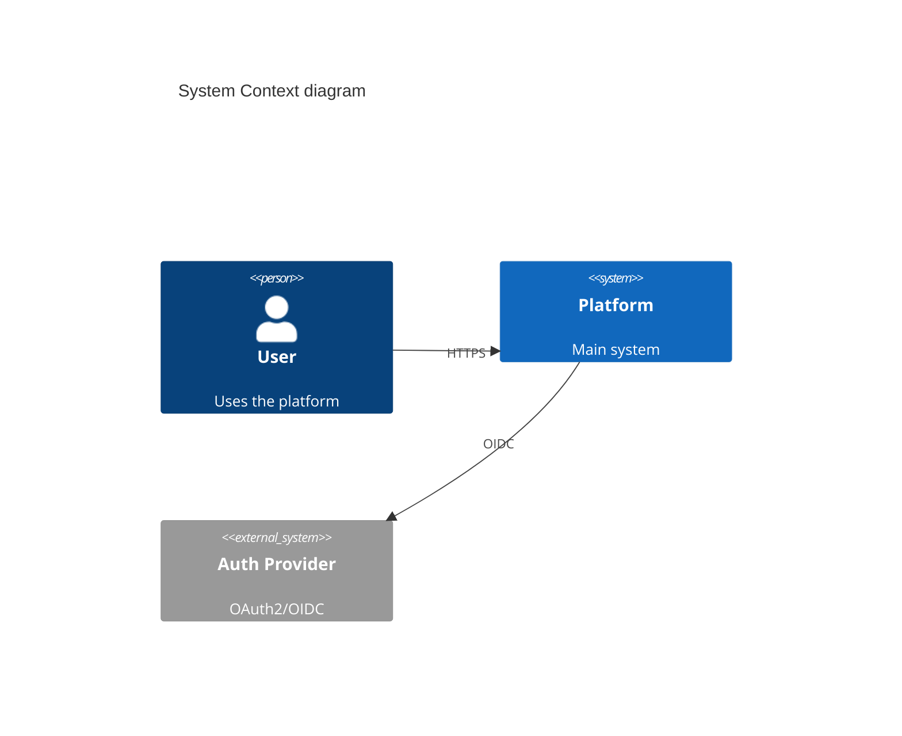

# Architecture, Design & Development

System design through code review: C4 diagrams, API design, database schema, architecture patterns, ADRs, branching, dependency management. Includes DDIA, Staff Engineer patterns, and architecture fitness functions.

## When to Use

Trigger when user:
- Designs system architecture or draws C4 diagrams
- Designs REST/GraphQL/gRPC APIs
- Creates database schemas or migrations
- Chooses architecture patterns (Clean, Hexagonal, DDD)
- Sets up branching strategy or code review workflow
- Writes Architecture Decision Records

## Step 1: System Design & C4 Diagrams

### C4 Model (Simon Brown)
Source: https://c4model.com/

4 hierarchical abstraction levels — each zooms into element from level above:

**Level 1 — Context:** System scope, users, external dependencies.
- Shows: your system as box, actors (people/systems) connected
- Audience: everyone

**Level 2 — Container:** Applications/services inside system boundary.
- Shows: web apps, APIs, databases, message buses as boxes inside system
- Labels: technology choices (e.g., "Spring Boot", "PostgreSQL")
- Audience: developers, ops

**Level 3 — Component:** Major building blocks inside a container.
- Shows: classes/packages/modules that fulfill responsibilities
- Audience: developers

**Level 4 — Code:** UML class diagram for specific component.
- Shows: classes, interfaces, relationships
- Audience: developers (rarely needed for entire system)

**Core notation:**
- Person (stick figure or box)
- Software System (box, solid or dashed border)
- Container (box with tech label)
- Component (box with tech label)
- Relationships (arrows with description + protocol)

**Key rules:**
- Don't mix abstraction levels on one diagram
- Supplement with supporting text (e.g., arc42 doc template)

### Structurizr DSL
```dsl
workspace {
  model {
    user = person "User"
    softwareSystem = softwareSystem "Platform" {
      webApp = container "Web App" "React" "TypeScript"
      api = container "API" "FastAPI" "Python"
      db = container "Database" "PostgreSQL"
    }
    user -> webApp "uses"
    webApp -> api "JSON/HTTPS"
    api -> db "SQL/TCP"
  }
}

views {
  systemContext softwareSystem {
    include *
    autolayout lr
  }
  container softwareSystem {
    include *
    autolayout lr
  }
}
```

### Mermaid Alternative


## Step 2: API Design

### REST
```yaml
# OpenAPI 3.1
openapi: 3.1.0
info:
  title: Order API
  version: 1.0.0
paths:
  /orders:
    get:
      summary: List orders
      parameters:
        - name: status
          in: query
          schema: { type: string, enum: [pending, shipped, delivered] }
      responses:
        '200':
          description: Order list
          content:
            application/json:
              schema:
                type: array
                items: { $ref: '#/components/schemas/Order' }
```

### GraphQL
```graphql
type Query {
  order(id: ID!): Order
  orders(status: OrderStatus, first: Int, after: String): OrderConnection!
}

type Order {
  id: ID!
  status: OrderStatus!
  items: [OrderItem!]!
  total: Money!
}
```

### gRPC
```protobuf
service OrderService {
  rpc GetOrder(GetOrderRequest) returns (Order);
  rpc ListOrders(ListOrdersRequest) returns (ListOrdersResponse);
}
```

### API Versioning
- **URL path**: `/v1/orders` (simplest)
- **Header**: `Accept: application/vnd.api.v1+json`
- **Query param**: `?version=1`

## Step 3: Database Schema Design

### Normalization vs Denormalization
- **3NF** for transactional systems (OLTP)
- **Denormalized** for analytics (OLAP) and read-heavy workloads
- **Event sourcing** for auditability

### Schema Patterns
```sql
-- Polymorphic association (bad)
-- Use instead: shared PK or junction table

-- Soft delete
ALTER TABLE orders ADD COLUMN deleted_at TIMESTAMP NULL;

-- Audit trail
CREATE TABLE order_audit (
  id BIGSERIAL PRIMARY KEY,
  order_id UUID NOT NULL,
  action VARCHAR(10) NOT NULL, -- INSERT, UPDATE, DELETE
  old_data JSONB,
  new_data JSONB,
  changed_at TIMESTAMP DEFAULT NOW(),
  changed_by UUID
);

-- Temporal tables (SQL:2011)
-- Use for point-in-time queries
```

### Indexing Strategy
```sql
-- Composite index for common query pattern
CREATE INDEX idx_orders_user_status ON orders(user_id, status);

-- Partial index for active records
CREATE INDEX idx_orders_active ON orders(user_id) WHERE deleted_at IS NULL;

-- GIN index for JSONB queries
CREATE INDEX idx_orders_metadata ON orders USING GIN(metadata);

-- Always EXPLAIN ANALYZE before deploying
EXPLAIN ANALYZE SELECT * FROM orders WHERE user_id = '...' AND status = 'pending';
```

### Migration Tools
| Tool | Ecosystem |
|------|-----------|
| Flyway | Java, SQL |
| Alembic | Python |
| golang-migrate | Go |
| Prisma Migrate | JS/TS |
| Atlas | Go, SQL-first |

## Step 4: Code Architecture Patterns

### Clean Architecture
```
src/
  domain/          # Entities, value objects, domain services
  application/     # Use cases, DTOs, ports
  infrastructure/  # Frameworks, DB, external services
    db/
    external/
```
Rule: dependencies point inward. Domain has zero imports from infra.

### Hexagonal Architecture (Ports & Adapters)
Source: https://alistair.cockburn.us/hexagonal-architecture/

```
src/
  domain/
    ports/
      inbound/     # Use case interfaces
      outbound/    # Repository/gateway interfaces
    model/
  adapters/
    inbound/       # REST handlers, CLI, GraphQL resolvers
    outbound/      # DB repos, HTTP clients, message publishers
```

**Core concepts:**
- **Application Core** — business logic, NO dependencies on infrastructure
- **Primary/Driving Ports** — interfaces the app exposes (use case interfaces)
- **Secondary/Driven Ports** — interfaces the app needs (repository interfaces)
- **Primary/Driving Adapters** — invoke the app (REST controllers, CLI, tests)
- **Secondary/Driven Adapters** — implement secondary ports (DB repos, message publishers)

**Dependency rule:** Dependencies point INWARD. Core never imports adapter code.

**Benefits:**
- Testable: swap adapters for mocks/fakes at boundaries
- Replaceable: swap DB, UI, transport without touching core
- Framework-independent: core doesn't know Spring/Django/Express

### DDD Strategic Patterns
Source: Eric Evans "Domain-Driven Design" (2003), Vaughn Vernon "Implementing DDD" (2013)

**Bounded Context** — explicit boundary within which domain model is defined:
- Same term can mean different things in different contexts
- Each bounded context has its own ubiquitous language

**Context Map — patterns for relationships between bounded contexts:**

| Pattern | Description |
|---------|-------------|
| Shared Kernel | Two contexts share subset of model. Changes require agreement. |
| Customer-Supplier | Downstream depends on upstream. Supplier may prioritize customer needs. |
| Conformist | Downstream conforms entirely to upstream model. No translation. |
| Anti-Corruption Layer (ACL) | Downstream translates upstream model into own model. Isolation. |
| Open Host Service | Upstream provides protocol/API for multiple consumers. |
| Published Language | Shared, documented data format (e.g., Avro schema, OpenAPI spec). |
| Separate Ways | Contexts don't integrate. Each evolves independently. |
| Partnership | Both contexts coordinate evolution together. |

**Ubiquitous Language** — shared language between developers and domain experts:
- Same terms in code, docs, conversation
- Scoped to bounded context (don't force global terms)

**Tactical Patterns (within bounded context):**
- **Entity** — identity-based equality, lifecycle
- **Value Object** — immutable, attribute-based equality
- **Aggregate** — cluster of entities/VOs, transactional consistency boundary
- **Aggregate Root** — single entry point, enforces invariants
- **Domain Event** — something that happened, immutable past-tense fact
- **Repository** — collection-like interface for aggregate persistence
- **Domain Service** — operation that doesn't belong to single entity/VO
- **Application Service** — orchestrates use cases, no business logic

**DDD Lite (pragmatic subset):**
- Start with bounded contexts + ubiquitous language
- Add aggregates + domain events when complexity warrants
- Skip full tactical patterns for CRUD domains

### Modular Monolith (start here)
```
modules/
  orders/
    api/           # Public interface
    domain/
    infrastructure/
  inventory/
    api/
    domain/
    infrastructure/
```

## Step 5: Branching Strategies

### Trunk-Based Development (recommended for SaaS)
- Single `main` branch
- Short-lived feature branches (< 1 day)
- Feature flags for incomplete work
- Deploy from main continuously

### GitFlow (for versioned releases)
```
main ← release branches
  ↑
develop ← feature branches
  ↑
hotfix branches → main
```

### Feature Flag Tools
- **LaunchDarkly** — commercial, targeting rules
- **Unleash** — open-source, self-hosted
- **Flagsmith** — open-source
- **OpenFeature** — vendor-neutral SDK standard (CNCF)

## Step 6: Code Review

### PR Standards
- Small PRs (< 400 lines ideal, < 200 best)
- Template with checklist: tests, docs, breaking changes
- Required reviewers: 1-2

### Automation Before Human Review
- Lint/format passes
- Type checking passes
- Tests pass with coverage threshold
- SAST scans clean

### pre-commit config
```yaml
repos:
  - repo: https://github.com/pre-commit/pre-commit-hooks
    hooks:
      - id: trailing-whitespace
      - id: end-of-file-fixer
  - repo: https://github.com/astral-sh/ruff-pre-commit
    hooks:
      - id: ruff
      - id: ruff-format
```

## Step 7: Dependency Management

### Renovate (preferred)
```json
{
  "$schema": "https://docs.renovatebot.com/renovate-schema.json",
  "extends": ["config:recommended"],
  "packageRules": [
    { "matchUpdateTypes": ["minor", "patch"], "automerge": true }
  ],
  "schedule": ["before 6am on Monday"]
}
```

### Security Scanning
- `npm audit`, `pip-audit`, `cargo audit`, `govulncheck`
- **Snyk**, **Socket.dev** (supply chain)

### Monorepo Tools
| Tool | Ecosystem |
|------|-----------|
| Turborepo | JS/TS |
| Nx | JS/TS/Angular |
| Bazel / Pants | Polyglot, large scale |

## Step 8: Architecture Decision Records

### ADR Format (Michael Nygard)
Source: https://adr.github.io/

```markdown
# ADR-001: Use PostgreSQL as primary database

## Status
Accepted — 2025-01-15

## Context
We need a relational database. Requirements: ACID, JSON support, full-text search.

## Decision
Use PostgreSQL 16 as primary database.

## Consequences
+ JSONB eliminates need for separate document store
- Requires more ops than managed NoSQL

## Alternatives Considered
- DynamoDB: rejected (poor relational queries)
- MongoDB: rejected (no ACID for multi-doc)
```

### MADR Enhanced Template
Source: https://adr.github.io/madr/

```markdown
# [short title of solved problem and solution]

## Context and Problem Statement
[describe context and problem]

## Decision Drivers
* [driver 1]
* [driver 2]

## Considered Options
* [option 1]
* [option 2]

## Decision Outcome
Chosen option: "[option]", because [justification].

### Consequences
* Good: ...
* Bad: ...

### Confirmation
[how to confirm implementation follows decision]

## Pros and Cons of Options

### [option 1]
* Good: ...
* Bad: ...

## More Information
[links, references]
```

### ADR Best Practices
- One ADR per significant decision
- ADRs are immutable — supersede with new ADR
- Store in repo: `docs/adr/`
- Link from code where decision applies
- Tooling: adr-tools (CLI), Log4brains (static site)

## Step 9: Architecture Fitness Functions

Source: "Building Evolutionary Architectures" (Neal Ford, Rebecca Parsons, Patrick Kua, 2017)

**Definition:** Objective integrity assessment of architecture characteristic(s).

**Types:**
| Type | Description | Example |
|------|-------------|---------|
| Atomic + Triggered | Tests single characteristic on event | Layer violation check on PR |
| Atomic + Continuous | Tests single characteristic always | Performance monitoring |
| Holistic + Triggered | Tests combination on event | Load test + resilience on deploy |
| Holistic + Continuous | Tests combination always | Chaos engineering in production |

**Examples:**

```python
# ArchUnit-style: enforce dependency rules
def test_domain_never_depends_on_infra():
    """Domain layer must not import from infrastructure."""
    rule = no_classes().that().reside_in("..domain..").should().depend_on_classes_that().reside_in("..infra..")
    rule.check(import_classes)

# Performance fitness function in CI
def test_api_latency_p99_under_200ms():
    """P99 latency must be under 200ms for /api/orders."""
    result = load_test("/api/orders", concurrent_users=100, duration="30s")
    assert result.p99_latency_ms < 200

# Resilience fitness function
def test_api_survives_db_outage():
    """API returns cached data when DB is unavailable."""
    with chaos_kill("database"):
        response = get("/api/orders")
        assert response.status == 200  # degraded but available
```

**Implementation patterns:**
- Fitness functions as CI pipeline stages (gates on PR merge)
- Dashboard of architecture metrics over time
- Versioned architecture decisions linked to fitness functions

## Step 10: Data-Intensive Design (from DDIA — Kleppmann)

### Key Principles
- Choose consistency model based on use case, not dogma
- Use event sourcing for auditability and reprocessing
- Monitor percentiles not averages (p50, p95, p99)
- "Exactly-once" is usually "effectively once" via idempotence

### Derived Data Pattern
```
Source of truth (DB) → Event log → Derived views (caches, search indexes)
```

### Schema Evolution
- Backward compatible: new code reads old data
- Forward compatible: old code reads new data
- Use Avro/Protobuf for schema evolution

## Step 10b: Platform Engineering

Source: https://backstage.io/, https://score.dev/, https://humanitec.com/, https://maturity.platformengineering.org/

Treat the platform as a product. Build an Internal Developer Platform (IDP) that gives developers golden paths — opinionated, well-supported workflows for common tasks.

### Core Concepts

| Concept | Description |
|---------|-------------|
| Internal Developer Platform (IDP) | Self-service layer abstracting infrastructure. Developers consume via APIs, CLIs, UIs. |
| Golden Paths | Pre-approved, paved roadways for common workflows (new service, deploy pipeline, observability setup). Opinionated defaults, escape hatches available. |
| Platform-as-Product | Platform team has roadmap, SLAs, internal customers. Measure developer satisfaction (DORA metrics, developer NPS). |
| Self-Service | Developers provision infrastructure, create services, manage configs without tickets. |
| Abstraction Layer | Hide complexity of K8s, cloud providers, CI/CD behind developer-friendly interfaces. |

### Backstage (Spotify → CNCF)
Source: https://backstage.io/

Developer portal — single pane of glass for services, docs, APIs, infrastructure.

- **Software Catalog:** register all services, track ownership, dependencies
- **Software Templates:** scaffold new services from golden path templates (cookiecutter-based)
- **TechDocs:** docs-as-code (Markdown in repo, rendered in Backstage)
- **Plugins:** Scaffolder, Kubernetes, GitHub Actions, SonarQube, Grafana, PagerDuty
- **RBAC:** role-based access to templates, catalog entities, plugins

### Score Spec
Source: https://score.dev/

Platform-agnostic workload specification. Developers declare workload intent; platform resolves to concrete infrastructure.

```yaml
# score.yaml
apiVersion: score.dev/v1b1
metadata:
  name: orders-service
containers:
  main:
    image: orders:latest
    variables:
      DB_HOST: ${resources.db.host}
service:
  ports:
    http:
      port: 8080
resources:
  db:
    type: postgres
```

- Decouples workload definition from infrastructure
- `score-compose`, `score-k8s` — resolve Score to Docker Compose or K8s manifests
- No vendor lock-in: same spec works across environments

### CNCF Platform Engineering Maturity Model
Source: https://maturity.platformengineering.org/

4 levels:
1. **Operators:** manual ops, tribal knowledge, ad-hoc tools
2. **Enabling:** curated tools, some self-service, basic docs
3. **Scalable:** golden paths, self-service portal, platform team with SLAs
4. **Optimizing:** data-driven iteration, high DORA metrics, platform NPS tracked

### Implementation Checklist
- Inventory existing tools and workflows (pain point mapping)
- Start with one golden path: new service → CI/CD → observability in < 30 min
- Build on Backstage or similar portal — don't build from scratch
- Measure: time-to-first-deploy, onboarding time, platform NPS
- Iterate: treat platform team as product team with sprints and backlog

## Step 11: Codebase Deepening

### Key Concepts
- **Depth** — leverage at interface: lots of behavior behind small interface
- **Seam** — where behavior can be altered without editing in place
- **Deletion test**: delete module. If complexity vanishes → pass-through

### Process
1. Read domain glossary + ADRs
2. Map modules, interfaces, seams
3. Identify shallow modules
4. Propose deepening: extract, consolidate, reduce coupling

## Step 12: Event-Driven Architecture (EDA)

Source: https://martinfowler.com/articles/201701-event-driven.html

Components communicate by producing and consuming events rather than direct calls.

**Patterns:**
- **Event Notification:** Producer sends event, doesn't care about consumers. Loose coupling.
- **Event-Carried State Transfer:** Event carries enough data so consumer doesn't need to call back.
- **Choreography:** Services react to events, no central coordinator.
- **Orchestration:** Central coordinator (saga orchestrator) manages workflow.

**Event brokers:** Kafka, RabbitMQ, AWS EventBridge, NATS, Pulsar

**Key concepts:** eventual consistency, idempotent consumers, dead letter queues, schema registry (Avro/Protobuf)

## Step 13: CQRS + Event Sourcing

### CQRS (Command Query Responsibility Segregation)
Source: https://martinfowler.com/bliki/CQRS.html (Greg Young, 2010)

Separate write model (commands) from read model (queries).

```
Commands → Write Side (Domain Model) → Events → Read Side (Projections) → Queries
```

- Write side: domain model, validates commands, emits events
- Read side: denormalized projections, optimized for specific queries
- Can use different databases for read/write (polyglot persistence)
- Tradeoff: eventual consistency between write and read

### Event Sourcing
Source: https://martinfowler.com/eaaDev/EventSourcing.html (Greg Young)

Instead of storing current state, store all state changes as immutable sequence of events.

```
Events: [OrderCreated, ItemAdded, ItemAdded, PaymentProcessed, OrderShipped]
Current state = replay events from beginning (or from snapshot)
```

**Benefits:**
- Complete audit trail built-in
- Temporal queries: reconstruct state at any point in time
- Pairs naturally with CQRS

**Challenges:**
- Event schema migration complexity
- Querying current state requires building read models
- Event store choice matters (EventStoreDB, Axon, Kafka-based)

Source: https://eventstore.com/blog/what-is-event-sourcing/

## Step 14: Microservices Patterns

Source: https://microservices.io/patterns/index.html (Chris Richardson)

### Saga Pattern
Distributed transactions across microservices via sequence of local transactions.

- **Choreography:** Each service listens for events, performs action, publishes next event
- **Orchestration:** Central orchestrator coordinates steps, tells services what to do
- Compensating transactions for rollback (no 2PC)

### Circuit Breaker
Source: https://microservices.io/patterns/reliability/circuit-breaker.html

Track failures. When threshold exceeded, "open" circuit, fail fast.

```
Closed → (failures exceed threshold) → Open → (timeout) → Half-Open → (probe succeeds) → Closed
```

**Implementations:** Resilience4j, Polly (.NET), AWS App Mesh

### API Gateway
Source: https://microservices.io/patterns/apigateway.html

Single entry point that routes, aggregates, and handles cross-cutting concerns.

**Responsibilities:** request routing, composition, protocol translation, auth, rate limiting, SSL termination

**API Gateway vs Service Mesh:**
- Gateway: north-south traffic (external → internal)
- Service Mesh: east-west traffic (service → service)

## Step 15: Service Mesh

Source: https://istio.io/latest/docs/concepts/, https://cilium.io/

Infrastructure layer for service-to-service communication. Two architectural approaches:

**Sidecar proxy pattern** (traditional): one proxy per pod (Envoy, linkerd2-proxy).
**Sidecar-less / eBPF-based** (next-gen): kernel-level packet processing, no per-pod proxy.

| Feature | Istio | Linkerd |
|---------|-------|---------|
| Proxy | Envoy | Rust-based (linkerd2-proxy) |
| Complexity | High | Low |
| mTLS | ✓ | ✓ |
| Traffic management | ✓ | ✓ |
| Observability | ✓ | ✓ |
| CNCF status | Graduated | Graduated |

**Linkerd2-proxy (Rust-based):**
- Memory-safe, no CVEs from buffer overflows
- Minimal resource footprint (~10MB RSS vs Envoy ~50MB)
- Sub-millisecond p99 latency overhead
- Source: https://linkerd.io/2.15/overview/

**Cilium Service Mesh (eBPF-based):**
Source: https://cilium.io/

- Sidecar-less: eBPF programs in Linux kernel handle networking, security, observability
- No per-pod proxy container — reduced resource overhead and latency
- Replaces kube-proxy (Cilium CNI), adds service mesh, network policy, Hubble observability
- mTLS via eBPF socket-level encryption (no proxy negotiation)
- CNCF Graduated project
- Tradeoff: requires Linux kernel 5.10+, less mature traffic management than Istio

**When to choose:**
| Scenario | Recommendation |
|----------|---------------|
| Max features, complex traffic rules | Istio + Envoy |
| Low ops overhead, memory safety | Linkerd |
| Kernel-level performance, minimal sidecar overhead | Cilium |
| Hybrid: CNI + mesh in one | Cilium |

## Step 16: Kubernetes Gateway API

Source: https://gateway-api.sigs.k8s.io/

Replaces Ingress resource as the standard for K8s traffic routing. Richer, role-oriented, extensible.

**Why Gateway API over Ingress:**
- Expressive routing: header matching, method matching, weighted backends — natively
- Role-oriented: InfrastructureProvider, ClusterOperator, ApplicationDeveloper roles
- Protocol support: HTTP, HTTPS, gRPC, TCP, UDP, TLS in one API
- Extensible: policy attachment model (attach rate limiting, auth, CORS per route)
- Cross-namespace routing (ReferenceGrant)

**Core resources:**
```yaml
# GatewayClass — infrastructure provider (e.g., Envoy, Cilium, Istio)
apiVersion: gateway.networking.k8s.io/v1
kind: GatewayClass
metadata:
  name: cilium
spec:
  controllerName: io.cilium/gateway-controller
---
# Gateway — cluster operator configures listeners
apiVersion: gateway.networking.k8s.io/v1
kind: Gateway
metadata:
  name: main-gateway
  namespace: infra
spec:
  gatewayClassName: cilium
  listeners:
    - name: https
      protocol: HTTPS
      port: 443
      tls:
        mode: Terminate
        certificateRefs:
          - name: wildcard-cert
---
# HTTPRoute — app developer defines routing
apiVersion: gateway.networking.k8s.io/v1
kind: HTTPRoute
metadata:
  name: orders-route
  namespace: orders
spec:
  parentRefs:
    - name: main-gateway
      namespace: infra
  hostnames: ["orders.example.com"]
  rules:
    - matches:
        - path: { type: PathPrefix, value: /api/orders }
      backendRefs:
        - name: orders-svc
          port: 8080
          weight: 90
        - name: orders-svc-canary
          port: 8080
          weight: 10
```

**Policy attachments:** attach auth, rate limiting, CORS, retries to routes without modifying route definitions.

**Implementations:** Cilium Gateway API, Istio Gateway API, Envoy Gateway, NGINX Gateway Fabric, Traefik

## Step 17: API Gateway Tools

| Tool | Base | Key Features | Source |
|------|------|-------------|--------|
| Kong | OpenResty/Nginx | Plugin architecture, JWT, OAuth2, rate limiting | https://docs.konghq.com/gateway/latest/ |
| Ambassador | Envoy | K8s-native, CRD-based, GitOps friendly | https://www.getambassador.io/docs/emissary/latest/ |
| Traefik | Go | Auto-discovery, Let's Encrypt, Docker/K8s native | https://doc.traefik.io/traefik/ |
| AWS API Gateway | Managed | Serverless-friendly, pay-per-call | https://docs.aws.amazon.com/apigateway/ |

## Step 18: Green Software & Carbon-Aware Computing

Source: ThoughtWorks Technology Radar — ADOPT

Reduce carbon footprint of software systems. Green Software Foundation patterns.

### Principles
- **Energy Efficiency:** minimize energy consumed per request (efficient code, fewer round trips)
- **Carbon Awareness:** shift compute to times/locations with cleaner energy grid
- **Hardware Efficiency:** maximize utilization, extend hardware lifespan, choose efficient hardware

### Carbon-Aware Patterns
```yaml
# Shift batch workloads to low-carbon windows
# Use carbon-aware scheduler (e.g., KEDA + Carbon Aware SDK)
triggers:
  - type: carbon-intensity
    carbonIntensityThreshold: 200  # gCO2/kWh
    region: westeurope
```

- **Time-shifting:** run batch jobs when grid carbon intensity is lowest (Carbon Aware SDK)
- **Region-shifting:** deploy to regions with cleaner grids (electricityMap API provides real-time data)
- **Demand shaping:** reduce precision/quality during high-carbon periods (e.g., lower video resolution)
- **Measurement:** track carbon per request, carbon per deploy (Cloud Carbon Footprint, Green Metrics Tool)
- **Sustainability scorecards:** include carbon cost in PR review and architecture fitness functions

### Implementation Checklist
- Instrument: add carbon intensity metrics to CI/CD dashboards
- Measure: Cloud Carbon Footprint (CCF) for cloud usage
- Shift: KEDA carbon-aware scaler for batch workloads
- Optimize: profile hot paths, reduce idle resources, right-size instances
- Report: include sustainability section in ADRs and architecture reviews

## Step 19: API Governance — Structured Logging & Correlation IDs

Distributed systems require consistent observability. Enforce structured logging and correlation ID propagation as team standard.

### Correlation ID Standard
```yaml
# Every service MUST propagate these headers:
X-Request-ID: uuid-v4        # unique per request, generated at edge
X-Correlation-ID: uuid-v4    # groups related requests (saga, batch)
X-Trace-ID: hex-128          # OpenTelemetry trace ID (if using OTel)
```

- Generate `X-Request-ID` at API gateway / load balancer
- Propagate all three headers across service calls (HTTP, gRPC metadata, message headers)
- Log all three in every structured log entry
- Use correlation ID in error responses for support debugging

### Structured Logging Format
```json
{
  "timestamp": "2025-01-15T10:30:00Z",
  "level": "INFO",
  "service": "orders-service",
  "traceId": "abc123",
  "spanId": "def456",
  "requestId": "uuid-v4",
  "correlationId": "uuid-v4",
  "message": "Order created",
  "orderId": "ORD-001",
  "userId": "USR-001",
  "duration_ms": 42
}
```

- Use JSON format for machine parsing
- Include: timestamp (ISO 8601), level, service name, trace/span IDs, message, domain context
- Library recommendations: structlog (Python), pino (Node), zerolog (Go), tracing (Rust)
- Aggregate to centralized log platform (ELK, Loki, CloudWatch)

### Enforcement
- Add to CI: lint log statements for structured format compliance
- Include in PR template: "Does this PR propagate correlation IDs across all call boundaries?"
- Architecture fitness function: test that correlation headers are present in response headers

## Pitfalls

1. **Don't start with microservices** — modular monolith first
2. **Don't design API without OpenAPI/SDL first**
3. **Don't use GitFlow for SaaS** — trunk-based + feature flags
4. **Don't skip EXPLAIN ANALYZE** — index problems compound
5. **Don't review style manually** — automate lint/format
6. **Don't write ADRs after the fact** — write during decision
7. **Don't ignore Hyrum's Law** — all observable behaviors become contracts
8. **Don't mix C4 levels** — one abstraction per diagram
9. **Don't skip fitness functions** — architecture erodes without automated checks
10. **Don't force DDD on CRUD** — DDD Lite (bounded contexts + ubiquitous language) is enough
11. **Don't forget context mapping** — bounded contexts need explicit integration patterns
12. **Don't build platform without measuring** — track developer time-to-first-deploy, platform NPS
13. **Don't use Ingress for new K8s projects** — Gateway API is the standard, richer and role-oriented
14. **Don't ignore carbon cost** — include sustainability in architecture fitness functions
15. **Don't allow unstructured logging** — enforce structured JSON + correlation IDs from day one
