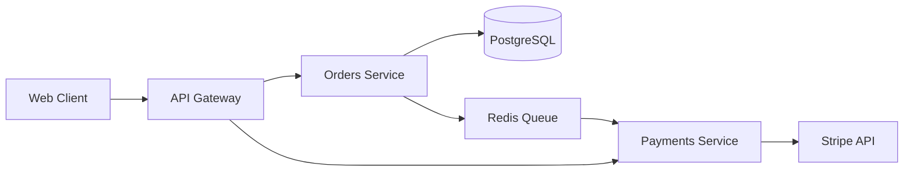

# PRD to Production

End-to-end workflow: PRD → design doc → implementation → code review → testing → deployment → monitoring → retrospective. Includes Ship/Show/Ask branching and design doc templates.

## When to Use

Trigger when user:
- Starts a new feature from scratch
- Writes PRD or design doc
- Plans implementation workflow
- Defines branching strategy for a feature
- Reviews end-to-end process

## Step 1: PRD (Product Requirements Document)

### PRD Structure
Source: https://www.atlassian.com/software/jira/guides/use-cases/what-is-a-prd

```
1. Overview / Problem Statement
   - What problem are we solving? For whom? Why now?

2. Goals & Success Metrics
   - Measurable outcomes. OKRs if applicable.

3. User Stories / Scenarios
   - "As a [user], I want [capability] so that [outcome]."

4. Requirements
   - Functional: what it must do.
   - Non-functional: performance, security, accessibility.

5. Scope / Out of Scope
   - Explicit boundaries. What NOT building.

6. Design / UX
   - Wireframes, user flows, interaction notes.

7. Technical Considerations
   - Dependencies, constraints, API contracts.

8. Milestones / Timeline
   - Phases, release plan.

9. Open Questions
   - Unresolved decisions.

10. Appendix / References
```

### PRD-lite (One-Pager)
For small features. Problem + Solution + Success.

```
# [Feature Name]

## Problem
[One paragraph: what's broken or missing]

## Solution
[One paragraph: what we'll build]

## Success
[How we know it worked: metric + target]

## Out of Scope
[What we're explicitly NOT building]
```

### YC-Style Fast Iteration PRD
Source: Paul Graham's "Launch Fast" + YC playbook.

Lean PRD for speed-to-market. Ship v0.1, measure, iterate.

```
# [Feature Name] — v0.1 Launch Spec

## Hypothesis
[One sentence: what we believe users need]

## Minimum Viable Slice
[Smallest thing that tests the hypothesis. 1-2 weeks max.]

## Kill Metric
[Metric that proves hypothesis wrong. If X < Y after Z days, pivot.]

## Success Metric
[Metric that proves hypothesis right. If X > Y, double down.]

## Measurement Plan
[What to instrument from day 1. Events, funnels, cohorts.]

## Iteration Backlog
[Post-v0.1 ideas — only populated after first measurement]
```

**Rules:**
- No feature > 2 weeks in first cut
- Ship with instrumentation, not just functionality
- Every PRD has a kill metric — precommit to abandoning if wrong
- v0.1 scope = absolute minimum to learn
- Iterate weekly based on real data, not opinions

### Amazon Working Backwards Press Release
Source: Amazon press release FAQ method.

Write the press release FIRST. Work backwards to requirements.

```
# Press Release: [Product/Feature Name]

## Headline
[Customer-benefit-focused headline]

## Sub-headline
[One sentence: who benefits and how]

## Problem
[Paragraph: the pain point, in customer language]

## Solution
[Paragraph: how the product solves it, in customer language]

## Quote from Spokesperson
[What the PM/CEO would say. Customer empathy, not tech.]

## Customer Experience
[Step-by-step: what the customer does, sees, feels]

## Call to Action
[What the customer does next]

# FAQ (Internal)

## Customer FAQ
Q: [Anticipated customer questions]
A: [Answers in plain language]

## Internal FAQ
Q: Why build this now?
Q: What's the tech approach?
Q: What are the dependencies?
Q: What's the cost/effort?
Q: What are the risks?
```

**Rules:**
- If the press release is boring, the product is boring — rewrite
- FAQ section surfaces hidden assumptions early
- Share press release with customers before building
- Customer language only — no jargon in PR section

## Step 2: Design Doc / RFC

### Google Design Doc Template
Source: https://www.industrialempathy.com/posts/design-docs-at-google/

```
1. Authors
2. Status (Draft / In Review / Approved / Superseded)
3. Background / Context
   - Why are we doing this? What is the problem?
4. Goals & Non-Goals
   - Explicit non-goals prevent scope creep.
5. Overview
   - High-level approach, one paragraph.
6. Detailed Design
   - Architecture, data models, APIs, sequence diagrams.
   - Include error handling, edge cases.
7. Alternatives Considered
   - What else was evaluated? Why rejected?
8. Cross-Cutting Concerns
   - Security, privacy, monitoring, logging, i18n.
9. Operations
   - Rollout plan, feature flags, rollback strategy.
10. Risks & Tradeoffs
11. Open Questions
12. Milestones / Timeline
13. Appendix
```

### Enhanced Design Doc: Observability & SLO Sections

Add these sections to any design doc for production-grade features:

```
14. Observability Requirements
    a. Instrumentation Plan
       - Metrics: [which RED/USE metrics to emit]
       - Logs: [structured log format, levels, correlation IDs]
       - Traces: [span boundaries, propagation strategy]
    b. Dashboards
       - Service health dashboard (latency, error rate, throughput)
       - Business metrics dashboard (conversion, adoption)
       - Infrastructure dashboard (CPU, memory, disk, network)
    c. Alerting
       - Burn-rate alerts (SLO-based)
       - Anomaly detection alerts
       - Runbook links for each alert

15. SLO Definition
    a. SLIs (Service Level Indicators)
       - Availability: [e.g., ratio of successful requests]
       - Latency: [e.g., p99 < 250ms for /api/v1/orders]
       - Throughput: [e.g., 10K requests/sec sustained]
       - Correctness: [e.g., 99.99% of orders processed correctly]
    b. SLOs (Service Level Objectives)
       - [e.g., 99.9% availability over 30-day window]
       - [e.g., p95 latency < 100ms, p99 < 250ms]
    c. Error Budget
       - Budget: [e.g., 0.1% = 43.2 min downtime/month]
       - Policy: what happens when budget exhausted
       - Burn rate thresholds: [e.g., alert at 2x burn rate]
    d. Dependencies
       - Upstream SLOs that constrain this service's SLO
       - Downstream SLOs this service constrains
```

**Why this matters:**
- Forces teams to think about production behavior before writing code
- SLOs create shared language between eng and product
- Error budgets enable data-driven release velocity decisions
- Observability as first-class design concern, not afterthought

### RFC (Request for Comments) Process
Source: https://github.com/reactjs/rfcs

1. Author writes RFC doc
2. Shared with stakeholders (Slack channel, doc link, PR)
3. Review period (typically 1-5 business days)
4. Reviewers comment inline. Author addresses.
5. Final approver signs off (usually tech lead or architect)
6. RFC becomes source of truth for implementation

**RFC vs Design Doc:**
- RFC: process-oriented, emphasizes review/approval workflow
- Design Doc: content-oriented, emphasizes technical detail
- Many orgs use both terms interchangeably

## Step 3: Ship / Show / Ask Branching

Source: https://martinfowler.com/articles/ship-show-ask.html

Three categories for branch merging decisions:

### SHIP
- Merge directly to main. No PR, no review needed.
- For: tiny changes, typo fixes, config tweaks, doc-only.
- Trust the author. Speed matters here.

### SHOW
- Merge to main immediately. Open PR afterward for visibility/async review.
- For: small, low-risk changes that still benefit from eyes.
- "Show, don't ask." Review happens after merge.

### ASK
- Open PR, wait for review and approval before merging.
- For: architectural changes, new dependencies, security-sensitive code, public API changes.
- Standard PR workflow. No shortcuts.

### Why This Matters
- Not all changes need same review rigor
- Reduces PR bottlenecks on trivial changes
- Keeps focus on high-signal reviews (ASK items)
- Maintains trunk-based development velocity
- Works with feature flags for safe production deploys

### Implementation
- Define team agreement: which changes fall in each bucket
- SHIP: author self-merges. Log it.
- SHOW: merge first, PR after. Bot can enforce opening PR.
- ASK: standard branch protection rules. Require approvals.

## Step 4: Implementation Workflow

```
PRD Written
    │
    ▼
Design Doc / RFC
    │
    ▼
Implementation
    ├── Ship/Show/Ask classification per change
    ├── CI runs (lint, test, build)
    ├── Code review per classification
    └── Feature flags for progressive rollout
    │
    ▼
Testing & QA
    ├── Unit tests (fast, isolated)
    ├── Integration tests (module boundaries)
    ├── E2E tests (critical user flows)
    └── Staging environment validation
    │
    ▼
Deployment
    ├── Canary or progressive rollout
    ├── Monitoring, alerting
    └── Rollback plan ready
    │
    ▼
Monitoring & Observability
    ├── SLIs/SLOs defined
    ├── Error budgets tracked
    └── Dashboards created
    │
    ▼
Retrospective
    ├── What went well?
    ├── What could improve?
    └── 1-3 action items
```

## Step 5: Code Review

See `sdlc-adversarial-review` for full review process.

**Quick checklist:**
- [ ] PR < 400 LOC (or justified)
- [ ] Design reviewed (right approach?)
- [ ] Security reviewed (OWASP Top 10)
- [ ] Tests present and passing
- [ ] Comments explain WHY
- [ ] No hardcoded secrets

**Google code review SLA:** respond within 4 hours.

## Step 6: Testing

See `sdlc-testing-qa` for full testing process.

**Quick checklist:**
- [ ] Unit tests for business logic
- [ ] Integration tests for module boundaries
- [ ] E2E tests for critical flows
- [ ] Coverage > 80%
- [ ] No flaky tests

## Step 7: Deployment

See `sdlc-deployment` for full deployment strategies.

**Quick checklist:**
- [ ] Canary or progressive rollout
- [ ] Health checks configured
- [ ] Rollback plan ready
- [ ] Monitoring and alerting active
- [ ] Feature flags for gradual rollout

## Step 8: Monitoring

See `sdlc-observability` for full observability process.

**Quick checklist:**
- [ ] SLIs defined (availability, latency)
- [ ] SLOs set (99.9%, p99 < 250ms)
- [ ] Error budgets tracked
- [ ] Dashboards created
- [ ] Alerts configured (burn-rate based)

## Step 9: Retrospective

See `sdlc-retrospective` for full retrospective formats.

**Quick checklist:**
- [ ] Format chosen (Start/Stop/Continue, 4Ls, Sailboat)
- [ ] Prime Directive read
- [ ] 1-3 action items with owners
- [ ] Previous actions reviewed

## End-to-End Checklist

```
□ PRD written (problem, goals, stories, requirements, scope)
□ Design doc / RFC reviewed and approved
□ Implementation plan (tasks, timeline, feature flags)
□ Code review (Ship/Show/Ask classification)
□ Tests (unit, integration, e2e)
□ Staging validation
□ Deployment plan (canary, rollback)
□ Monitoring (SLIs, SLOs, dashboards, alerts)
□ Retrospective (action items with owners)
□ Documentation updated
□ Stakeholders notified
```

## Step 10: Platform Engineering

### Internal Developer Platforms (IDP)

Source: https://tag-app-delivery.cncf.io/whitepapers/platforms/

IDP = self-service abstraction layer between infra and devs. Reduces cognitive load.

**Key components:**
- Service catalog (what exists, who owns it)
- Self-service provisioning (databases, queues, envs)
- Golden path templates (best practices built-in)
- Observability portal (logs, metrics, traces linked to services)
- RBAC + policy-as-code (OPA/Kyverno gates)

### Backstage (Spotify)
Source: https://backstage.io/docs/

CNCF Incubating. Developer portal + scaffolder + catalog.

**Core features:**
- **Software Catalog:** register all services, APIs, data pipelines
- **Software Templates:** scaffolder creates new services from templates
- **TechDocs:** docs-as-code rendered in portal
- **Plugins:** 100+ community plugins (K8s, ArgoCD, Grafana, PagerDuty)

Source: https://github.com/backstage/backstage

### Ephemeral Environments

PR-based preview environments:

```
1. PR opened → CI builds image, tags with PR number
2. ApplicationSet PR generator detects new PR
3. Renders Application pointing to PR-specific overlay
4. ArgoCD syncs new namespace (pr-123.myapp.staging.example.com)
5. PR merged → namespace deleted, Application removed
```

**Tools:** Argo CD ApplicationSets, Garden.io, Uffizzi, Loft vCluster

#### Argo CD ApplicationSets (PR Generator)
```yaml
apiVersion: argoproj.io/v1alpha1
kind: ApplicationSet
metadata:
  name: pr-preview
spec:
  generators:
    - pullRequest:
        github:
          owner: myorg
          repo: myapp
          tokenRef:
            secretName: github-token
            key: token
        requeueAfterSeconds: 30
  template:
    metadata:
      name: 'pr-{{number}}'
    spec:
      project: default
      source:
        repoURL: https://github.com/myorg/myapp
        targetRevision: '{{head_sha}}'
        path: k8s/overlay/preview
      destination:
        server: https://kubernetes.default.svc
        namespace: 'pr-{{number}}'
  templatePatch: |
    spec:
      source:
        helm:
          parameters:
            - name: ingress.host
              value: 'pr-{{number}}.preview.example.com'
```

#### Garden.io
Source: https://docs.garden.io/

Define full stack in `garden.yml`. Spin up dev/preview envs per PR.

```yaml
# garden.yml
kind: Deploy
name: api
type: container
dependencies: [build-api]
spec:
  image: ${actions.build.api.outputs.deploymentImageId}
  ports:
    - name: http
      containerPort: 8080
  ingresses:
    - path: /
      port: http
  env:
    DATABASE_URL: postgres://...
```

#### Uffizzi
Source: https://docs.uffizzi.com/

GitHub Action-based preview environments. No cluster needed.

```yaml
# .github/workflows/uffizzi-preview.yml
on:
  pull_request:
    types: [opened, reopened, synchronize, closed]
jobs:
  preview:
    uses: UffizziCloud/preview-action@v2
    with:
      compose-file: docker-compose.uffizzi.yml
    permissions:
      contents: read
      pull-requests: write
```

**Comparison:**

| Feature | Argo CD AppSets | Garden.io | Uffizzi |
|---|---|---|---|
| Cluster needed | Yes (existing) | Yes (existing) | No (SaaS) |
| Config complexity | Medium | Low | Low |
| Full-stack support | Manual overlays | Built-in | Docker Compose |
| Best for | K8s-native teams | Multi-service dev | OSS/small teams |
| Cost | Self-hosted | Self-hosted/paid | SaaS free tier |

## DORA 2024 Insights

Source: https://dora.dev/research/2024/

### Documentation Quality
- Documentation quality is a **strong predictor** of organizational performance
- Teams with high doc quality have 2x+ better software delivery performance
- Doc quality = accuracy, findability, freshness, completeness
- Docs-as-code (in repo, reviewed in PRs) correlates with better outcomes

### AI-Augmented Development
- AI coding assistants (Copilot, etc.) show **moderate productivity gains**
- Gains strongest for: boilerplate, tests, docs, unfamiliar languages
- Gains weakest for: architecture decisions, complex debugging, novel logic
- **Risk:** over-reliance on AI without code review degrades quality
- **Recommendation:** AI augments review, not replaces it. Pair AI output with human judgment.

### AI-Augmented Development Workflow (Expanded)
Source: DORA 2024 — AI usage across the SDLC, not just code generation.

**Where AI helps most (DORA findings):**
1. **Code review:** AI flags style issues, security patterns, test gaps before human review
2. **Test generation:** AI generates test scaffolds, edge cases, property-based tests
3. **Documentation:** AI drafts PR descriptions, changelogs, API docs from diffs
4. **Incident response:** AI triages alerts, suggests root cause, drafts postmortems

**Where AI hurts (anti-patterns):**
- Blind acceptance of AI-generated code without understanding
- AI-generated tests that pass but don't test meaningful behavior
- Over-reliance reducing developer skill atrophy
- AI suggestions that introduce subtle bugs in concurrent/security code

**Recommended AI integration points in this workflow:**

```
PRD Step:         AI assists with user story expansion, acceptance criteria
Design Doc:       AI reviews for completeness, suggests missing sections
Implementation:  AI generates boilerplate, suggests patterns
Code Review:      AI pre-reviews for style/security/smell BEFORE human review
Testing:          AI generates test scaffolds, humans validate coverage quality
Deployment:       AI generates deployment configs, validates against policy
Monitoring:       AI triages alerts, suggests runbook actions
Retrospective:    AI summarizes PR data, identifies patterns in reviews
```

**AI review integration pattern:**
```yaml
# .github/workflows/ai-review.yml
name: AI Pre-Review
on: [pull_request]
jobs:
  ai-review:
    runs-on: ubuntu-latest
    steps:
      - uses: ai-reviewer/action@v2
        with:
          focus: security,performance,test-coverage
          # AI reviews first, human reviewer sees AI comments
          mode: pre-review
          # Do NOT auto-approve — always require human sign-off
          auto-approve: false
```

**Metrics to track AI impact:**
- PR cycle time (before/after AI adoption)
- Defect escape rate (are AI-reviewed PRs higher quality?)
- Review comment density (are humans finding fewer issues?)
- Test coverage delta (is AI generating meaningful tests?)

### Key Takeaways for This Workflow
1. Write docs in the PRD/Design Doc step — treat them as first-class deliverables
2. Use AI for code generation in implementation, but enforce Ship/Show/Ask review
3. Track doc freshness as a team metric (stale docs = tech debt)
4. Invest in doc tooling (backstage TechDocs, Docusaurus, mkdocs)

## Score Spec (Workload Specification)

Source: https://score.dev/

Score is platform-agnostic workload spec. Defines what workload needs, not how platform provides it.

```yaml
# score.yaml
apiVersion: score.dev/v1b1
metadata:
  name: orders-api
  annotations:
    score.dev/description: "Orders API service"

containers:
  main:
    image: ${resources.container-image}
    variables:
      PORT: "8080"
      DATABASE_URL: ${resources.db.connection-string}
      REDIS_URL: ${resources.cache.connection-string}
    files:
      - target: /app/config.yaml
        content: |
          log_level: info
    resources:
      limits:
        memory: "512Mi"
        cpu: "500m"

service:
  ports:
    http:
      port: 8080

resources:
  container-image:
    type: container-image
  db:
    type: postgres
  cache:
    type: redis
```

**Why Score:**
- One spec, many targets (K8s, Docker Compose, Nomad, PaaS)
- Separates "what I need" from "how platform provides it"
- Enables self-service: devs declare needs, platform fulfills
- Works with Humanitec, score-compose, score-k8s

**Integration with this workflow:**
- PRD defines business requirements
- Design Doc defines technical approach + observability + SLOs
- Score spec defines workload resource requirements
- Platform team maps Score resources to actual infra

## Technical Specification Template

Use after design doc approval, before implementation begins. Captures contract-level detail.

### API Specification

```yaml
# specs/api.yaml (OpenAPI 3.1)
openapi: 3.1.0
info:
  title: [Service Name]
  version: 1.0.0
paths:
  /api/v1/resource:
    get:
      summary: [What it does]
      parameters: [query/path params with types and constraints]
      responses:
        '200':
          description: Success
          content:
            application/json:
              schema: { $ref: '#/components/schemas/Resource' }
        '400': { description: Validation error, content: { application/json: { schema: { $ref: '#/components/schemas/Error' } } } }
        '401': { description: Unauthorized }
        '429': { description: Rate limited }
        '500': { description: Internal error }
components:
  schemas:
    Resource:
      type: object
      required: [id, created_at]
      properties:
        id: { type: string, format: uuid }
        created_at: { type: string, format: date-time }
    Error:
      type: object
      required: [code, message]
      properties:
        code: { type: string }
        message: { type: string }
        details: { type: array, items: { type: object } }
```

### Data Model

```
# specs/data-model.md

## Entity: [Name]
- Table: [table_name]
- Primary key: [id type]
- Indexes: [list with rationale]
- Constraints: [unique, foreign key, check]

| Field       | Type      | Nullable | Default   | Description       |
|-------------|-----------|----------|-----------|-------------------|
| id          | uuid      | no       | gen_...   | Primary key       |
| created_at  | timestamp | no       | now()     | Creation time     |
| updated_at  | timestamp | no       | now()     | Last update       |

## Relationships
- [Entity A] 1:N [Entity B] via [foreign_key]
- Cascade rules: [delete cascade / restrict / set null]

## Migration Strategy
- Forward-only migrations (no rollback scripts)
- Backward-compatible schema changes only in shared tables
- Blue-green compatible: schema works with N and N+1 code versions
```

### Error Handling Strategy

```
# specs/error-handling.md

## Error Taxonomy
| Code   | Category     | Retryable | User Action          |
|--------|-------------|-----------|----------------------|
| 400    | Validation  | No        | Fix input            |
| 401    | Auth        | No        | Re-authenticate      |
| 403    | Authorization | No      | Request access       |
| 404    | Not Found   | No        | Check resource ID    |
| 409    | Conflict    | Maybe     | Retry or resolve     |
| 429    | Rate Limit  | Yes       | Backoff + retry      |
| 500    | Internal    | Yes       | Retry, then escalate |
| 503    | Unavailable | Yes       | Retry with backoff   |

## Error Response Format
```json
{
  "error": {
    "code": "VALIDATION_FAILED",
    "message": "Human-readable description",
    "details": [
      { "field": "email", "issue": "invalid format", "value": "abc" }
    ],
    "request_id": "req-uuid",
    "timestamp": "2024-01-15T10:30:00Z"
  }
}
```

## Retry Policy
- Exponential backoff: base 1s, max 30s, jitter ±50%
- Max retries: 3 for idempotent operations, 0 for non-idempotent
- Circuit breaker: open after 5 consecutive failures, half-open after 30s

## Observability Hooks
- Every error emits structured log: {error_code, request_id, user_id, duration_ms}
- Error rate tracked per endpoint as SLI input
- Anomaly alert on error rate > 2x baseline
```

### Observability Spec

```
# specs/observability.md

## Structured Logging Format
```json
{
  "timestamp": "ISO8601",
  "level": "INFO|WARN|ERROR",
  "service": "service-name",
  "trace_id": "otel-trace-id",
  "span_id": "otel-span-id",
  "request_id": "req-uuid",
  "user_id": "user-uuid",
  "method": "GET",
  "path": "/api/v1/resource",
  "status": 200,
  "duration_ms": 42,
  "message": "Human readable"
}
```

## Metrics (OpenTelemetry)
| Metric Name              | Type      | Labels                      | Description               |
|--------------------------|-----------|-----------------------------|---------------------------|
| http_request_duration_ms | Histogram | method, path, status        | Request latency           |
| http_requests_total      | Counter   | method, path, status        | Total requests            |
| db_query_duration_ms     | Histogram | operation, table            | Database query latency    |
| queue_depth              | Gauge     | queue_name                  | Current queue depth       |

## Tracing
- Propagate W3C traceparent header
- Span boundaries: HTTP handler → service → repository → external call
- Sample rate: 100% for errors, 10% for success (adjust per traffic)

## Dashboards (minimum)
1. Service health: latency p50/p95/p99, error rate, throughput
2. Business metrics: conversion, adoption, feature usage
3. Infrastructure: CPU, memory, disk I/O, network
```

## PRD-to-Production Automation Patterns

### GitOps Workflow

Source: https://opengitops.dev/

```
PRD → Design Doc → Code → PR → CI → Image → Git Repo → ArgoCD/Flux → Cluster

All infrastructure and app config lives in Git. No kubectl apply in CI.
ArgoCD/Flux watches Git, reconciles cluster state to desired state.
```

**GitOps principles:**
1. Declarative: desired state described declaratively in Git
2. Versioned: Git is single source of truth, full audit trail
3. Automated: agents pull and reconcile, CI never pushes to cluster
4. Self-healing: drift detected and corrected automatically

**GitOps repo structure:**
```
environments/
├── base/
│   ├── kustomization.yaml
│   ├── deployment.yaml
│   ├── service.yaml
│   └── hpa.yaml
├── staging/
│   ├── kustomization.yaml
│   └── patches/
│       └── replicas.yaml
└── production/
    ├── kustomization.yaml
    └── patches/
        ├── replicas.yaml
        └── resources.yaml
```

**ArgoCD Application (GitOps):**
```yaml
apiVersion: argoproj.io/v1alpha1
kind: Application
metadata:
  name: orders-api-production
  namespace: argocd
spec:
  project: default
  source:
    repoURL: https://github.com/myorg/k8s-configs
    targetRevision: main
    path: environments/production
  destination:
    server: https://kubernetes.default.svc
    namespace: orders
  syncPolicy:
    automated:
      prune: true          # delete resources removed from Git
      selfHeal: true       # revert manual cluster changes
    syncOptions:
      - CreateNamespace=true
```

### Progressive Delivery

Source: https://fluxcd.io/flux/flagger/

```
Canary → 5% traffic → 20% → 50% → 100%
         ↓ (failure)         ↓ (failure)
      Auto-rollback       Auto-rollback
```

**Flagger Canary (progressive delivery with automated rollback):**
```yaml
apiVersion: flagger.app/v1beta1
kind: Canary
metadata:
  name: orders-api
spec:
  targetRef:
    apiVersion: apps/v1
    kind: Deployment
    name: orders-api
  progressDeadlineSeconds: 600
  service:
    port: 8080
  analysis:
    # Canary promotion criteria
    interval: 30s
    threshold: 5          # max failed checks before rollback
    maxWeight: 50         # max traffic percentage for canary
    stepWeight: 10        # traffic increment per step
    metrics:
      - name: request-success-rate
        thresholdRange:
          min: 99         # rollback if success rate < 99%
        interval: 1m
      - name: request-duration
        thresholdRange:
          max: 500        # rollback if p99 > 500ms
        interval: 30s
    webhooks:             # optional: run tests before promotion
      - name: integration-tests
        type: pre-rollout
        url: http://flagger-loadtester.test/
        timeout: 120s
        metadata:
          cmd: "hey -z 1m -q 10 -c 2 http://orders-api-canary.orders:8080/"
```

### Automated Rollback Patterns

```
## Rollback Triggers
1. Error rate > SLO threshold → immediate rollback
2. Latency p99 > threshold for 2+ analysis windows → rollback
3. Health check failures > 3 consecutive → rollback
4. Integration test failure in canary → rollback

## Rollback Process (Flagger)
1. Flagger detects metric violation
2. Flagger shifts traffic back to primary (100%)
3. Flagger scales canary replica to 0
4. Alert fires to team with reason

## Manual Rollback (GitOps)
1. `git revert <commit>` on k8s-configs repo
2. Push to main
3. ArgoCD syncs automatically
4. Cluster returns to previous state
```

**Blue-Green variant:**
```yaml
apiVersion: flagger.app/v1beta1
kind: Canary
metadata:
  name: orders-api
spec:
  analysis:
    interval: 1m
    iterations: 5        # run 5 checks before switching
    metrics:
      - name: request-success-rate
        thresholdRange:
          min: 99
  strategy:
    blueGreen:           # instead of canary percentage
      activeService: orders-api-active
      previewService: orders-api-preview
```

## Documentation-as-Code Pipeline

Source: DORA 2024 — doc quality predicts org performance.

### Auto-Generated API Docs

```
# Generate from OpenAPI spec at build time
openapi-generator generate -i specs/api.yaml -g html2 -o docs/api/

# Or render in Backstage via TechDocs
# mkdocs.yml at repo root, source in /docs folder
```

**mkdocs.yml for service docs:**
```yaml
site_name: Orders API
nav:
  - Home: index.md
  - API Reference: api.md      # auto-generated from OpenAPI
  - Data Model: data-model.md
  - Runbook: runbook.md
  - Changelog: changelog.md    # auto-generated from commits
plugins:
  - techdocs-core              # Backstage integration
```

### Auto-Generated Changelog

**Conventional Commits + changelog generation:**
```yaml
# .github/workflows/changelog.yml
name: Generate Changelog
on:
  push:
    tags: ['v*']
jobs:
  changelog:
    runs-on: ubuntu-latest
    steps:
      - uses: actions/checkout@v4
        with:
          fetch-depth: 0
      - uses: conventional-changelog/standard-version@v1
        with:
          release-count: 1
      - run: git push --follow-tags
```

**Commit format (enforce via CI):**
```
feat: add order cancellation endpoint
fix: prevent duplicate payment processing
docs: update API reference for v2
perf: optimize order query with composite index
BREAKING CHANGE: remove deprecated /v1/orders/search endpoint
```

### Architecture Diagrams as Code

**Use Mermaid or Structurizr in design docs:**

```markdown
## Architecture


```

**Structurizr DSL for full architecture:**
```
workspace {
  model {
    user = person "Customer"
    orders = softwareSystem "Orders Service"
    payments = softwareSystem "Payments Service"
    user -> orders "Places orders"
    orders -> payments "Processes payments"
  }
  views {
    systemContext orders {
      include *
      autolayout lr
    }
  }
}
```

### Documentation Pipeline Integration

```
PR opened
  → CI checks: API spec valid, no broken links, diagram renders
  → TechDocs preview deployed to ephemeral environment
  → Reviewer validates docs alongside code

PR merged
  → TechDocs built and published to Backstage
  → Changelog updated (if conventional commits used)
  → Architecture diagrams re-rendered
  → API docs regenerated from OpenAPI spec

Release tagged
  → Versioned docs snapshot created
  → Changelog entry generated from commits
  → Release notes published
```

## Metrics-Driven Development

Source: Google SRE book — define SLIs before writing code.

### SLI-First Development

**Pattern: define what to measure before writing implementation.**

```
# In design doc (Step 2), before any code:

## SLI Definitions
| SLI              | Measurement                    | Target (SLO)     |
|------------------|--------------------------------|-------------------|
| Availability     | successful requests / total    | 99.9%             |
| Latency (p99)    | request duration at 99th pct   | < 250ms           |
| Correctness      | correct orders / total orders  | 99.99%            |
| Freshness        | time from event to visibility  | < 5s              |

## Instrumentation Plan
- Add: http_request_duration_ms histogram in handler
- Add: http_requests_total counter with status label
- Add: order_processed_total counter with result label
- Emit from day 1 of implementation, not after launch
```

### Instrumentation During Implementation

**Every PR should include instrumentation alongside features:**

```
# Pattern: instrument in the same PR as the feature

## PR checklist addition:
- [ ] SLI metrics emitted (latency, error rate, throughput)
- [ ] Structured logs with correlation IDs
- [ ] Trace spans for new operations
- [ ] Dashboard panels defined (or link to existing)
- [ ] Alert thresholds set based on SLO
```

**OpenTelemetry instrumentation example:**
```python
from opentelemetry import metrics, trace

meter = metrics.get_meter("orders-service")
request_duration = meter.create_histogram(
    "http_request_duration_ms",
    description="Request duration in milliseconds",
    unit="ms",
)
order_counter = meter.create_counter(
    "orders_processed_total",
    description="Total orders processed",
)

tracer = trace.get_tracer("orders-service")

def handle_order(req):
    with tracer.start_as_current_span("handle_order") as span:
        span.set_attribute("order.customer_id", req.customer_id)
        start = time.time()
        try:
            result = process_order(req)
            order_counter.add(1, {"result": "success"})
            return result
        except Exception as e:
            order_counter.add(1, {"result": "error"})
            span.set_status(trace.Status(trace.StatusCode.ERROR, str(e)))
            raise
        finally:
            duration = (time.time() - start) * 1000
            request_duration.record(duration, {"method": "POST", "path": "/orders"})
```

### SLO-Based Alerting

```yaml
# Prometheus burn-rate alert (multi-window)
groups:
  - name: orders-slo
    rules:
      - alert: OrdersHighErrorBurnRate
        expr: |
          (
            1 - (
              sum(rate(http_requests_total{service="orders",status=~"2.."}[1h]))
              /
              sum(rate(http_requests_total{service="orders"}[1h]))
            )
          ) > (14.4 * 0.001)
          and
          (
            1 - (
              sum(rate(http_requests_total{service="orders",status=~"2.."}[5m]))
              /
              sum(rate(http_requests_total{service="orders"}[5m]))
            )
          ) > (14.4 * 0.001)
        for: 2m
        labels:
          severity: critical
        annotations:
          summary: "Orders API error budget burning 14.4x faster than allowed"
          runbook: "https://wiki/runbooks/orders-high-error-rate"
```

### Metrics Review in Retrospective

```
## Retrospective addition — metrics review:
- Did we hit SLOs this sprint?
- Which SLIs are we missing?
- Are alerts actionable? (false positive rate)
- Should we tighten or loosen any SLO?
- What new instrumentation should we add next sprint?
```

## Production Readiness Review (PRR)

Gate before production launch. Every item must be signed off by owner.

### Reliability
- [ ] Health check endpoints defined and tested (`/healthz`, `/readyz`)
- [ ] Graceful shutdown handles in-flight requests (drain period configured)
- [ ] Retry logic with exponential backoff + jitter on all external calls
- [ ] Circuit breakers on critical downstream dependencies
- [ ] Bulkhead isolation — failure in one path doesn't cascade
- [ ] Idempotency keys on all write operations
- [ ] Chaos testing results reviewed (pod kill, network partition, latency injection)

### Scalability
- [ ] Load test completed at 2x expected peak traffic
- [ ] Horizontal autoscaling configured (HPA/KEDA) with tested thresholds
- [ ] Database connection pooling sized for max concurrent connections
- [ ] No single-threaded bottlenecks in request path
- [ ] Caching strategy defined (L1/L2/invalidation policy)
- [ ] Queue depth monitoring and backpressure handling
- [ ] Resource requests and limits set in container spec

### Observability
- [ ] RED metrics emitted for every endpoint (Rate, Errors, Duration)
- [ ] USE metrics emitted for every resource (Utilization, Saturation, Errors)
- [ ] Structured logging with correlation IDs (trace_id, request_id)
- [ ] Distributed tracing spans cover full request path
- [ ] Dashboard exists: service health, business metrics, infrastructure
- [ ] Alerts defined with runbook links for every SLO
- [ ] Log retention policy documented and tested

### Security
- [ ] AuthN/AuthZ verified on every endpoint
- [ ] Input validation and output encoding applied (OWASP Top 10)
- [ ] Secrets managed via vault/K8s secrets — no hardcoded credentials
- [ ] Dependency vulnerability scan passed (no critical/high CVEs)
- [ ] TLS enforced end-to-end (no plaintext in transit)
- [ ] Rate limiting and abuse protection configured
- [ ] Data classification reviewed (PII handling, encryption at rest)
- [ ] Security review signed off by security team

### Rollback
- [ ] Rollback procedure documented and tested in staging
- [ ] Database migrations are backward-compatible (works with N-1 code)
- [ ] Feature flag kill switch tested (instant disable, no deploy needed)
- [ ] Rollback time measured: target < 5 min from decision to restored state
- [ ] GitOps revert tested (`git revert` + ArgoCD/Flux sync)
- [ ] Data migration rollback plan (if schema changes involved)

**PRR Sign-off:**
```
| Area          | Owner       | Status | Date       |
|---------------|-------------|--------|------------|
| Reliability   | [eng lead]  | ☐      |            |
| Scalability   | [eng lead]  | ☐      |            |
| Observability | [sre lead]  | ☐      |            |
| Security      | [sec lead]  | ☐      |            |
| Rollback      | [eng lead]  | ☐      |            |
```

## Launch Strategies

### Soft Launch (Gradual Rollout)
Deploy to production with limited exposure. Measure before scaling.

```
Day 1: Internal dogfooding (employees only)
Day 3: 1% of traffic (random sampling or cohort)
Day 5: 5% of traffic
Day 7: 25% of traffic
Day 10: 100% of traffic
```

**When to use:** new features with uncertain impact, user-facing changes.
**Metrics gate:** only advance if error rate and latency within SLO at each stage.

### Hard Launch (Big Bang)
Full release to all users at once. Immediate full exposure.

```
Deploy → 100% traffic immediately
```

**When to use:** internal tools, low-risk changes, regulatory requirements (must ship by date).
**Risk mitigation:** feature flag as kill switch, staged rollback plan, war room active.

### Dark Launch
Code deployed to production, receives real traffic, but results invisible to users.

```
Production traffic → Feature processes request
                   → Result logged/metrics emitted
                   → User sees OLD behavior (shadow response discarded)
```

**When to use:** testing performance under real load, validating new algorithms, migration dry-runs.
**Implementation:**
```python
def handle_request(req):
    old_result = old_handler(req)
    try:
        new_result = new_handler(req)
        emit_metric("dark_launch.compare", old_result == new_result)
        emit_metric("dark_launch.latency", new_duration)
    except Exception:
        emit_metric("dark_launch.error", 1)
    return old_result  # user always sees old behavior
```

### Feature Flag Rollout
Decouple deployment from release. Ship code to production behind flag, enable selectively.

```
Flag states:
  OFF          → code deployed but unreachable
  INTERNAL     → employees only
  BETA         → opted-in users / beta cohort
  PERCENTAGE   → X% of random users
  ON           → all users
  KILL_SWITCH  → emergency disable (no deploy)
```

**Flag lifecycle:**
1. Create flag in flag system (LaunchDarkly, Unleash, Flagsmith, point solution)
2. Implement feature behind flag check
3. Ship to production (flag OFF by default)
4. Enable per strategy above (internal → beta → % → all)
5. Monitor metrics at each stage
6. Once stable: remove flag, clean up code paths

**Flag hygiene rules:**
- Every flag has an owner and expiry date
- Stale flags (> 90 days) trigger cleanup alert
- Never nest flags (flag-in-flag = untestable complexity)
- Flag changes are auditable (who toggled, when, why)

**Tool comparison:**

| Tool | Type | Best for |
|------|------|----------|
| LaunchDarkly | SaaS | Enterprise, multi-platform |
| Unleash | OSS/SaaS | Self-hosted, cost-sensitive |
| Flagsmith | OSS/SaaS | Simple flag management |
| Custom (env vars) | Point | Small teams, few flags |

## Post-Launch Monitoring

### Key Metrics to Watch (First 72 Hours)

**Technical metrics (continuous):**
| Metric | Threshold | Action if breached |
|--------|-----------|-------------------|
| Error rate | > 1% of requests | Investigate immediately, prepare rollback |
| Latency p99 | > SLO target for 5+ min | Check dependencies, scale or rollback |
| Latency p50 | > 2x baseline | Profile, check resource contention |
| CPU utilization | > 80% sustained | Scale horizontally, check for leaks |
| Memory utilization | > 85% sustained | Check for memory leaks, scale |
| Queue depth | > 1000 or growing | Check consumer health, scale consumers |
| Disk I/O | > 80% of provisioned IOPS | Scale storage, optimize queries |
| Restart count | > 0 unexpected | Check logs for crash reason |

**Business metrics (hourly for first 24h, then daily):**
| Metric | What to watch |
|--------|-------------|
| Conversion rate | Drop vs baseline = UX regression |
| Adoption rate | New feature usage vs eligible users |
| Engagement | Session duration, pages per session |
| Support tickets | Spike = user confusion or bugs |
| Revenue impact | For commerce features, immediate delta |

### Anomaly Detection

**Automated detection approaches:**
1. **Static thresholds** — alert if metric crosses fixed value (simple, noisy)
2. **Standard deviation** — alert if value > 3σ from rolling mean (adaptive)
3. **Seasonal decomposition** — account for daily/weekly patterns (best for traffic)
4. **ML-based** — train on 30 days of data, detect deviations (fewest false positives)

**Minimum viable anomaly detection:**
```yaml
# Prometheus recording rule: 3σ anomaly detection
- record: http_error_rate_anomaly
  expr: |
    (
      rate(http_requests_total{status=~"5.."}[5m])
      / rate(http_requests_total[5m])
    ) > (
      avg_over_time(http_error_rate[7d]) + 3 * stddev_over_time(http_error_rate[7d])
    )
```

### Rollback Triggers

Automatic rollback if ANY of these hit:
1. Error rate > 2x baseline for 5 minutes
2. p99 latency > SLO target for 10 minutes
3. Health check failures > 3 consecutive
4. Canary analysis threshold exceeded (Flagger)
5. Business metric drop > 10% from baseline (conversion, revenue)

Manual rollback consideration:
6. Spike in support tickets (> 3x normal rate)
7. Security alert triggered by new code path
8. Data integrity issue detected (duplicate records, missing data)

**Rollback decision matrix:**
```
Impact + Urgency → Action

P0 (service down):        Auto-rollback + war room + incident process
P1 (degraded, many users): Manual rollback within 15 min + notify stakeholders
P2 (edge case, few users):  Feature flag disable + fix forward
P3 (cosmetic, no data loss):  Fix forward in next release
```

## Stakeholder Communication Templates

### Launch Announcement

```
Subject: [Launch] [Feature Name] is live in production

Hi team,

[Feature Name] is now live for [audience: all users / beta users / X%].

## What changed
[2-3 sentence summary of what the feature does and why it matters]

## What to watch for
[Known limitations, expected behavior changes, things that look different]

## Links
- Dashboard: [link]
- Documentation: [link]
- Rollback plan: [link]
- Feature flag: [link to flag system]

## Support
- On-call: [name/handle]
- Escalation: [name/handle]

Questions? Reach out in #[channel].
```

### Status Update (During Rollout)

```
Subject: [Status] [Feature Name] rollout — [stage]

## Current status: [ON TRACK / AT RISK / BLOCKED]

## Rollout progress
- [x] Internal dogfooding (completed [date])
- [x] 1% rollout (completed [date])
- [→] 5% rollout (in progress, started [date])
- [ ] 25% rollout
- [ ] 100% rollout

## Metrics
- Error rate: [X%] (target: < 1%) — [OK / ELEVATED / CRITICAL]
- Latency p99: [Xms] (target: < Yms) — [OK / ELEVATED / CRITICAL]
- Adoption: [X% of eligible users] — [ON TRACK / BELOW EXPECTATIONS]

## Issues
- [Issue 1]: [status, owner, ETA]

## Next milestone
[What's next and when]
```

### Incident Communication

```
Subject: [INCIDENT-SEV[X]] [Feature Name] — [brief description]

## Status: [INVESTIGATING / IDENTIFIED / MONITORING / RESOLVED]

## Impact
- Who is affected: [all users / segment / region]
- What is broken: [symptom description]
- Since when: [timestamp]
- Current error rate: [X%]

## Timeline
- [HH:MM] Issue detected via [alert/dashboard]
- [HH:MM] Investigation started. [finding]
- [HH:MM] Root cause identified: [cause]
- [HH:MM] Mitigation applied: [action taken]

## Current action
[What's being done right now]

## Next update
[When the next status update will be sent]

## Incident commander: [name]
```

### Post-Incident Summary (for Stakeholders)

```
Subject: [Post-Incident] [Feature Name] — [date]

## Summary
[1 paragraph: what happened, impact, resolution]

## Impact
- Duration: [X hours Y minutes]
- Users affected: [count/percentage]
- Revenue impact: [if applicable]

## Root cause
[Technical explanation, simplified for audience]

## What we're doing to prevent recurrence
- [Action 1] — owner: [name], ETA: [date]
- [Action 2] — owner: [name], ETA: [date]

## Lessons learned
- [Lesson 1]
- [Lesson 2]

Full postmortem: [link to internal doc]
```

## Product-Engineering Alignment

### OKR Tracking

Connect feature launches to measurable objectives.

```
## OKR Mapping

| Objective | Key Result | Feature | SLI | Current | Target |
|-----------|------------|---------|-----|---------|--------|
| Improve checkout speed | Reduce p99 to < 2s | Optimized checkout | checkout_latency_p99 | 3.2s | < 2s |
| Grow user base | Increase DAU by 20% | Referral program | daily_active_users | 10K | 12K |
| Reduce support load | Cut tickets by 30% | Self-service portal | support_tickets_daily | 150 | 105 |
```

**OKR review cadence:**
- Weekly: check SLI trends against OKR targets
- Monthly: review OKR progress with product + eng leads
- Quarterly: assess OKR completion, set next quarter's targets

**Engineering health OKRs (don't neglect):**
| Objective | Key Result | Measurement |
|-----------|------------|-------------|
| Improve reliability | SLO compliance > 99.9% | SLI dashboards |
| Reduce tech debt | < 10% sprint capacity on debt | Sprint tracking |
| Improve deploy velocity | DORA deploy frequency > 1/day | CI/CD metrics |
| Improve developer experience | PR cycle time < 24h | Git analytics |

### Feature Usage Analytics

Instrument features to measure actual usage vs expected usage.

**Minimum instrumentation per feature:**
```yaml
events:
  - name: feature_impression
    properties:
      feature_name: string
      user_id: string
      user_segment: string
      timestamp: datetime

  - name: feature_interaction
    properties:
      feature_name: string
      interaction_type: string  # click, submit, dismiss
      user_id: string
      session_id: string
      timestamp: datetime

  - name: feature_outcome
    properties:
      feature_name: string
      outcome: string  # success, error, abandon
      value: number    # revenue, time_saved, etc.
      user_id: string
      timestamp: datetime
```

**Feature adoption funnel:**
```
Impression → Interaction → Engagement → Value Created → Retained Use
100%         45%            20%          12%             8%

Where does the funnel break? Focus improvement at biggest drop.
```

**Analytics tools:**
| Tool | Best for |
|------|----------|
| Amplitude / Mixpanel | Product analytics, funnels, cohorts |
| PostHog | Open-source, self-hosted option |
| Grafana + Prometheus | Technical metrics, SLO tracking |
| BigQuery / Snowflake | Custom analysis on raw event data |

### A/B Testing

Validate feature impact with controlled experiments.

**A/B test lifecycle:**
```
1. Hypothesis: "Changing X will improve Y by Z%"
2. Design: control (A) vs variant (B), sample size, duration
3. Implement: feature flag routes users to A or B
4. Run: minimum 1 week, or until statistical significance
5. Analyze: check primary metric + guardrail metrics
6. Decide: ship winner, iterate, or kill
```

**Sample size calculation:**
```
n = (Z_α/2 + Z_β)² * 2p(1-p) / δ²

Where:
  Z_α/2 = 1.96 (95% confidence)
  Z_β = 0.84 (80% power)
  p = baseline conversion rate
  δ = minimum detectable effect

Example: baseline 5%, want to detect 10% relative lift (5% → 5.5%)
  n = (1.96 + 0.84)² * 2 * 0.05 * 0.95 / 0.005²
  n ≈ 29,645 per variant
```

**Guardrail metrics (check even if primary metric improves):**
- Error rate must not increase
- Latency must not increase > 10%
- Support tickets must not spike
- Revenue per user must not decrease

**A/B test pitfalls:**
- Peeking at results early (inflates false positive rate)
- Running during holidays or unusual traffic patterns
- Testing too many variants simultaneously (interaction effects)
- Not accounting for novelty effect (users interact with anything new)
- Small sample sizes (need statistical power)

**Integration with feature flags:**
```yaml
# Feature flag config with A/B variant
feature: new-checkout-flow
variants:
  - name: control
    weight: 50
    value: { layout: "current" }
  - name: streamlined
    weight: 50
    value: { layout: "minimal" }
targeting:
  - segment: beta_users
    variant: streamlined
metrics:
  primary: checkout_conversion_rate
  guardrails: [error_rate, p99_latency, support_tickets]
  minimum_sample_size: 30000
  minimum_duration: 7d
```

## Step 14: Continuous Discovery Habits

Source: Teresa Torres — *Continuous Discovery Habits*.

Weekly customer touchpoints + structured assumption testing = better product decisions.

### Weekly Customer Touchpoints

**Rule: talk to customers every single week, no exceptions.**

```
# Weekly discovery cadence

| Day       | Activity                          | Duration | Output              |
|-----------|-----------------------------------|----------|---------------------|
| Monday    | Review last week's interview notes | 30 min   | Insight summary     |
| Tuesday   | Customer interview (1:1)          | 30 min   | Interview notes     |
| Wednesday | Analyze feedback + update OST     | 45 min   | Updated opportunity |
| Thursday  | Prototype test with user          | 30 min   | Test results        |
| Friday    | Share discovery insights w/ team  | 15 min   | Slack update/doc    |
```

**Interview question framework (opportunity-based):**
```
1. Context: "Tell me about the last time you [did task]..."
2. Struggle: "What was hardest about that?"
3. Workaround: "How do you deal with that today?"
4. Ideal: "If you could wave a magic wand, what would happen?"
5. Priority: "On a scale of 1-10, how important is fixing this?"
```

### Opportunity Solution Tree (OST)

Visual map: desired outcome → opportunities → solutions → experiments.

```
                    ┌─────────────────┐
                    │  Desired Outcome │
                    │ (Increase trial  │
                    │  → paid by 20%)  │
                    └────────┬────────┘
               ┌─────────────┼─────────────┐
               ▼             ▼             ▼
        ┌──────────┐  ┌──────────┐  ┌──────────┐
        │Onboarding│  │Feature   │  │Pricing   │
        │too complex│  │discover- │  │confusion │
        │          │  │ability   │  │          │
        └────┬─────┘  └────┬─────┘  └────┬─────┘
        ┌────┼────┐   ┌────┼────┐   ┌────┼────┐
        ▼    ▼    ▼   ▼    ▼    ▼   ▼    ▼    ▼
      [S1] [S2] [S3] [S4] [S5] [S6] [S7] [S8] [S9]

S = Solution experiment (assumption test)
```

**OST maintenance rules:**
- Update weekly after customer touchpoints
- Max 3-5 opportunities per outcome (forced prioritization)
- Each opportunity maps to 2-4 solution experiments
- Prune dead branches monthly

### Assumption Testing Framework

**Four types of assumptions to test before building:**

```
| Assumption Type | Question                        | Test Method              |
|-----------------|---------------------------------|--------------------------|
| Desirability    | Do users want this?             | Fake door test, survey   |
| Viability       | Will this drive business value? | Wizard of Oz, concierge  |
| Feasibility     | Can we build this?              | Prototype, spike         |
| Usability       | Can users use this?             | Usability test, 5-second |
```

**Assumption test template:**
```yaml
assumption:
  statement: "Users will invite teammates during onboarding"
  type: desirability          # desirability | viability | feasibility | usability
  risk_level: high            # high = test first
  confidence: low             # low | medium | high
  test:
    method: "Fake door test"
    metric: "% of users clicking 'Invite Team' button"
    threshold: ">= 15% click rate"
    duration: "5 days, 200 users"
  result:
    observed: "8% click rate"
    verdict: invalidated       # validated | invalidated | inconclusive
    next_action: "Redesign invite flow, test new placement"
```

**Testing cadence:**
- Test highest-risk assumption first
- Run 1-2 tests per week
- Timebox each test (max 5 business days)
- Kill or pivot on invalidated assumptions — don't rationalize

---

## Step 15: Product-Led Growth (PLG)

Source: Wes Bush — *Product-Led Growth*.

Let the product sell itself. Users experience value before paying.

### Self-Serve Onboarding

**Goal: time-to-value (TTV) < 5 minutes. No sales call required.**

```
# Onboarding funnel stages

1. Sign-up        → < 30 seconds (SSO, magic link, no credit card)
2. Activation     → First meaningful action within 2 minutes
3. Aha moment     → User sees core value (milestone varies by product)
4. Habit loop     → User returns 3+ times in first week

# Activation examples by product type:
| Product Type   | Activation Event                    | Target TTV |
|----------------|-------------------------------------|------------|
| SaaS tool      | Create first project/dashboard      | 2 min      |
| API product    | First successful API call           | 5 min      |
| Data platform  | First query returns results         | 3 min      |
| Collaboration  | Invite first teammate               | 1 min      |
```

**Onboarding checklist (in-product):**
```yaml
onboarding:
  steps:
    - id: create_workspace
      label: "Create your workspace"
      required: true
      skip_if: "workspace exists"
    - id: import_data
      label: "Import your data"
      required: false
      help_text: "Connect CSV, API, or database"
    - id: first_action
      label: "Create your first [core object]"
      required: true
      tooltip: "This is where the magic happens"
    - id: invite_team
      label: "Invite your team"
      required: false
      incentive: "Unlock collaboration features"
  progress_bar: true
  skip_option: true  # let power users bypass
```

### Usage-Based Pricing

**Align cost with value delivered. Users pay as they grow.**

```
# Pricing tiers (example)

| Tier       | Price        | Included         | Overage   | Target Segment    |
|------------|--------------|------------------|-----------|-------------------|
| Free       | $0/mo        | 1K API calls     | N/A       | Evaluation        |
| Starter    | $29/mo       | 50K API calls    | $0.001/ea | Small teams       |
| Growth     | $99/mo       | 500K API calls   | $0.0008/ea| Growing companies |
| Enterprise | Custom       | Unlimited        | Volume    | Large orgs        |

# Usage metrics to price on:
- API calls, events processed, seats, storage, compute minutes
- Pick metric that correlates with customer value received
- Avoid pricing on metric users will optimize away (e.g., don't price on log volume if users will log less)
```

### Viral Loops

**Built-in sharing mechanics that drive organic growth.**

```
# Viral loop types

1. Collaboration invite    → "Invite teammate to edit" (Slack, Figma)
2. Shareable output        → "Share dashboard link" (Notion, Amplitude)
3. Embed/widget            → "Powered by [Product]" badges
4. Referral program        → "Give $X, get $X" credit
5. Template sharing        → "Publish template to marketplace"

# Viral coefficient (k-factor):
k = (invites sent per user) × (conversion rate per invite)
Target: k > 1.0 for exponential growth

Example: avg user sends 3 invites, 40% sign up → k = 1.2 ✓
```

### Product-Qualified Lead (PQL) Metrics

**Users who've experienced product value — better than MQLs.**

```
# PQL definition template

pql_criteria:
  must_match:
    - "Completed onboarding (activation event)"
    - "Used core feature 3+ times in 7 days"
  scoring:
    - action: "Created workspace"       points: 10
    - action: "Invited teammate"        points: 15
    - action: "Used API integration"    points: 20
    - action: "Hit usage limit"         points: 25
    - action: "Viewed pricing page"     points: 10
  threshold: 40  # PQL when score >= 40
  handoff: "Route to sales with product usage context"
```

**PQL funnel metrics to track:**
```
| Metric                  | Definition                          | Target    |
|-------------------------|-------------------------------------|-----------|
| Sign-up → Activation    | % completing activation event       | > 60%     |
| Activation → PQL        | % reaching PQL score threshold      | > 25%     |
| PQL → Conversion        | % converting to paid                | > 15%     |
| Free → Paid (overall)   | % of sign-ups converting            | > 5%      |
| Time to PQL             | Median days from sign-up to PQL     | < 14 days |
```

---

## Step 16: Technical Debt Management

Source: Martin Fowler — Technical Debt Quadrant.

Not all debt is equal. Classify, quantify, remediate strategically.

### Fowler's Debt Quadrant

```
                    Deliberate                Inadvertent
                ┌─────────────────────┬─────────────────────┐
   Reckless     │ "We don't have      │ "What's layered     │
                │  time for design"   │  architecture?"     │
                │                     │                     │
                │  DANGER: ships fast │  DANGER: unaware    │
                │  but compounds      │  of the mess        │
                ├─────────────────────┼─────────────────────┤
   Prudent      │ "We must ship now   │ "Now we know how    │
                │  and deal with      │  we should have     │
                │  consequences"      │  done it"           │
                │                     │                     │
                │  ACCEPTABLE: aware  │  VALUABLE: learning │
                │  tradeoff           │  happened           │
                └─────────────────────┴─────────────────────┘
```

**Classification action matrix:**
```
| Quadrant             | Action                                | Priority        |
|----------------------|---------------------------------------|-----------------|
| Reckless + Deliberate| STOP. Escalate. Refuse to ship.       | P0 — block      |
| Reckless + Inadvertent| Educate team. Add architecture review | P1 — urgent     |
| Prudent + Deliberate | Track in debt register. Schedule fix. | P2 — planned    |
| Prudent + Inadvertent| Document. Fix opportunistically.      | P3 — background |
```

### Quantifying Technical Debt: Principal vs Interest

```
# Debt tracking template

debt_item:
  id: TD-042
  name: "Monolith order service — no boundary isolation"
  quadrant: prudent_deliberate
  principal:
    effort_to_fix: "3-4 sprints (2 engineers)"
    affected_files: 47
    affected_services: 3
  interest:
    monthly_cost:
      extra_development_time: "15% slower feature delivery"
      incidents: "1-2 cross-service failures per month"
      cognitive_load: "All 8 engineers must understand order flow"
    annualized_cost: "$180K (based on engineer time × incident hours)"
  decision:
    status: tracked        # tracked | fixing | resolved
    scheduled_fix: "Q3 2026"
    accepted_because: "Revenue-critical feature taking priority"
```

**Debt register rules:**
- Every debt item has principal + interest estimates
- Review quarterly: interest growing? Fix faster.
- If interest > cost to fix → fix immediately
- Track debt ratio: debt sprint points / total sprint points

### Remediation Strategies

**1. Boy Scout Rule — "Leave code better than you found it"**
```
# PR template addition:
- [ ] If I touched a file, I improved:
      - [ ] Naming / readability
      - [ ] Removed dead code
      - [ ] Added missing test
      - [ ] Extracted magic numbers to constants
Timebox: max 30 min per PR on cleanup. Don't refactor entire module.
```

**2. Strangler Fig Pattern — Incrementally replace legacy systems**
```
# Migration strategy:

Phase 1: Identify boundaries (1 week)
  └─ Map all inputs/outputs of legacy component

Phase 2: Build facade (1-2 weeks)
  └─ New component routes to old + new based on feature flag

Phase 3: Migrate incrementally (ongoing)
  └─ Move one route/endpoint at a time to new component
  └─ Each migration = 1 small PR, independently deployable

Phase 4: Remove old (when traffic = 0)
  └─ Delete legacy code. Celebrate.

# Routing example:
if feature_flag("use-new-order-service", user_id):
    return new_order_service.handle(req)   # ← new
else:
    return legacy_order_service.handle(req) # ← old
```

**3. 20% Sprints — Dedicated debt reduction capacity**
```
# Sprint allocation:
| Capacity        | Percentage | Purpose                          |
|-----------------|------------|----------------------------------|
| Feature work    | 70%        | Product features + improvements  |
| Tech debt       | 20%        | Planned debt reduction           |
| Innovation      | 10%        | Spikes, experiments, tooling     |

# Rules:
- 20% is non-negotiable — don't borrow from it for features
- Debt items selected from register based on interest cost
- Track: sprint velocity on debt items (trend should be stable/increasing)
- Demo debt work in sprint review (visibility = accountability)
```

---

## Step 17: Engineering Metrics Beyond DORA

DORA metrics (deploy frequency, lead time, MTTR, change failure rate) are necessary but not sufficient.

### Code Health Trends

```yaml
# Code health dashboard metrics

complexity:
  metric: "Cyclomatic complexity per function"
  tool: "radon (Python), complexity-report (JS), lizard (multi-lang)"
  threshold: "avg < 10, max < 20 per function"
  trend: "Track monthly — should be stable or decreasing"

duplication:
  metric: "Duplicated lines %"
  tool: "jscpd, PMD CPD"
  threshold: "< 3% of codebase"
  trend: "Increasing = architecture problem"

dead_code:
  metric: "Unreachable code / unused exports"
  tool: "vulture (Python), ts-prune (TS), deadcode (Go)"
  threshold: "0 new dead code per quarter"
  trend: "Should decrease over time"

file_size:
  metric: "Lines per file"
  threshold: "< 500 lines (warn), < 1000 (error)"
  trend: "Watch for files growing beyond threshold"
```

### Dependency Freshness

```yaml
# Dependency health tracking

freshness:
  metric: "Days since last dependency update"
  tool: "Renovate, Dependabot, pip-audit, npm audit"
  thresholds:
    critical: "Dependencies > 180 days old"
    warning: "Dependencies > 90 days old"
    healthy: "Dependencies < 30 days old"
  policy: "Update patch versions automatically, minor versions in PR, major versions manually"

vulnerability_sla:
  critical: "Fix within 24 hours"
  high: "Fix within 7 days"
  medium: "Fix within 30 days"
  low: "Fix within 90 days"

license_compliance:
  tool: "FOSSA, license-checker, pip-licenses"
  banned: ["GPL-3.0", "AGPL-3.0"]  # adjust per org policy
  check: "CI pipeline blocks on banned license"
```

### Test Coverage Trends

```yaml
# Coverage tracking (absolute numbers less important than trends)

overall_coverage:
  metric: "Line coverage %"
  tool: "coverage.py, istanbul/nyc, go cover"
  minimum: "No new code below 80%"
  trend: "Must not decrease month-over-month"

differential_coverage:
  metric: "Coverage of changed lines only"
  tool: "diff-cover, Codecov patch coverage"
  minimum: "> 90% of changed lines covered"
  enforcement: "CI fails if differential coverage < threshold"

test_health:
  flaky_test_rate: "< 2% of test runs"
  test_duration:
    unit: "< 5 minutes total"
    integration: "< 15 minutes total"
    e2e: "< 30 minutes total"
  quarantine: "Flaky tests moved to quarantine suite, fixed within 2 weeks or deleted"
```

### Developer Experience (DevEx)

Source: DX (dx.dev) framework — measure what developers feel, not just what tools measure.

```yaml
# DevEx metrics framework

# Quantitative metrics (from tooling):
cycle_time:
  metric: "PR open → merge"
  target: "< 24 hours"
  tool: "LinearB, Sleuth, Jellyfish"

pr_review_wait:
  metric: "Time to first review"
  target: "< 4 hours (business hours)"
  tool: "GitHub Insights, LinearB"

build_time:
  metric: "CI pipeline duration"
  target: "< 10 minutes for main branch"
  tool: "CI platform analytics"

environment_setup:
  metric: "New dev → first successful build"
  target: "< 1 hour"
  tool: "Track manually, optimize with devcontainer/Nix"

# Qualitative metrics (from surveys — quarterly):
survey_dimensions:
  - name: "Ease of shipping"
    question: "How easy is it to get changes to production?"
    scale: "1-5 Likert"
  - name: "Codebase health"
    question: "How confident are you making changes to unfamiliar code?"
    scale: "1-5 Likert"
  - name: "Tooling satisfaction"
    question: "How satisfied are you with dev tools and CI/CD?"
    scale: "1-5 Likert"
  - name: "Cognitive load"
    question: "How much context do you need to make a simple change?"
    scale: "1-5 Likert"
  - name: "Onboarding experience"
    question: "How quickly could you contribute in your first week?"
    scale: "1-5 Likert"
```

**Engineering productivity dashboard:**
```
┌──────────────────────────────────────────────────────────────┐
│                 Engineering Metrics Dashboard                 │
├──────────────┬──────────────┬──────────────┬─────────────────┤
│  DORA        │  Code Health │  Dep Fresh   │  DevEx          │
│              │              │              │                 │
│  Deploy: 2/d │  Complexity: │  Avg age:    │  Cycle time:    │
│  Lead: 3h    │    avg 7.2   │    23 days   │    18h ✓        │
│  MTTR: 45m   │  Dup: 1.8%   │  Vulns: 0    │  Review wait:   │
│  CFR: 2.1%   │    ✓        │    critical  │    2.5h ✓       │
│              │  Dead: -3%   │    ✓        │  Build: 8m ✓    │
│              │    ✓        │              │  Survey: 4.1/5  │
└──────────────┴──────────────┴──────────────┴─────────────────┘
```

---

## Step 18: Incident Management

Source: PagerDuty Incident Response, Google SRE book.

Structured incident response = faster resolution + better learning.

### PagerDuty Severity Levels

```
| Level | Name     | Definition                                        | Response Time  | Examples                                      |
|-------|----------|---------------------------------------------------|----------------|-----------------------------------------------|
| SEV1  | Critical | Service fully down, data loss, security breach    | < 15 min       | Production down, data breach, payment failure |
| SEV2  | Major    | Major feature broken, significant user impact     | < 30 min       | Checkout broken, API errors > 5%, data lag    |
| SEV3  | Minor    | Minor feature degraded, workaround available      | < 2 hours      | Slow page load, minor UI bug, non-critical    |
| SEV4  | Low      | Cosmetic issue, no user impact                    | Next business  | Typo, minor visual glitch, dev env issue      |

# Escalation rules:
SEV1: Auto-page on-call + engineering manager + VP Eng immediately
SEV2: Auto-page on-call, escalate if not acked in 15 min
SEV3: Create ticket, on-call triages during business hours
SEV4: Create ticket, assign to team backlog
```

### Response Lifecycle: Detect → Respond → Triage → Mitigate → Resolve → Review

```
# Incident response phases

1. DETECT
   Sources: monitoring alert, customer report, status page check
   Actions:
   - Acknowledge alert in PagerDuty (< 5 min)
   - Open incident channel (#inc-YYYY-MM-DD-brief-description)
   - Post initial status: "Investigating — [service] showing [symptom]"

2. RESPOND
   Actions:
   - Incident commander (IC) assigned (on-call or first responder)
   - IC declares severity level
   - IC assigns roles: communications lead, technical lead
   - IC posts to status page: "Investigating [service] issues"

3. TRIAGE
   Actions:
   - Identify blast radius (which users, which services, which regions)
   - Determine root cause hypothesis
   - Check recent deployments (last 2 hours)
   - Check dependency health (upstream services, databases, third-party)
   - Update incident channel with findings

4. MITIGATE
   Actions:
   - Stop the bleeding (rollback, feature flag off, scale up, failover)
   - Mitigation may not be a fix — just stop user impact
   - Document every action taken with timestamp
   - Update status page: "Mitigating — we've [action] to reduce impact"

5. RESOLVE
   Actions:
   - Confirm metrics returned to normal (SLIs green)
   - Update status page: "Resolved — [root cause summary]"
   - Close incident channel (post-mortem moves to separate doc)
   - Notify stakeholders: "Resolved, post-mortem scheduled"

6. REVIEW (Post-Mortem)
   Actions:
   - Schedule post-mortem within 48 hours (blameless)
   - Write post-mortem doc using template (below)
   - Identify action items with owners and due dates
   - Share post-mortem with organization
   - Track action items to completion
```

### Communication Templates

**Incident channel message (initial):**
```
🚨 INCIDENT — SEV[X] — [Brief Description]

**Status:** Investigating
**Impact:** [What's broken, who's affected]
**IC:** @[name]
**Started:** [timestamp]
**Channel:** #inc-YYYY-MM-DD-slug

Updates every [15 min for SEV1/2, 30 min for SEV3].
```

**Status page update:**
```
[Investigating / Identified / Monitoring / Resolved]

We are investigating reports of [description of issue].
Some users may experience [specific impact].
We are actively working on a resolution.

Next update: [time]
```

**Stakeholder email (SEV1/2):**
```
Subject: [SEV{X}] {Service} Incident — {Date}

Summary:
{One paragraph: what happened, impact, current status}

Impact:
- Duration: {start time} to {end time} ({duration})
- Affected users: {number or percentage}
- Affected services: {list}

Timeline:
{HH:MM} — {event}
{HH:MM} — {event}
{HH:MM} — {event}

Root Cause:
{Brief technical explanation}

Mitigation:
{What we did to stop the bleeding}

Resolution:
{Permanent fix, or planned fix with timeline}

Action Items:
- [ ] {Action} — Owner: {name} — Due: {date}
- [ ] {Action} — Owner: {name} — Due: {date}
```

**Post-mortem template:**
```markdown
# Post-Mortem: {Title}

| Field          | Value                          |
|----------------|--------------------------------|
| Date           | YYYY-MM-DD                     |
| Severity       | SEV{X}                         |
| Duration       | {start} → {end} ({duration})   |
| Impact         | {users affected, revenue impact}|
| IC             | {name}                         |
| Author         | {name}                         |

## Summary
{2-3 sentence summary}

## Timeline (UTC)
| Time  | Event |
|-------|-------|
| HH:MM | {event} |

## Root Cause
{Technical explanation of what went wrong and why}

## Contributing Factors
- {Factor 1}
- {Factor 2}

## What Went Well
- {Thing 1}
- {Thing 2}

## What Went Poorly
- {Thing 1}
- {Thing 2}

## Action Items
| # | Action | Owner | Due Date | Priority |
|---|--------|-------|----------|----------|
| 1 | {action} | @name | YYYY-MM-DD | P1 |
| 2 | {action} | @name | YYYY-MM-DD | P2 |

## Lessons Learned
- {Lesson 1}
- {Lesson 2}
```

---

## Step 19: Engineering Leadership

Source: Camille Fournier — *The Manager's Path*; Will Larson — *An Elegant Puzzle*; Charity Majors.

Engineering orgs grow in layers. Each layer requires different skills, tools, and mindset shifts. Getting this wrong creates chaos, burnout, and attrition.

### Role Progression: IC → Tech Lead → Manager → Director → VP
Source: Camille Fournier — *The Manager's Path*.

```
IC (Individual Contributor)
  → Owns technical execution within a team
  → Deep expertise in one or more domains
  → Impact through own work + code review + mentoring

Tech Lead
  → Owns technical direction for a team
  → Still writes code (50-70% of time)
  → Resolves technical disagreements, sets architecture standards
  → NOT a people manager — no hiring/firing/comp decisions
  → Key skill: influence without authority, writing technical docs

Engineering Manager
  → Owns people + delivery for a team
  → Writes little to no code (0-20% of time)
  → Hiring, firing, career growth, comp reviews, 1:1s
  → Key skill: giving feedback, having hard conversations, protecting team from chaos
  → Common trap: micromanaging code reviews, staying in IC comfort zone

Director of Engineering
  → Owns multiple teams (2-4) or a department
  → Sets process, standards, cross-team coordination
  → Hires managers, builds organizational structure
  → Key skill: org design, managing managers, strategic planning
  → Common trap: skipping middle management, creating matrix confusion

VP of Engineering
  → Owns engineering org as a whole
  → Partners with product, design, exec on strategy
  → Sets culture, values, hiring bar at org level
  → Key skill: organizational communication, executive presence, resource allocation
  → Common trap: becoming disconnected from technical reality
```

### Org Design Principles (Will Larson)
Source: Will Larson — *An Elegant Puzzle*.

#### Team Sizing: 4-8 Engineers

```
Below 4: team is too fragile
  - 1 departure = 25-33% capacity loss
  - No slack for sick days, vacations, on-call rotation
  - Risk: single point of failure on key knowledge

Sweet spot 4-8: ideal team size
  - Enough capacity for meaningful work
  - Small enough for everyone to have context
  - On-call rotation works (1 in 5-8)
  - 1:1s and code review manageable

Above 8: split into sub-teams
  - Communication overhead grows quadratically (n*(n-1)/2)
  - Managers can't give individual attention
  - Risk: team within a team, invisible politics

Exception: teams of 2-3 can work for focused, time-boxed initiatives (skunkworks, prototypes)
but should not be permanent structures.
```

#### Migration Patterns

```
# Larson's org migration approach:

1. IDENTIFY the migration (new platform, reorg, tool change)
2. DEFINE the migration contract
   - What's changing, what's NOT changing
   - Timeline (migrations take 2-4x longer than estimate)
   - Success criteria (what does "done" look like?)
3. CREATE a migration team (temporary, 4-6 engineers)
   - Not the team that owns the destination platform
   - Focused entirely on migration, not dual-tasked
4. EXECUTE incrementally
   - Migrate one team/service at a time
   - Validate each before moving to next
   - Document patterns and blockers as you go
5. DISSOLVE migration team once complete
   - Knowledge transfers to receiving teams
   - Migration team members become advocates

# Common migration anti-patterns:
- Big bang: "we'll migrate everything next quarter" → never happens
- Dual-tasking: same team owns product AND migration → migration starves
- No rollback: "we can always go back" → you can't, plan accordingly
- Executive sponsorship without IC buy-in → grudging compliance, poor execution
```

#### Org Debt

```
# Org debt = structural problems that slow work down over time
# Analogous to tech debt but in organizational structure

Examples of org debt:
  - Ambiguous ownership: "who owns the auth service?" → nobody, everybody
  - Cross-cutting responsibilities: every change requires 3+ team approvals
  - Stale org charts: team names don't match actual work
  - Unclear decision rights: nobody knows who makes the call → death by committee
  - Informal power structures: "ask Sarah, she knows everything" → bus factor of 1

Remediation:
  - Quarterly org review: map teams to domains, flag gaps/overlaps
  - Decision rights matrix (RACI or equivalent): who decides what
  - Ownership registry: service → owning team (updated automatically from CODEOWNERS)
  - Retro on org issues: "what process/team structure slowed us down this quarter?"

Cost of ignoring org debt:
  - Onboarding takes 3x longer (nobody knows who to ask)
  - Projects stall in review/approval limbo
  - Best engineers leave (frustrated by bureaucracy)
```

### Management ≠ Promotion: The IC Track (Charity Majors)
Source: Charity Majors — "The Manager's Path is Not a Promotion", "The IC Track".

```
# Core principle: management is a CAREER CHANGE, not a promotion
# Promoting best IC to manager = losing best IC, gaining bad manager

Anti-pattern: "You're a senior IC, now manage people"
  - IC skills ≠ management skills (empathy, feedback, delegation ≠ code quality)
  - No training offered: "figure it out" → manager fails, team suffers
  - Reverting to IC seen as demotion → cultural trap

# Charity's advice for orgs:

1. Create compelling Staff+ IC track
   - Staff Engineer = same influence as Engineering Manager
   - Principal Engineer = same influence as Director
   - Distinguished Engineer = same influence as VP
   - Equal pay, equal voice in org decisions

2. Never promote to management as reward
   - "You're doing great as IC, want to try management?" = wrong framing
   - Ask: "Do you want to be responsible for people's careers and emotional well-being?"
   - If answer is not enthusiastic YES → don't do it

3. Make it easy to switch tracks
   - IC → Manager → IC should be normal career movement
   - No stigma, no pay cut, no "step back"
   - 6-month trial: try management, revert easily if not a fit

4. Staff+ IC responsibilities:
   - Technical vision and strategy (cross-team)
   - Architecture decisions and RFCs
   - Mentoring and growing other engineers
   - Bridging between eng and product/business
   - NOT: "just a really senior coder"

5. Common failure mode: "We can't afford Staff+ ICs, we need managers"
   - Response: "You can't afford NOT to. Every team needs technical leadership."
   - Orgs with only managers drift technically → architecture debt compounds
```

---

## Step 20: Developer Onboarding

Source: Google Engineering Practices, Stripe engineering culture.

Onboarding is a system, not a checklist. Poor onboarding costs 3-6 months of productivity. Great onboarding ships code in week 1.

### Google Codelab System
Source: Google engineering onboarding — internal codelabs.

```
# Codelab = self-paced, hands-on tutorial with real code
# Not documentation — interactive exercises with working examples

Google's approach:
  1. New hire receives curated list of codelabs (role-specific)
  2. Codelabs cover: codebase overview, team conventions, common patterns
  3. Each codelab: 30-90 min, ends with working code change
  4. Mentor reviews codelab output — not test, but learning conversation
  5. Codelabs updated by team (not HR) — always current

# Creating codelabs for your org:

Template:
  1. Objective: "After this codelab, you can [specific skill]"
  2. Prerequisites: what you need before starting
  3. Environment setup: copy-paste commands (devcontainer, Docker, Nix)
  4. Step-by-step: each step = code change + explanation + verification
  5. Cleanup: how to reset / remove artifacts
  6. Next steps: what to learn next, links to related codelabs

# Codelab topics (minimum viable set):
  - "Build and run [service] locally"
  - "Make your first PR (ship to production)"
  - "Debug a failing test"
  - "Add a new API endpoint"
  - "Trace a request through the system"
  - "Deploy to staging via GitOps"
```

### Stripe's Incremental Onboarding
Source: Stripe engineering blog — onboarding practices.

```
# Core principle: ship real code in week 1
# Not "read docs for 2 weeks then shadow someone"

Week 1: Ship a real change to production
  - Day 1: setup environment, get access, meet buddy
  - Day 2: complete 2-3 codelabs
  - Day 3: pick starter bug from backlog
  - Day 4: implement fix, open PR, get review
  - Day 5: ship to production (with buddy review)
  - Celebration: team acknowledges first deploy (Slack channel, lunch, etc.)

Week 2-3: Expand scope
  - Own a small feature (1-2 PRs)
  - Participate in code review (review others' PRs)
  - Attend team rituals (standup, retro, planning)
  - Shadow on-call rotation (observe, don't respond)

Week 4-6: Full contributor
  - Own a medium-sized feature
  - Take on-call shifts (paired with experienced member first)
  - Present a tech talk or write a doc for next new hire
  - Give feedback on onboarding process (meta-improvement)

# Why this works:
  - Learning by doing > learning by reading
  - First PR builds confidence and belonging
  - Real code = real context (not toy examples)
  - Buddy system prevents getting stuck for days
```

### Time-to-First-Commit Targets

```
| Metric                    | Poor    | Acceptable | Excellent |
|---------------------------|---------|------------|-----------|
| Time to first commit      | > 2 weeks | 3-5 days | < 1 day   |
| Time to first deploy      | > 4 weeks | 1-2 weeks | < 1 week |
| Time to on-call ready     | > 3 months | 4-6 weeks | < 4 weeks |
| Time to full productivity | > 6 months | 3-4 months | < 2 months |

# How to measure:
  - Track first PR date from HR start date
  - Track first on-call shift date
  - Survey new hires at 30/60/90 days: "How productive do you feel?" (1-5)
  - Compare across teams — if one team has 2x longer onboarding, investigate

# Common blockers (fix before hiring):
  - Access provisioning takes > 1 day → automate with SSO/SCIM
  - Environment setup takes > 4 hours → devcontainer/Nix/flake.nix
  - No starter bugs in backlog → create them in advance
  - Buddy system doesn't exist → assign buddy before day 1
  - Documentation stale → docs-as-code, CI checks freshness
```

### Buddy System

```
# Every new hire gets a buddy (not their manager)
# Buddy = same team, 6+ months tenure, volunteered (not voluntold)

Buddy responsibilities:
  - Answer "stupid questions" (no such thing) without judgment
  - Pair on first 2-3 PRs (not do it for them — guide)
  - Introduce to people: "meet Sarah, she owns payments; Tom, infra"
  - Explain unwritten rules: "we always squash merge", "ping @channel for deploy"
  - Check in daily week 1, weekly weeks 2-4
  - Escalate to manager if new hire seems stuck/unhappy

Time commitment: ~2-3 hours/week for first 4 weeks, then decreasing

# Buddy rotation: different buddy per new hire (don't overload one person)
# Track buddy effectiveness: survey new hires, buddy should score 4+/5
```

### Starter Bugs

```
# Pre-curated list of bugs for new hires to fix on day 3-5
# Not throwaway work — real issues that need fixing

Criteria for good starter bugs:
  - Well-defined (clear description, reproduction steps)
  - Low-risk (no data loss, no security implications)
  - Self-contained (minimal cross-team dependencies)
  - Good learning opportunity (touches key system areas)
  - Can be completed in 1-3 days
  - Has clear acceptance criteria

Examples:
  - Fix a broken link in docs
  - Add missing error handling in a code path
  - Improve a confusing error message
  - Add unit test for untested function
  - Fix a minor UI bug (button alignment, missing label)
  - Update a stale README

# Maintenance: team reviews and refreshes starter bugs monthly
# Labels: `good-first-issue`, `starter-bug`, `onboarding`
```

---

## Step 21: Inner Source Patterns

Source: InnerSource Commons — https://innersourcecommons.org/.

Inner source = apply open-source practices within your organization. Teams contribute to other teams' repositories instead of forking, duplicating, or waiting for the owning team.

### Trusted Committer Role

```
# Trusted Committer (TC) = maintainer of a shared repository
# Analogous to open-source maintainer, but within the org

TC responsibilities:
  - Review PRs from other teams (within 48 hours)
  - Maintain contribution guidelines (CONTRIBUTING.md)
  - Triage issues from contributors outside the owning team
  - Mentor contributors: explain architecture, conventions, patterns
  - Merge or delegate merge authority to frequent contributors
  - Maintain CODEOWNERS for their repository

TC selection criteria:
  - Deep knowledge of the repository/service
  - Willingness to review external PRs (not just own team's)
  - Good communication (explain WHY, not just WHAT to change)
  - Time allocation: TC duties should be part of sprint capacity (10-20%)

# Scaling TCs:
  - 1 TC per repo minimum, 2-3 for high-traffic repos
  - Promote frequent contributors to TC after 3+ accepted PRs
  - TC burns out if too many contributions → add more TCs, not restrict contributions
```

### 30-Minute Rule

```
# Rule: if you can't figure out how to contribute to a repo in 30 minutes, the repo failed

What "30 minutes" means:
  - Clone repo
  - Read README and CONTRIBUTING.md
  - Run tests locally (all pass)
  - Understand directory structure
  - Find where your change would go

What makes a repo pass the 30-minute rule:
  - Clear README: what this is, how to run it, who owns it
  - CONTRIBUTING.md: how to fork, branch, PR, test, get review
  - Makefile / script: `make setup && make test` works on fresh clone
  - Devcontainer or Nix flake: zero-config environment
  - CI runs on PR: contributor sees pass/fail without manual setup
  - CODEOWNERS: contributor knows who to ping for review

What fails the 30-minute rule:
  - README says "ask @person for setup instructions"
  - Tests require specific environment vars, databases, or third-party credentials
  - No clear entry point (20 top-level directories, no structure guide)
  - CI only runs on main branch (PRs don't get validation)
```

### GIG Model (Governed Inner Source Gateway)

```
# GIG = structured process for accepting contributions from outside the owning team

# Governance layers:

1. CONTRIBUTION GUIDE (published to internal portal)
   - Which repos accept inner-source contributions
   - How to propose a change (issue first, then PR)
   - SLA for PR review: 48 hours for initial response
   - What changes are appropriate (bug fix, small feature, docs)
   - What changes require owning team involvement (architecture, API changes)

2. CONTRIBUTION AGREEMENT
   - Contributing team owns the code they add (maintains it, fixes bugs)
   - Owning team retains architectural control
   - Breaking changes require owning team approval
   - Both teams listed in CODEOWNERS for shared areas

3. QUALITY GATES
   - All contributions pass same CI as owning team's code
   - Same test coverage threshold
   - Same linting and style enforcement
   - Trusted Committer signs off on merge

4. ESCALATION PATH
   - If TC not responsive within 48h → escalate to TC's manager
   - If teams disagree on architecture → escalate to shared architect or RFC process
   - If contribution rejected → TC provides clear reason and alternative approach
```

### Repository Model

```
# Two models for inner-source repositories:

MODEL A: Shared Repository (recommended for most orgs)
  - One canonical repo per service/library
  - Owning team maintains it
  - Other teams contribute via PRs (governed by GIG)
  - CODEOWNERS lists both owning team and frequent contributors
  - Pros: single source of truth, no fork divergence
  - Cons: owning team review bottleneck if TCs are scarce

MODEL B: Fork + Upstream
  - Teams fork the canonical repo
  - Work in their fork, submit PRs to upstream
  - Upstream team reviews and merges
  - Pros: contributors have autonomy, no blocking on main repo
  - Cons: fork divergence risk, merge conflicts, sync overhead
  - Best for: large orgs with many contributors, regulatory separation

# Decision matrix:
| Factor                    | Shared Repo | Fork + Upstream |
|---------------------------|-------------|-----------------|
| Contributor frequency     | Low-Medium  | High            |
| Contributor team count    | < 10        | > 10            |
| Code divergence risk      | Low         | Medium          |
| Maintenance overhead      | Low         | Medium-High     |
| Regulatory requirements   | None        | Some            |
```

### Benefits: 20-40% Code Dedup

```
# Measured benefits from inner-source adoption (industry data):

Code deduplication: 20-40% reduction in duplicated code
  - Teams stop building their own auth, logging, config, etc.
  - One well-maintained library beats 5 forked copies
  - Metric: count unique implementations of same functionality before/after

Other quantified benefits:
  - Bug fix propagation: fix once, all consumers get it (vs. 5 fixes in 5 forks)
  - New service bootstrap: 2-3 days (using shared templates/libs) vs. 2-3 weeks
  - Cross-team knowledge: engineers understand other services (reduces bus factor)
  - Review quality: more eyes on shared code = fewer bugs shipped

Costs and risks:
  - TC review time (10-20% of sprint capacity)
  - Governance overhead (GIG process, agreements)
  - Political friction ("you're changing MY code")
  - Initial investment: 2-4 weeks to set up contribution guides + CI for shared repos

# Rollout strategy:
  Phase 1 (1 month): Identify 3-5 highest-duplication libraries/services
  Phase 2 (2 weeks): Add CONTRIBUTING.md, devcontainer, starter bugs to each
  Phase 3 (1 month): Pilot inner-source with 2-3 contributing teams
  Phase 4 (ongoing): Measure dedup, contributor satisfaction, review SLA
  Phase 5: Expand to more repos, formalize GIG process
```

---

## Step 22: Product Analytics

### Tool Selection: Amplitude vs Mixpanel vs PostHog

```
# Product analytics platform comparison — 2024/2025 state

| Dimension       | Amplitude                        | Mixpanel                         | PostHog                           |
|-----------------|----------------------------------|----------------------------------|-----------------------------------|
| Type            | Cloud SaaS                       | Cloud SaaS                       | Open-source / self-host or cloud  |
| Core Strength   | Behavioral cohorts, predictive   | Funnel/retention, simplicity     | All-in-one (analytics, flags,     |
|                 | analytics, experimentation       |                                  | session replay, surveys)          |
| Pricing Model   | MTU-based (free tier: 50K MTU)   | Events-based (free: 20M/mo)     | Events-based (free: 1M/mo self-  |
|                 | Enterprise: $$$                  | Growth: $20+/mo                  | hosted). Cloud: $0.00005/event    |
| Privacy         | US-hosted, SOC2, HIPAA (ent.)    | US-hosted, SOC2, GDPR           | Self-host option = full data      |
|                 |                                  |                                  | control. EU cloud available.      |
| Best For        | B2C at scale, growth teams,      | Mid-market SaaS, quick setup,    | Privacy-first orgs, startups,     |
|                 | advanced experimentation         | event-driven products            | teams wanting unified stack       |

# Decision guide:

1. Need self-hosting or data sovereignty? -> PostHog
2. Need advanced behavioral cohorts + ML predictions? -> Amplitude
3. Need fastest time-to-value with clean UI? -> Mixpanel
4. Want analytics + feature flags + replays in one tool? -> PostHog
5. Already on GCP/AWS with enterprise budget? -> Amplitude

# Implementation checklist:
  - Define event taxonomy BEFORE instrumenting (avoid event sprawl)
  - Use tracking plan with schema validation (Amplitude Taxonomy, Mixpanel Lexicon)
  - Instrument server-side for revenue/auth events (client-side blocks by ad blockers)
  - Set up identity resolution (anonymous -> identified user merge)
  - Create 5-10 core dashboards: activation funnel, retention cohorts, feature adoption,
    revenue by segment, experiment results
  - Add data governance: naming conventions, PII scrubbing, retention policies
  - Weekly data quality audit: check for duplicate events, schema drift, missing properties
```

### Event Taxonomy Template

```
# Standard event naming: [noun].[verb] or [object]_[action]

# Examples:
user.signup
user.login
feature.activated
checkout.started
checkout.completed
subscription.upgraded
subscription.cancelled

# Properties (standard across all events):
  user_id        - authenticated user ID
  anonymous_id   - device/session ID
  timestamp      - ISO 8601
  platform       - web | ios | android | api
  app_version    - semver
  experiment_*   - active experiment variants (for attribution)

# Anti-patterns:
  - camelCase vs snake_case inconsistency
  - Usernames or emails in event names
  - Events tied to UI element names (button_clicked_v2)
  - Missing properties on conversion events
```

---

## Step 23: A/B Testing at Scale

### Industry Experimentation Platforms

```
# How the biggest tech companies run experiments at scale

# NETFLIX — XP (Experimentation Platform)
# Scale: 250+ concurrent experiments at any time
# Key innovations:
  - Causal inference methods for observational data
  - "Cell-based" randomization: users assigned to cells, experiments
    assigned to cells (avoids interaction effects)
  - Per-metric confidence intervals (not just p-values)
  - Guardrail metrics: every experiment must not degrade latency,
    error rates, or engagement baseline
  - Culture: nearly every product change is A/B tested before full rollout

# MICROSOFT — ExP (Experimentation Platform)
# Scale: 10,000+ experiments/year across Bing, Office, Azure, etc.
# Key innovations:
  - OEC (Overall Evaluation Criterion): single metric combining
    short-term + long-term value (prevents metric gaming)
  - Variance reduction: CUPED (Controlled-experiment Using Pre-Experiment Data)
    reduces variance by 50%, enabling smaller sample sizes
  - Trustworthy Online Controlled Experiments (book by Tang et al.)
  - SRM (Sample Ratio Mismatch) detection: automatic alerts when
    treatment/control split deviates from expected

# GOOGLE — Overlapping Experiments Framework
# Scale: thousands of concurrent experiments on search, ads, etc.
# Key innovations:
  - Layered experiment framework: each traffic layer is independently
    randomized. Experiments in different layers don't interact.
  - Domain-level isolation: one experiment can't affect another's results
  - Traffic splitting: fractional factorial designs for interaction testing
  - Bayesian + frequentist hybrid approaches

# Common lessons across all three:

  1. GUARDRAIL METRICS are non-negotiable
     - Every experiment checks latency, error rate, engagement floor
     - If guardrail breaks, experiment auto-stops or blocks launch
     - Prevents "win on primary metric, lose on everything else"

  2. SRM (Sample Ratio Mismatch) detection
     - If you expect 50/50 split but get 49.2/50.8, something is wrong
     - Common causes: different cookie persistence, bot traffic, AAU issues
     - Always check SRM before analyzing results (invalidates experiment otherwise)

  3. Sequential testing
     - Don't peek at results and stop early (inflates false positive rate)
     - Use sequential methods: always-valid p-values, mSPRT, or Bayesian
     - Allows valid early stopping when effect is obvious
     - Netflix uses always-valid confidence sequences

  4. Multiple testing correction
     - 20 metrics × 4 variants = 80 comparisons. Expect 4 false positives.
     - Use Benjamini-Hochberg FDR or hierarchical testing
     - Pre-register primary metric to avoid garden of forking paths

  5. Long-term holdouts
     - Keep 5-10% control group for weeks/months to measure lasting impact
     - Short-term wins (novelty effect) vs. long-term value differ
     - Microsoft requires holdouts for all major changes

  6. Experimentation maturity model:
     Level 0: No experiments, ship by opinion
     Level 1: Occasional A/B test for big features
     Level 2: Most features tested, basic tooling
     Level 3: Platform team, standard tooling, guardrails enforced
     Level 4: Culture of experimentation, every change tested, advanced stats
```

### Experiment Design Template

```
# Experiment Brief

Hypothesis: [If we change X, then Y metric will improve by Z% because reason]
Primary metric: [one metric that decides go/no-go]
Guardrail metrics: [metrics that must not degrade]
Target population: [who is eligible]
Variant split: [e.g., 50/50 or 90/10]
Sample size needed: [from power analysis — use Evan Miller calculator or similar]
Minimum detectable effect (MDE): [smallest change worth detecting]
Duration: [based on sample size + weekly traffic]
Pre-registration: [link to analysis plan written BEFORE experiment starts]

# Analysis plan (write BEFORE running):
  - Primary analysis: [metric, statistical test, significance level]
  - Segmentation: [dimensions to cut results by — device, geo, tenure]
  - Guardrail checks: [automated alerts if any guardrail degrades >X%]
  - SRM check: [chi-squared test on assignment ratios]
  - Multiple testing correction: [method if >1 primary metric]

# Launch criteria:
  - Primary metric significant at p < 0.05 (or Bayesian equivalent)
  - No guardrail metric degraded beyond threshold
  - No SRM detected
  - Effect validated in at least 2 key segments
  - Long-term holdout plan (if applicable)
```

---

## Step 24: Feature Flag Experimentation

### Platform Comparison

```
# Feature flag + experimentation platform comparison

| Dimension      | LaunchDarkly          | Unleash              | Statsig             | Flipt              | Flagsmith           |
|----------------|-----------------------|----------------------|---------------------|--------------------|---------------------|
| Type           | Cloud SaaS            | Open-source / cloud  | Cloud SaaS          | Open-source        | Open-source / cloud |
| Flags          | Yes (best-in-class)   | Yes                  | Yes                 | Yes                | Yes                 |
| Experimentation| A/B, multivariate     | Basic (via plugins)  | Advanced (Bayesian) | Basic (via API)    | Basic (A/B only)    |
| Analytics      | Built-in + integrations| Requires integration | Built-in stats engine| Requires integration| Requires integration|
| Pricing        | $$ (seat-based,       | Free self-host.      | Generous free tier. | Free self-host.    | Free self-host.     |
|                | enterprise $$$)       | Cloud: €€/mo         | Pay per event       | Cloud: $$          | Cloud: $$           |
| Self-Host      | No                    | Yes                  | No                  | Yes                | Yes                 |
| SDK Languages  | 20+                   | 12+                  | 10+                 | 15+ (server only)  | 12+                 |
| Best For       | Enterprise, complex   | Privacy-first,       | Data-driven teams,  | Lightweight,       | Budget-conscious,   |
|                | targeting at scale    | self-host priority   | full experimentation| minimal infra      | basic needs         |

# Decision guide:

1. Need advanced experimentation + built-in stats? -> Statsig
2. Need enterprise-grade flags with complex targeting? -> LaunchDarkly
3. Must self-host everything? -> Unleash or Flipt
4. Want simplest possible setup? -> Flipt (single binary)
5. Need mobile SDKs + remote config? -> LaunchDarkly or Flagsmith
```

### Architecture Pattern: SDK -> Exposure -> Analysis -> Guardrails

```
# Feature flag experimentation architecture

┌─────────────┐     ┌──────────────┐     ┌───────────────┐
│  Client SDK  │────>│  Flag Service │────>│  Assignment   │
│  (evaluate   │     │  (rules,     │     │  Logger       │
│   flags)     │     │   targeting) │     │  (who got     │
└─────────────┘     └──────────────┘     │   what)       │
                                          └───────┬───────┘
                                                  │
                                                  v
┌─────────────┐     ┌──────────────┐     ┌───────────────┐
│  Product     │<────│  Analysis    │<────│  Event        │
│  Dashboard   │     │  Pipeline    │     │  Pipeline     │
│  (decisions) │     │  (stats,     │     │  (outcomes,   │
│              │     │   CUPED,     │     │   metrics)    │
│              │     │   SRM check) │     │               │
└─────────────┘     └──────────────┘     └───────────────┘
       │
       v
┌─────────────┐
│  Guardrail   │
│  Monitor     │──> Auto-rollback if guardrail breaks
│  (latency,   │
│   errors)    │
└─────────────┘

# Key design principles:

1. ASSIGNMENT LOGGING IS CRITICAL
   - Log every flag evaluation with: user_id, flag_key, variant, timestamp
   - Without assignment logs, you can't attribute outcomes to variants
   - Server-side logging preferred (client can lose events)

2. SEPARATE ASSIGNMENT FROM OUTCOME
   - Assignment: who got which variant (logged at evaluation time)
   - Outcome: what they did (logged via analytics pipeline)
   - Join on user_id + timestamp for analysis
   - This separation prevents biases from late-arriving data

3. STICKINESS
   - Same user must always get same variant (hash-based assignment)
   - Use: hash(user_id + flag_key) % 100 < percentage
   - Never use random() on each request (non-sticky = useless for experiments)

4. GUARDRAIL INTEGRATION
   - Every flag rollout has automatic guardrail checks
   - Guardrails: p99 latency, error rate, core engagement metrics
   - If guardrail breaks: auto-disable flag, alert on-call
   - Think of guardrails as circuit breakers for experiments

5. FLAG HYGIENE
   - Every flag has an owner and expiry date
   - Stale flag cleanup: flags older than 90 days with 100% rollout -> remove
   - Flag naming convention: [team]-[feature]-[purpose]
     e.g., growth-checkout-redesign-experiment
   - Archive completed experiments (don't just leave flags around)
```

### Implementation Checklist

```
# Rolling out feature flag experimentation:

Phase 1 (1-2 weeks): Flag infrastructure
  [ ] Choose platform (evaluate with pilot team)
  [ ] Install SDKs (server-side first — most reliable)
  [ ] Define flag naming conventions and taxonomy
  [ ] Set up flag management UI access for PMs

Phase 2 (2-3 weeks): Experimentation plumbing
  [ ] Implement assignment logging (server-side)
  [ ] Connect assignment logs to analytics pipeline
  [ ] Build SRM check (automated, runs daily)
  [ ] Create experiment analysis template/dashboard

Phase 3 (2-4 weeks): Guardrails and process
  [ ] Define guardrail metrics per service
  [ ] Set up auto-rollback triggers
  [ ] Write experiment review checklist (template above)
  [ ] Train team on experiment design (power analysis, MDE)

Phase 4 (ongoing): Culture
  [ ] Every feature launch goes through flag -> experiment -> rollout
  [ ] Monthly experiment review (what shipped, what killed, what learned)
  [ ] Quarterly flag cleanup (remove stale flags)
  [ ] Share experiment wins/losses in team demos
```

---

## Step 25: Product Metrics Frameworks

### AARRR (Pirate Metrics)

```
# AARRR — Dave McClure's framework for startup metrics
# Maps the full user journey into 5 stages

ACQUISITION — How do users find you?
  Metrics: traffic sources, CAC (cost per acquisition), signup rate,
           channel breakdown (organic, paid, referral, direct)
  Question: "Which channels bring users who actually convert?"

ACTIVATION — Do users have a great first experience?
  Metrics: time to first value, onboarding completion rate,
           "aha moment" completion (e.g., Facebook's 7 friends in 10 days)
  Question: "What action predicts long-term retention?"

RETENTION — Do users come back?
  Metrics: DAU/MAU ratio, cohort retention curves (D1, D7, D30),
           feature-specific retention (not just login)
  Question: "Are we building a habit or a one-time use?"

REVENUE — Do users pay?
  Metrics: ARPU, LTV, conversion to paid, expansion revenue,
           churn rate, net revenue retention
  Question: "Is the business model sustainable?"

REFERRAL — Do users tell others?
  Metrics: viral coefficient (K-factor), NPS, referral conversion rate,
           invite rate, organic share rate
  Question: "Does growth compound or require constant input?"
```

### North Star Metric

```
# North Star Metric — one metric that captures core value delivery
# Every team optimizes toward this. Other metrics are input levers.

# Examples by company:

Airbnb         -> Nights booked
Spotify        -> Time spent listening
Slack          -> Messages sent in channels (weekly)
Facebook       -> Daily Active Users (DAU)
Uber           -> Rides completed per week
Dropbox        -> Files saved
Amazon         -> Purchase frequency (orders per customer per year)
Zoom           -> Weekly hosted meetings
Netflix        -> Viewing hours per subscriber
Stripe         -> Total payment volume processed
Notion         -> Weekly active editors
Discord        -> Messages sent per DAU
Figma          -> Files edited per week

# How to choose your North Star:

1. It must reflect value delivered to the customer (not revenue)
2. It must be a LEADING indicator of revenue (revenue is lagging)
3. It must be measurable and attributable
4. It must be actionable — teams can move it by building features
5. It should capture frequency AND depth of engagement

# Anti-patterns:
  - Revenue as North Star (lagging indicator, not directly actionable)
  - Vanity metrics (total signups without retention context)
  - Too complex (composite of 10 things = nobody understands it)
  - Not connected to daily product decisions

# North Star + Input Metrics:

North Star: Weekly Active Editors (Notion)
  Input lever 1: New user activation rate
  Input lever 2: Template usage rate
  Input lever 3: Collaboration features adoption
  Input lever 4: Mobile app DAU
  Input lever 5: Time to first edit

# Each team owns 1-2 input levers. Improving inputs moves the North Star.
```

### HEART Framework (Google)

```
# HEART — Google's framework for user-centered metrics at scale
# Designed for measuring UX quality, not just business outcomes

HAPPINESS — How do users feel about the product?
  Metrics: NPS, CSAT, SUS (System Usability Scale), survey ratings
  When to use: after major UX changes, quarterly surveys
  Example: "NPS improved from 32 to 45 after redesign"

ENGAGEMENT — How much are users interacting?
  Metrics: sessions per week, actions per session, feature usage depth,
           time in product, content created
  When to use: measuring stickiness and habit formation
  Example: "Average 4.2 sessions/week (up from 3.1)"

ADOPTION — Are new users starting to use the product/feature?
  Metrics: new user signups, feature adoption rate, first action completion,
           trial-to-paid conversion
  When to use: new feature launches, growth measurement
  Example: "38% of existing users tried new search within 2 weeks"

RETENTION — Are users coming back over time?
  Metrics: cohort retention curves, churn rate, reactivation rate,
           feature-level retention (not just account-level)
  When to use: long-term product health measurement
  Example: "D30 retention improved from 22% to 31% for cohort"

TASK SUCCESS — Can users accomplish what they came to do?
  Metrics: task completion rate, time on task, error rate,
           search success rate, support ticket rate per task
  When to use: measuring efficiency of core workflows
  Example: "Checkout completion rate: 68% (target: 75%)"

# How to use HEART:
  1. Pick 2-3 HEART categories most relevant to current goals
  2. Define specific signals for each category
  3. Convert signals into measurable metrics
  4. Set targets and track over time
  5. Don't try to optimize all 5 simultaneously — focus on weakest
```

### Choosing a Framework

```
# Framework selection guide:

┌────────────────────┬──────────────────────────────────────────────┐
│ Situation          │ Recommended Framework                        │
├────────────────────┼──────────────────────────────────────────────┤
│ Early-stage startup│ AARRR (focus on activation + retention)      │
│ Scaling startup    │ North Star + AARRR inputs                    │
│ Enterprise product │ HEART + North Star                           │
│ UX redesign        │ HEART (happiness + task success)             │
│ Growth team        │ AARRR (acquisition + referral) + experiments │
│ Platform/product   │ North Star (usage frequency) + HEART         │
│ B2B SaaS           │ North Star + AARRR (retention + revenue)     │
│ Consumer app       │ AARRR (activation + retention + referral)    │
└────────────────────┴──────────────────────────────────────────────┘

# You can combine frameworks. Common combos:

1. North Star (company level) + AARRR (team level)
   - Company rallies around one metric
   - Each team owns one AARRR stage as their primary focus

2. AARRR (funnel health) + HEART (UX quality)
   - AARRR tells you if the business is working
   - HEART tells you if users are happy
   - You can have great AARRR with terrible HEART (short-term growth, long-term churn)

3. North Star (outcome) + Input Metrics (leading indicators)
   - North Star is what you optimize
   - Input metrics are what teams can directly change
   - Weekly review: "did our input levers move? did North Star follow?"

# Metrics review cadence:
  Daily: operational metrics (errors, latency, uptime)
  Weekly: product metrics (North Star, key AARRR metrics, experiment results)
  Monthly: business metrics (revenue, churn, CAC, LTV)
  Quarterly: strategic metrics (HEART scores, market share, NPS trend)
```

---

## Pitfalls

1. **Don't skip PRD** — even one-pager prevents scope creep
2. **Don't skip design doc for complex features** — technical decisions need documentation
3. **Don't use ASK for trivial changes** — Ship/Show/Ask reduces bottlenecks
4. **Don't skip feature flags** — decouple deploy from release
5. **Don't skip retrospective** — continuous improvement requires reflection
6. **Don't skip monitoring setup** — deploy without observability is blind
7. **Don't skip rollback plan** — always have a way back
8. **Don't skip stakeholder communication** — keep everyone informed
