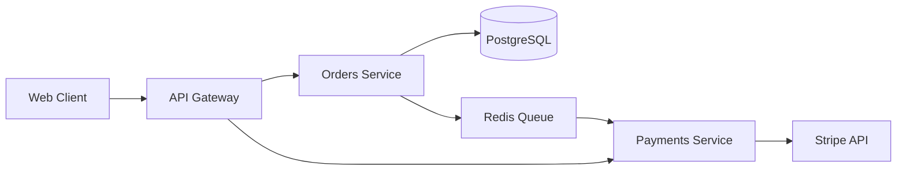

# PRD to Production

End-to-end workflow: PRD → design doc → implementation → code review → testing → deployment → monitoring → retrospective. Includes Ship/Show/Ask branching and design doc templates.

## When to Use

Trigger when user:
- Starts a new feature from scratch
- Writes PRD or design doc
- Plans implementation workflow
- Defines branching strategy for a feature
- Reviews end-to-end process

## Step 1: PRD (Product Requirements Document)

### PRD Structure
Source: https://www.atlassian.com/software/jira/guides/use-cases/what-is-a-prd

```
1. Overview / Problem Statement
   - What problem are we solving? For whom? Why now?

2. Goals & Success Metrics
   - Measurable outcomes. OKRs if applicable.

3. User Stories / Scenarios
   - "As a [user], I want [capability] so that [outcome]."

4. Requirements
   - Functional: what it must do.
   - Non-functional: performance, security, accessibility.

5. Scope / Out of Scope
   - Explicit boundaries. What NOT building.

6. Design / UX
   - Wireframes, user flows, interaction notes.

7. Technical Considerations
   - Dependencies, constraints, API contracts.

8. Milestones / Timeline
   - Phases, release plan.

9. Open Questions
   - Unresolved decisions.

10. Appendix / References
```

### PRD-lite (One-Pager)
For small features. Problem + Solution + Success.

```
# [Feature Name]

## Problem
[One paragraph: what's broken or missing]

## Solution
[One paragraph: what we'll build]

## Success
[How we know it worked: metric + target]

## Out of Scope
[What we're explicitly NOT building]
```

### YC-Style Fast Iteration PRD
Source: Paul Graham's "Launch Fast" + YC playbook.

Lean PRD for speed-to-market. Ship v0.1, measure, iterate.

```
# [Feature Name] — v0.1 Launch Spec

## Hypothesis
[One sentence: what we believe users need]

## Minimum Viable Slice
[Smallest thing that tests the hypothesis. 1-2 weeks max.]

## Kill Metric
[Metric that proves hypothesis wrong. If X < Y after Z days, pivot.]

## Success Metric
[Metric that proves hypothesis right. If X > Y, double down.]

## Measurement Plan
[What to instrument from day 1. Events, funnels, cohorts.]

## Iteration Backlog
[Post-v0.1 ideas — only populated after first measurement]
```

**Rules:**
- No feature > 2 weeks in first cut
- Ship with instrumentation, not just functionality
- Every PRD has a kill metric — precommit to abandoning if wrong
- v0.1 scope = absolute minimum to learn
- Iterate weekly based on real data, not opinions

### Amazon Working Backwards Press Release
Source: Amazon press release FAQ method.

Write the press release FIRST. Work backwards to requirements.

```
# Press Release: [Product/Feature Name]

## Headline
[Customer-benefit-focused headline]

## Sub-headline
[One sentence: who benefits and how]

## Problem
[Paragraph: the pain point, in customer language]

## Solution
[Paragraph: how the product solves it, in customer language]

## Quote from Spokesperson
[What the PM/CEO would say. Customer empathy, not tech.]

## Customer Experience
[Step-by-step: what the customer does, sees, feels]

## Call to Action
[What the customer does next]

# FAQ (Internal)

## Customer FAQ
Q: [Anticipated customer questions]
A: [Answers in plain language]

## Internal FAQ
Q: Why build this now?
Q: What's the tech approach?
Q: What are the dependencies?
Q: What's the cost/effort?
Q: What are the risks?
```

**Rules:**
- If the press release is boring, the product is boring — rewrite
- FAQ section surfaces hidden assumptions early
- Share press release with customers before building
- Customer language only — no jargon in PR section

## Step 2: Design Doc / RFC

### Google Design Doc Template
Source: https://www.industrialempathy.com/posts/design-docs-at-google/

```
1. Authors
2. Status (Draft / In Review / Approved / Superseded)
3. Background / Context
   - Why are we doing this? What is the problem?
4. Goals & Non-Goals
   - Explicit non-goals prevent scope creep.
5. Overview
   - High-level approach, one paragraph.
6. Detailed Design
   - Architecture, data models, APIs, sequence diagrams.
   - Include error handling, edge cases.
7. Alternatives Considered
   - What else was evaluated? Why rejected?
8. Cross-Cutting Concerns
   - Security, privacy, monitoring, logging, i18n.
9. Operations
   - Rollout plan, feature flags, rollback strategy.
10. Risks & Tradeoffs
11. Open Questions
12. Milestones / Timeline
13. Appendix
```

### Enhanced Design Doc: Observability & SLO Sections

Add these sections to any design doc for production-grade features:

```
14. Observability Requirements
    a. Instrumentation Plan
       - Metrics: [which RED/USE metrics to emit]
       - Logs: [structured log format, levels, correlation IDs]
       - Traces: [span boundaries, propagation strategy]
    b. Dashboards
       - Service health dashboard (latency, error rate, throughput)
       - Business metrics dashboard (conversion, adoption)
       - Infrastructure dashboard (CPU, memory, disk, network)
    c. Alerting
       - Burn-rate alerts (SLO-based)
       - Anomaly detection alerts
       - Runbook links for each alert

15. SLO Definition
    a. SLIs (Service Level Indicators)
       - Availability: [e.g., ratio of successful requests]
       - Latency: [e.g., p99 < 250ms for /api/v1/orders]
       - Throughput: [e.g., 10K requests/sec sustained]
       - Correctness: [e.g., 99.99% of orders processed correctly]
    b. SLOs (Service Level Objectives)
       - [e.g., 99.9% availability over 30-day window]
       - [e.g., p95 latency < 100ms, p99 < 250ms]
    c. Error Budget
       - Budget: [e.g., 0.1% = 43.2 min downtime/month]
       - Policy: what happens when budget exhausted
       - Burn rate thresholds: [e.g., alert at 2x burn rate]
    d. Dependencies
       - Upstream SLOs that constrain this service's SLO
       - Downstream SLOs this service constrains
```

**Why this matters:**
- Forces teams to think about production behavior before writing code
- SLOs create shared language between eng and product
- Error budgets enable data-driven release velocity decisions
- Observability as first-class design concern, not afterthought

### RFC (Request for Comments) Process
Source: https://github.com/reactjs/rfcs

1. Author writes RFC doc
2. Shared with stakeholders (Slack channel, doc link, PR)
3. Review period (typically 1-5 business days)
4. Reviewers comment inline. Author addresses.
5. Final approver signs off (usually tech lead or architect)
6. RFC becomes source of truth for implementation

**RFC vs Design Doc:**
- RFC: process-oriented, emphasizes review/approval workflow
- Design Doc: content-oriented, emphasizes technical detail
- Many orgs use both terms interchangeably

## Step 3: Ship / Show / Ask Branching

Source: https://martinfowler.com/articles/ship-show-ask.html

Three categories for branch merging decisions:

### SHIP
- Merge directly to main. No PR, no review needed.
- For: tiny changes, typo fixes, config tweaks, doc-only.
- Trust the author. Speed matters here.

### SHOW
- Merge to main immediately. Open PR afterward for visibility/async review.
- For: small, low-risk changes that still benefit from eyes.
- "Show, don't ask." Review happens after merge.

### ASK
- Open PR, wait for review and approval before merging.
- For: architectural changes, new dependencies, security-sensitive code, public API changes.
- Standard PR workflow. No shortcuts.

### Why This Matters
- Not all changes need same review rigor
- Reduces PR bottlenecks on trivial changes
- Keeps focus on high-signal reviews (ASK items)
- Maintains trunk-based development velocity
- Works with feature flags for safe production deploys

### Implementation
- Define team agreement: which changes fall in each bucket
- SHIP: author self-merges. Log it.
- SHOW: merge first, PR after. Bot can enforce opening PR.
- ASK: standard branch protection rules. Require approvals.

## Step 4: Implementation Workflow

```
PRD Written
    │
    ▼
Design Doc / RFC
    │
    ▼
Implementation
    ├── Ship/Show/Ask classification per change
    ├── CI runs (lint, test, build)
    ├── Code review per classification
    └── Feature flags for progressive rollout
    │
    ▼
Testing & QA
    ├── Unit tests (fast, isolated)
    ├── Integration tests (module boundaries)
    ├── E2E tests (critical user flows)
    └── Staging environment validation
    │
    ▼
Deployment
    ├── Canary or progressive rollout
    ├── Monitoring, alerting
    └── Rollback plan ready
    │
    ▼
Monitoring & Observability
    ├── SLIs/SLOs defined
    ├── Error budgets tracked
    └── Dashboards created
    │
    ▼
Retrospective
    ├── What went well?
    ├── What could improve?
    └── 1-3 action items
```

## Step 5: Code Review

See `sdlc-adversarial-review` for full review process.

**Quick checklist:**
- [ ] PR < 400 LOC (or justified)
- [ ] Design reviewed (right approach?)
- [ ] Security reviewed (OWASP Top 10)
- [ ] Tests present and passing
- [ ] Comments explain WHY
- [ ] No hardcoded secrets

**Google code review SLA:** respond within 4 hours.

## Step 6: Testing

See `sdlc-testing-qa` for full testing process.

**Quick checklist:**
- [ ] Unit tests for business logic
- [ ] Integration tests for module boundaries
- [ ] E2E tests for critical flows
- [ ] Coverage > 80%
- [ ] No flaky tests

## Step 7: Deployment

See `sdlc-deployment` for full deployment strategies.

**Quick checklist:**
- [ ] Canary or progressive rollout
- [ ] Health checks configured
- [ ] Rollback plan ready
- [ ] Monitoring and alerting active
- [ ] Feature flags for gradual rollout

## Step 8: Monitoring

See `sdlc-observability` for full observability process.

**Quick checklist:**
- [ ] SLIs defined (availability, latency)
- [ ] SLOs set (99.9%, p99 < 250ms)
- [ ] Error budgets tracked
- [ ] Dashboards created
- [ ] Alerts configured (burn-rate based)

## Step 9: Retrospective

See `sdlc-retrospective` for full retrospective formats.

**Quick checklist:**
- [ ] Format chosen (Start/Stop/Continue, 4Ls, Sailboat)
- [ ] Prime Directive read
- [ ] 1-3 action items with owners
- [ ] Previous actions reviewed

## End-to-End Checklist

```
□ PRD written (problem, goals, stories, requirements, scope)
□ Design doc / RFC reviewed and approved
□ Implementation plan (tasks, timeline, feature flags)
□ Code review (Ship/Show/Ask classification)
□ Tests (unit, integration, e2e)
□ Staging validation
□ Deployment plan (canary, rollback)
□ Monitoring (SLIs, SLOs, dashboards, alerts)
□ Retrospective (action items with owners)
□ Documentation updated
□ Stakeholders notified
```

## Step 10: Platform Engineering

### Internal Developer Platforms (IDP)

Source: https://tag-app-delivery.cncf.io/whitepapers/platforms/

IDP = self-service abstraction layer between infra and devs. Reduces cognitive load.

**Key components:**
- Service catalog (what exists, who owns it)
- Self-service provisioning (databases, queues, envs)
- Golden path templates (best practices built-in)
- Observability portal (logs, metrics, traces linked to services)
- RBAC + policy-as-code (OPA/Kyverno gates)

### Backstage (Spotify)
Source: https://backstage.io/docs/

CNCF Incubating. Developer portal + scaffolder + catalog.

**Core features:**
- **Software Catalog:** register all services, APIs, data pipelines
- **Software Templates:** scaffolder creates new services from templates
- **TechDocs:** docs-as-code rendered in portal
- **Plugins:** 100+ community plugins (K8s, ArgoCD, Grafana, PagerDuty)

Source: https://github.com/backstage/backstage

### Ephemeral Environments

PR-based preview environments:

```
1. PR opened → CI builds image, tags with PR number
2. ApplicationSet PR generator detects new PR
3. Renders Application pointing to PR-specific overlay
4. ArgoCD syncs new namespace (pr-123.myapp.staging.example.com)
5. PR merged → namespace deleted, Application removed
```

**Tools:** Argo CD ApplicationSets, Garden.io, Uffizzi, Loft vCluster

#### Argo CD ApplicationSets (PR Generator)
```yaml
apiVersion: argoproj.io/v1alpha1
kind: ApplicationSet
metadata:
  name: pr-preview
spec:
  generators:
    - pullRequest:
        github:
          owner: myorg
          repo: myapp
          tokenRef:
            secretName: github-token
            key: token
        requeueAfterSeconds: 30
  template:
    metadata:
      name: 'pr-{{number}}'
    spec:
      project: default
      source:
        repoURL: https://github.com/myorg/myapp
        targetRevision: '{{head_sha}}'
        path: k8s/overlay/preview
      destination:
        server: https://kubernetes.default.svc
        namespace: 'pr-{{number}}'
  templatePatch: |
    spec:
      source:
        helm:
          parameters:
            - name: ingress.host
              value: 'pr-{{number}}.preview.example.com'
```

#### Garden.io
Source: https://docs.garden.io/

Define full stack in `garden.yml`. Spin up dev/preview envs per PR.

```yaml
# garden.yml
kind: Deploy
name: api
type: container
dependencies: [build-api]
spec:
  image: ${actions.build.api.outputs.deploymentImageId}
  ports:
    - name: http
      containerPort: 8080
  ingresses:
    - path: /
      port: http
  env:
    DATABASE_URL: postgres://...
```

#### Uffizzi
Source: https://docs.uffizzi.com/

GitHub Action-based preview environments. No cluster needed.

```yaml
# .github/workflows/uffizzi-preview.yml
on:
  pull_request:
    types: [opened, reopened, synchronize, closed]
jobs:
  preview:
    uses: UffizziCloud/preview-action@v2
    with:
      compose-file: docker-compose.uffizzi.yml
    permissions:
      contents: read
      pull-requests: write
```

**Comparison:**

| Feature | Argo CD AppSets | Garden.io | Uffizzi |
|---|---|---|---|
| Cluster needed | Yes (existing) | Yes (existing) | No (SaaS) |
| Config complexity | Medium | Low | Low |
| Full-stack support | Manual overlays | Built-in | Docker Compose |
| Best for | K8s-native teams | Multi-service dev | OSS/small teams |
| Cost | Self-hosted | Self-hosted/paid | SaaS free tier |

## DORA 2024 Insights

Source: https://dora.dev/research/2024/

### Documentation Quality
- Documentation quality is a **strong predictor** of organizational performance
- Teams with high doc quality have 2x+ better software delivery performance
- Doc quality = accuracy, findability, freshness, completeness
- Docs-as-code (in repo, reviewed in PRs) correlates with better outcomes

### AI-Augmented Development
- AI coding assistants (Copilot, etc.) show **moderate productivity gains**
- Gains strongest for: boilerplate, tests, docs, unfamiliar languages
- Gains weakest for: architecture decisions, complex debugging, novel logic
- **Risk:** over-reliance on AI without code review degrades quality
- **Recommendation:** AI augments review, not replaces it. Pair AI output with human judgment.

### AI-Augmented Development Workflow (Expanded)
Source: DORA 2024 — AI usage across the SDLC, not just code generation.

**Where AI helps most (DORA findings):**
1. **Code review:** AI flags style issues, security patterns, test gaps before human review
2. **Test generation:** AI generates test scaffolds, edge cases, property-based tests
3. **Documentation:** AI drafts PR descriptions, changelogs, API docs from diffs
4. **Incident response:** AI triages alerts, suggests root cause, drafts postmortems

**Where AI hurts (anti-patterns):**
- Blind acceptance of AI-generated code without understanding
- AI-generated tests that pass but don't test meaningful behavior
- Over-reliance reducing developer skill atrophy
- AI suggestions that introduce subtle bugs in concurrent/security code

**Recommended AI integration points in this workflow:**

```
PRD Step:         AI assists with user story expansion, acceptance criteria
Design Doc:       AI reviews for completeness, suggests missing sections
Implementation:  AI generates boilerplate, suggests patterns
Code Review:      AI pre-reviews for style/security/smell BEFORE human review
Testing:          AI generates test scaffolds, humans validate coverage quality
Deployment:       AI generates deployment configs, validates against policy
Monitoring:       AI triages alerts, suggests runbook actions
Retrospective:    AI summarizes PR data, identifies patterns in reviews
```

**AI review integration pattern:**
```yaml
# .github/workflows/ai-review.yml
name: AI Pre-Review
on: [pull_request]
jobs:
  ai-review:
    runs-on: ubuntu-latest
    steps:
      - uses: ai-reviewer/action@v2
        with:
          focus: security,performance,test-coverage
          # AI reviews first, human reviewer sees AI comments
          mode: pre-review
          # Do NOT auto-approve — always require human sign-off
          auto-approve: false
```

**Metrics to track AI impact:**
- PR cycle time (before/after AI adoption)
- Defect escape rate (are AI-reviewed PRs higher quality?)
- Review comment density (are humans finding fewer issues?)
- Test coverage delta (is AI generating meaningful tests?)

### Key Takeaways for This Workflow
1. Write docs in the PRD/Design Doc step — treat them as first-class deliverables
2. Use AI for code generation in implementation, but enforce Ship/Show/Ask review
3. Track doc freshness as a team metric (stale docs = tech debt)
4. Invest in doc tooling (backstage TechDocs, Docusaurus, mkdocs)

## Score Spec (Workload Specification)

Source: https://score.dev/

Score is platform-agnostic workload spec. Defines what workload needs, not how platform provides it.

```yaml
# score.yaml
apiVersion: score.dev/v1b1
metadata:
  name: orders-api
  annotations:
    score.dev/description: "Orders API service"

containers:
  main:
    image: ${resources.container-image}
    variables:
      PORT: "8080"
      DATABASE_URL: ${resources.db.connection-string}
      REDIS_URL: ${resources.cache.connection-string}
    files:
      - target: /app/config.yaml
        content: |
          log_level: info
    resources:
      limits:
        memory: "512Mi"
        cpu: "500m"

service:
  ports:
    http:
      port: 8080

resources:
  container-image:
    type: container-image
  db:
    type: postgres
  cache:
    type: redis
```

**Why Score:**
- One spec, many targets (K8s, Docker Compose, Nomad, PaaS)
- Separates "what I need" from "how platform provides it"
- Enables self-service: devs declare needs, platform fulfills
- Works with Humanitec, score-compose, score-k8s

**Integration with this workflow:**
- PRD defines business requirements
- Design Doc defines technical approach + observability + SLOs
- Score spec defines workload resource requirements
- Platform team maps Score resources to actual infra

## Technical Specification Template

Use after design doc approval, before implementation begins. Captures contract-level detail.

### API Specification

```yaml
# specs/api.yaml (OpenAPI 3.1)
openapi: 3.1.0
info:
  title: [Service Name]
  version: 1.0.0
paths:
  /api/v1/resource:
    get:
      summary: [What it does]
      parameters: [query/path params with types and constraints]
      responses:
        '200':
          description: Success
          content:
            application/json:
              schema: { $ref: '#/components/schemas/Resource' }
        '400': { description: Validation error, content: { application/json: { schema: { $ref: '#/components/schemas/Error' } } } }
        '401': { description: Unauthorized }
        '429': { description: Rate limited }
        '500': { description: Internal error }
components:
  schemas:
    Resource:
      type: object
      required: [id, created_at]
      properties:
        id: { type: string, format: uuid }
        created_at: { type: string, format: date-time }
    Error:
      type: object
      required: [code, message]
      properties:
        code: { type: string }
        message: { type: string }
        details: { type: array, items: { type: object } }
```

### Data Model

```
# specs/data-model.md

## Entity: [Name]
- Table: [table_name]
- Primary key: [id type]
- Indexes: [list with rationale]
- Constraints: [unique, foreign key, check]

| Field       | Type      | Nullable | Default   | Description       |
|-------------|-----------|----------|-----------|-------------------|
| id          | uuid      | no       | gen_...   | Primary key       |
| created_at  | timestamp | no       | now()     | Creation time     |
| updated_at  | timestamp | no       | now()     | Last update       |

## Relationships
- [Entity A] 1:N [Entity B] via [foreign_key]
- Cascade rules: [delete cascade / restrict / set null]

## Migration Strategy
- Forward-only migrations (no rollback scripts)
- Backward-compatible schema changes only in shared tables
- Blue-green compatible: schema works with N and N+1 code versions
```

### Error Handling Strategy

```
# specs/error-handling.md

## Error Taxonomy
| Code   | Category     | Retryable | User Action          |
|--------|-------------|-----------|----------------------|
| 400    | Validation  | No        | Fix input            |
| 401    | Auth        | No        | Re-authenticate      |
| 403    | Authorization | No      | Request access       |
| 404    | Not Found   | No        | Check resource ID    |
| 409    | Conflict    | Maybe     | Retry or resolve     |
| 429    | Rate Limit  | Yes       | Backoff + retry      |
| 500    | Internal    | Yes       | Retry, then escalate |
| 503    | Unavailable | Yes       | Retry with backoff   |

## Error Response Format
```json
{
  "error": {
    "code": "VALIDATION_FAILED",
    "message": "Human-readable description",
    "details": [
      { "field": "email", "issue": "invalid format", "value": "abc" }
    ],
    "request_id": "req-uuid",
    "timestamp": "2024-01-15T10:30:00Z"
  }
}
```

## Retry Policy
- Exponential backoff: base 1s, max 30s, jitter ±50%
- Max retries: 3 for idempotent operations, 0 for non-idempotent
- Circuit breaker: open after 5 consecutive failures, half-open after 30s

## Observability Hooks
- Every error emits structured log: {error_code, request_id, user_id, duration_ms}
- Error rate tracked per endpoint as SLI input
- Anomaly alert on error rate > 2x baseline
```

### Observability Spec

```
# specs/observability.md

## Structured Logging Format
```json
{
  "timestamp": "ISO8601",
  "level": "INFO|WARN|ERROR",
  "service": "service-name",
  "trace_id": "otel-trace-id",
  "span_id": "otel-span-id",
  "request_id": "req-uuid",
  "user_id": "user-uuid",
  "method": "GET",
  "path": "/api/v1/resource",
  "status": 200,
  "duration_ms": 42,
  "message": "Human readable"
}
```

## Metrics (OpenTelemetry)
| Metric Name              | Type      | Labels                      | Description               |
|--------------------------|-----------|-----------------------------|---------------------------|
| http_request_duration_ms | Histogram | method, path, status        | Request latency           |
| http_requests_total      | Counter   | method, path, status        | Total requests            |
| db_query_duration_ms     | Histogram | operation, table            | Database query latency    |
| queue_depth              | Gauge     | queue_name                  | Current queue depth       |

## Tracing
- Propagate W3C traceparent header
- Span boundaries: HTTP handler → service → repository → external call
- Sample rate: 100% for errors, 10% for success (adjust per traffic)

## Dashboards (minimum)
1. Service health: latency p50/p95/p99, error rate, throughput
2. Business metrics: conversion, adoption, feature usage
3. Infrastructure: CPU, memory, disk I/O, network
```

## PRD-to-Production Automation Patterns

### GitOps Workflow

Source: https://opengitops.dev/

```
PRD → Design Doc → Code → PR → CI → Image → Git Repo → ArgoCD/Flux → Cluster

All infrastructure and app config lives in Git. No kubectl apply in CI.
ArgoCD/Flux watches Git, reconciles cluster state to desired state.
```

**GitOps principles:**
1. Declarative: desired state described declaratively in Git
2. Versioned: Git is single source of truth, full audit trail
3. Automated: agents pull and reconcile, CI never pushes to cluster
4. Self-healing: drift detected and corrected automatically

**GitOps repo structure:**
```
environments/
├── base/
│   ├── kustomization.yaml
│   ├── deployment.yaml
│   ├── service.yaml
│   └── hpa.yaml
├── staging/
│   ├── kustomization.yaml
│   └── patches/
│       └── replicas.yaml
└── production/
    ├── kustomization.yaml
    └── patches/
        ├── replicas.yaml
        └── resources.yaml
```

**ArgoCD Application (GitOps):**
```yaml
apiVersion: argoproj.io/v1alpha1
kind: Application
metadata:
  name: orders-api-production
  namespace: argocd
spec:
  project: default
  source:
    repoURL: https://github.com/myorg/k8s-configs
    targetRevision: main
    path: environments/production
  destination:
    server: https://kubernetes.default.svc
    namespace: orders
  syncPolicy:
    automated:
      prune: true          # delete resources removed from Git
      selfHeal: true       # revert manual cluster changes
    syncOptions:
      - CreateNamespace=true
```

### Progressive Delivery

Source: https://fluxcd.io/flux/flagger/

```
Canary → 5% traffic → 20% → 50% → 100%
         ↓ (failure)         ↓ (failure)
      Auto-rollback       Auto-rollback
```

**Flagger Canary (progressive delivery with automated rollback):**
```yaml
apiVersion: flagger.app/v1beta1
kind: Canary
metadata:
  name: orders-api
spec:
  targetRef:
    apiVersion: apps/v1
    kind: Deployment
    name: orders-api
  progressDeadlineSeconds: 600
  service:
    port: 8080
  analysis:
    # Canary promotion criteria
    interval: 30s
    threshold: 5          # max failed checks before rollback
    maxWeight: 50         # max traffic percentage for canary
    stepWeight: 10        # traffic increment per step
    metrics:
      - name: request-success-rate
        thresholdRange:
          min: 99         # rollback if success rate < 99%
        interval: 1m
      - name: request-duration
        thresholdRange:
          max: 500        # rollback if p99 > 500ms
        interval: 30s
    webhooks:             # optional: run tests before promotion
      - name: integration-tests
        type: pre-rollout
        url: http://flagger-loadtester.test/
        timeout: 120s
        metadata:
          cmd: "hey -z 1m -q 10 -c 2 http://orders-api-canary.orders:8080/"
```

### Automated Rollback Patterns

```
## Rollback Triggers
1. Error rate > SLO threshold → immediate rollback
2. Latency p99 > threshold for 2+ analysis windows → rollback
3. Health check failures > 3 consecutive → rollback
4. Integration test failure in canary → rollback

## Rollback Process (Flagger)
1. Flagger detects metric violation
2. Flagger shifts traffic back to primary (100%)
3. Flagger scales canary replica to 0
4. Alert fires to team with reason

## Manual Rollback (GitOps)
1. `git revert <commit>` on k8s-configs repo
2. Push to main
3. ArgoCD syncs automatically
4. Cluster returns to previous state
```

**Blue-Green variant:**
```yaml
apiVersion: flagger.app/v1beta1
kind: Canary
metadata:
  name: orders-api
spec:
  analysis:
    interval: 1m
    iterations: 5        # run 5 checks before switching
    metrics:
      - name: request-success-rate
        thresholdRange:
          min: 99
  strategy:
    blueGreen:           # instead of canary percentage
      activeService: orders-api-active
      previewService: orders-api-preview
```

## Documentation-as-Code Pipeline

Source: DORA 2024 — doc quality predicts org performance.

### Auto-Generated API Docs

```
# Generate from OpenAPI spec at build time
openapi-generator generate -i specs/api.yaml -g html2 -o docs/api/

# Or render in Backstage via TechDocs
# mkdocs.yml at repo root, source in /docs folder
```

**mkdocs.yml for service docs:**
```yaml
site_name: Orders API
nav:
  - Home: index.md
  - API Reference: api.md      # auto-generated from OpenAPI
  - Data Model: data-model.md
  - Runbook: runbook.md
  - Changelog: changelog.md    # auto-generated from commits
plugins:
  - techdocs-core              # Backstage integration
```

### Auto-Generated Changelog

**Conventional Commits + changelog generation:**
```yaml
# .github/workflows/changelog.yml
name: Generate Changelog
on:
  push:
    tags: ['v*']
jobs:
  changelog:
    runs-on: ubuntu-latest
    steps:
      - uses: actions/checkout@v4
        with:
          fetch-depth: 0
      - uses: conventional-changelog/standard-version@v1
        with:
          release-count: 1
      - run: git push --follow-tags
```

**Commit format (enforce via CI):**
```
feat: add order cancellation endpoint
fix: prevent duplicate payment processing
docs: update API reference for v2
perf: optimize order query with composite index
BREAKING CHANGE: remove deprecated /v1/orders/search endpoint
```

### Architecture Diagrams as Code

**Use Mermaid or Structurizr in design docs:**

```markdown
## Architecture


```

**Structurizr DSL for full architecture:**
```
workspace {
  model {
    user = person "Customer"
    orders = softwareSystem "Orders Service"
    payments = softwareSystem "Payments Service"
    user -> orders "Places orders"
    orders -> payments "Processes payments"
  }
  views {
    systemContext orders {
      include *
      autolayout lr
    }
  }
}
```

### Documentation Pipeline Integration

```
PR opened
  → CI checks: API spec valid, no broken links, diagram renders
  → TechDocs preview deployed to ephemeral environment
  → Reviewer validates docs alongside code

PR merged
  → TechDocs built and published to Backstage
  → Changelog updated (if conventional commits used)
  → Architecture diagrams re-rendered
  → API docs regenerated from OpenAPI spec

Release tagged
  → Versioned docs snapshot created
  → Changelog entry generated from commits
  → Release notes published
```

## Metrics-Driven Development

Source: Google SRE book — define SLIs before writing code.

### SLI-First Development

**Pattern: define what to measure before writing implementation.**

```
# In design doc (Step 2), before any code:

## SLI Definitions
| SLI              | Measurement                    | Target (SLO)     |
|------------------|--------------------------------|-------------------|
| Availability     | successful requests / total    | 99.9%             |
| Latency (p99)    | request duration at 99th pct   | < 250ms           |
| Correctness      | correct orders / total orders  | 99.99%            |
| Freshness        | time from event to visibility  | < 5s              |

## Instrumentation Plan
- Add: http_request_duration_ms histogram in handler
- Add: http_requests_total counter with status label
- Add: order_processed_total counter with result label
- Emit from day 1 of implementation, not after launch
```

### Instrumentation During Implementation

**Every PR should include instrumentation alongside features:**

```
# Pattern: instrument in the same PR as the feature

## PR checklist addition:
- [ ] SLI metrics emitted (latency, error rate, throughput)
- [ ] Structured logs with correlation IDs
- [ ] Trace spans for new operations
- [ ] Dashboard panels defined (or link to existing)
- [ ] Alert thresholds set based on SLO
```

**OpenTelemetry instrumentation example:**
```python
from opentelemetry import metrics, trace

meter = metrics.get_meter("orders-service")
request_duration = meter.create_histogram(
    "http_request_duration_ms",
    description="Request duration in milliseconds",
    unit="ms",
)
order_counter = meter.create_counter(
    "orders_processed_total",
    description="Total orders processed",
)

tracer = trace.get_tracer("orders-service")

def handle_order(req):
    with tracer.start_as_current_span("handle_order") as span:
        span.set_attribute("order.customer_id", req.customer_id)
        start = time.time()
        try:
            result = process_order(req)
            order_counter.add(1, {"result": "success"})
            return result
        except Exception as e:
            order_counter.add(1, {"result": "error"})
            span.set_status(trace.Status(trace.StatusCode.ERROR, str(e)))
            raise
        finally:
            duration = (time.time() - start) * 1000
            request_duration.record(duration, {"method": "POST", "path": "/orders"})
```

### SLO-Based Alerting

```yaml
# Prometheus burn-rate alert (multi-window)
groups:
  - name: orders-slo
    rules:
      - alert: OrdersHighErrorBurnRate
        expr: |
          (
            1 - (
              sum(rate(http_requests_total{service="orders",status=~"2.."}[1h]))
              /
              sum(rate(http_requests_total{service="orders"}[1h]))
            )
          ) > (14.4 * 0.001)
          and
          (
            1 - (
              sum(rate(http_requests_total{service="orders",status=~"2.."}[5m]))
              /
              sum(rate(http_requests_total{service="orders"}[5m]))
            )
          ) > (14.4 * 0.001)
        for: 2m
        labels:
          severity: critical
        annotations:
          summary: "Orders API error budget burning 14.4x faster than allowed"
          runbook: "https://wiki/runbooks/orders-high-error-rate"
```

### Metrics Review in Retrospective

```
## Retrospective addition — metrics review:
- Did we hit SLOs this sprint?
- Which SLIs are we missing?
- Are alerts actionable? (false positive rate)
- Should we tighten or loosen any SLO?
- What new instrumentation should we add next sprint?
```

## Pitfalls

1. **Don't skip PRD** — even one-pager prevents scope creep
2. **Don't skip design doc for complex features** — technical decisions need documentation
3. **Don't use ASK for trivial changes** — Ship/Show/Ask reduces bottlenecks
4. **Don't skip feature flags** — decouple deploy from release
5. **Don't skip retrospective** — continuous improvement requires reflection
6. **Don't skip monitoring setup** — deploy without observability is blind
7. **Don't skip rollback plan** — always have a way back
8. **Don't skip stakeholder communication** — keep everyone informed
