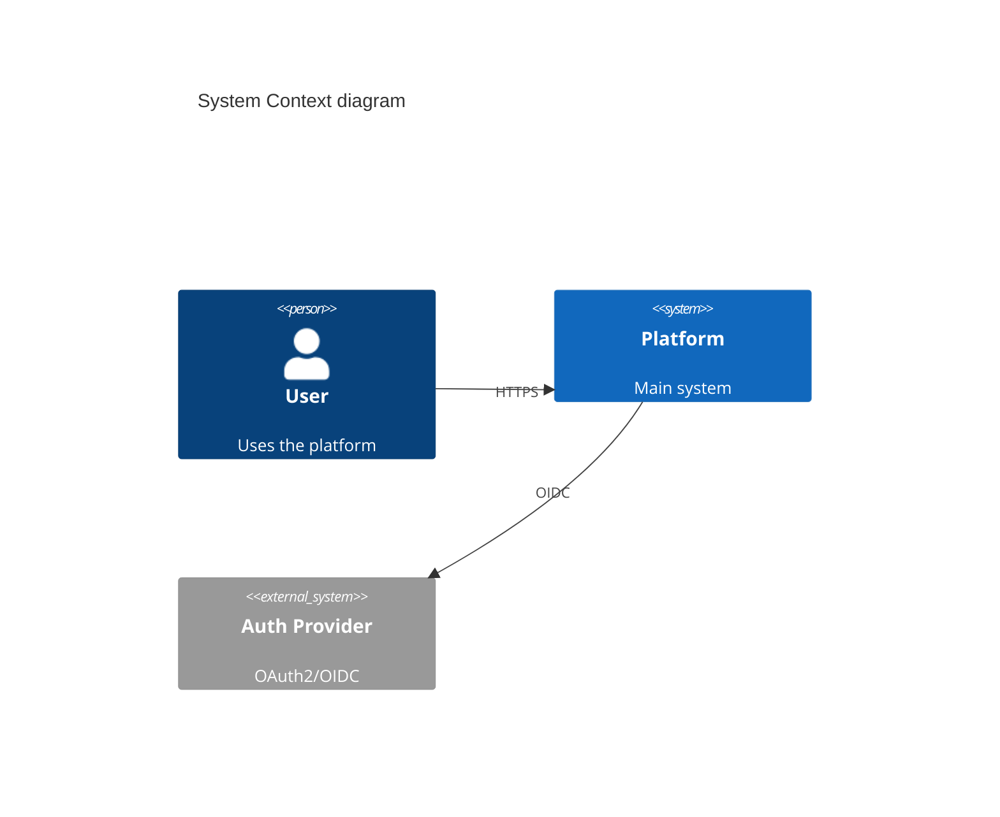

# Architecture, Design & Development (Moderate)

System design through code review: C4 diagrams, API design, database schema, architecture patterns, ADRs, branching, dependency management.

## When to Use

Trigger when user:
- Designs system architecture or draws C4 diagrams
- Designs REST/GraphQL/gRPC APIs
- Creates database schemas or migrations
- Chooses architecture patterns (Clean, Hexagonal, DDD)
- Sets up branching strategy or code review workflow
- Writes Architecture Decision Records

## Step 1: C4 Diagrams

4 hierarchical levels — each zooms into element from level above:

| Level | Shows | Audience |
|-------|-------|----------|
| Context | System as box, actors connected | Everyone |
| Container | Apps/services inside system boundary with tech labels | Devs, ops |
| Component | Classes/packages/modules fulfilling responsibilities | Devs |
| Code | UML class diagram (rarely needed for entire system) | Devs |

**Key rules:** Don't mix abstraction levels. Supplement with arc42 doc template.

### Structurizr DSL
```dsl
workspace {
  model {
    user = person "User"
    softwareSystem = softwareSystem "Platform" {
      webApp = container "Web App" "React" "TypeScript"
      api = container "API" "FastAPI" "Python"
      db = container "Database" "PostgreSQL"
    }
    user -> webApp "uses"
    webApp -> api "JSON/HTTPS"
    api -> db "SQL/TCP"
  }
}

views {
  systemContext softwareSystem { include *; autolayout lr }
  container softwareSystem { include *; autolayout lr }
}
```

### Mermaid Alternative


## Step 2: API Design

### REST (OpenAPI 3.1)
```yaml
openapi: 3.1.0
info:
  title: Order API
  version: 1.0.0
paths:
  /orders:
    get:
      summary: List orders
      parameters:
        - name: status
          in: query
          schema: { type: string, enum: [pending, shipped, delivered] }
      responses:
        '200':
          description: Order list
          content:
            application/json:
              schema:
                type: array
                items: { $ref: '#/components/schemas/Order' }
```

### GraphQL
```graphql
type Query {
  order(id: ID!): Order
  orders(status: OrderStatus, first: Int, after: String): OrderConnection!
}

type Order {
  id: ID!
  status: OrderStatus!
  items: [OrderItem!]!
  total: Money!
}
```

### gRPC
```protobuf
service OrderService {
  rpc GetOrder(GetOrderRequest) returns (Order);
  rpc ListOrders(ListOrdersRequest) returns (ListOrdersResponse);
}
```

### API Versioning

| Strategy | Pros | Cons | Best For |
|----------|------|------|----------|
| URL path `/v1/orders` | Simple, cacheable, explicit | URL proliferation | Public APIs |
| Header `Accept: application/vnd.api.v2+json` | Clean URLs | Hard to test in browser | Enterprise APIs |
| Query param `?version=2` | Easy to test | Cache key pollution | Internal APIs |

**Best practice:** URL path for public APIs. Support 2-3 concurrent versions. Use Sunset header (RFC 8594) for deprecation.

### GraphQL Federation (Apollo v2)

Compose multiple GraphQL services into unified supergraph.

```graphql
# Products subgraph
type Product @key(fields: "id") {
  id: ID!
  name: String!
  price: Float!
}

# Reviews subgraph
extend schema @link(url: "https://specs.apollo.dev/federation/v2.0", import: ["@key", "@external"])
type Product @key(fields: "id") {
  id: ID! @external
  reviews: [Review!]!
}
```

| Aspect | Apollo Federation v2 | Schema Stitching |
|--------|---------------------|------------------|
| Schema ownership | Declarative (@key, @external) | Imperative merge config |
| Entity resolution | Automatic via @key | Manual type merging |
| Tooling | Apollo Router, Rover CLI | graphql-tools |

## Step 3: Database Schema Design

### Schema Patterns
```sql
-- Soft delete
ALTER TABLE orders ADD COLUMN deleted_at TIMESTAMP NULL;

-- Audit trail
CREATE TABLE order_audit (
  id BIGSERIAL PRIMARY KEY,
  order_id UUID NOT NULL,
  action VARCHAR(10) NOT NULL,
  old_data JSONB,
  new_data JSONB,
  changed_at TIMESTAMP DEFAULT NOW(),
  changed_by UUID
);
```

### Indexing Strategy
```sql
-- Composite index for common query pattern
CREATE INDEX idx_orders_user_status ON orders(user_id, status);

-- Partial index for active records
CREATE INDEX idx_orders_active ON orders(user_id) WHERE deleted_at IS NULL;

-- GIN index for JSONB queries
CREATE INDEX idx_orders_metadata ON orders USING GIN(metadata);

-- Always EXPLAIN ANALYZE before deploying
EXPLAIN ANALYZE SELECT * FROM orders WHERE user_id = '...' AND status = 'pending';
```

### Migration Tools

| Tool | Ecosystem | Approach | Autogenerate |
|------|-----------|----------|--------------|
| Flyway | Java, SQL | Imperative | No |
| Alembic | Python | Imperative | Yes |
| Atlas | Go, SQL-first | Declarative (HCL) | Yes |
| Prisma Migrate | JS/TS | Declarative | Yes |

### Expand-and-Contract (Zero-Downtime)
```
Phase 1 (expand):  Add new column (nullable), backfill, deploy code writing both
Phase 2 (migrate): Switch reads to new column, deploy
Phase 3 (contract): Remove old column, clean up
```

### Polyglot Persistence

| Store Type | Use When | Examples | Anti-Pattern |
|-----------|----------|----------|--------------|
| Relational | ACID, complex joins, structured data | PostgreSQL, MySQL | Append-only logs |
| Document | Flexible schema, nested data | MongoDB, DynamoDB | Complex joins |
| Key-Value | Caching, sessions, high-throughput | Redis, DynamoDB | Range queries |
| Columnar | Analytics, time-series, high write | Cassandra, ClickHouse | OLTP workloads |
| Search | Full-text search, faceted nav | Elasticsearch | Primary data store |
| Graph | Relationship-heavy queries | Neo4j, Neptune | Simple CRUD |

**Decision framework:**
1. Start with PostgreSQL (handles 80% of workloads)
2. Add Elasticsearch only if full-text search is core
3. Add Redis only if sub-ms latency or pub/sub needed
4. Add graph DB only if >30% of queries traverse relationships
5. Justify each addition with measured bottleneck

### Database Sharding

| Strategy | Pros | Cons |
|----------|------|------|
| Hash-based | Even distribution | Range queries span all shards |
| Range-based | Range queries efficient | Hotspots on new ranges |
| Directory-based | Flexible, movable | Lookup table is SPOF |
| Geographic | Data residency, latency | Complex cross-region queries |

**Consistent hashing:** ring with virtual nodes (100-200 per physical node). Adding/removing node moves only ~1/n keys. Used by DynamoDB, Cassandra, Redis Cluster.

**Don't shard prematurely** — optimize queries, add read replicas first; shard at ~1TB or clear bottleneck.

### Caching Strategies

| Strategy | Description | Use Case |
|----------|-------------|----------|
| Cache-Aside | App checks cache → miss → read DB → write cache | Read-heavy workloads |
| Write-Through | App writes cache → cache writes DB synchronously | Cache always consistent |
| Write-Behind | App writes cache → cache acks → async batched DB write | Low write latency |
| Read-Through | App reads cache